# Rendering: the greybox

Owner: Rendering and Technical Art. Code: `render/`. Status: first playable greybox (P1), 2026-09-29; civilians and planet-scale pass, craters, scorch and water, and one world to the horizon, the same day.

The main scene runs the GDScript sim (`sim/`) as a 60 Hz fixed-step loop and draws it every frame in a 2.5D side-on view of the wrapped planet. Frames are interpolated between the last two ticks. It starts as an AI-vs-AI demo; any key or click hands P1 to a human, as the prototype did. Everything on screen is a greybox made of simple meshes and flat colours. The cel-shaded look comes later with Art.

## Run it

Godot 4.7.2 (`C:\Users\itsha\AppData\Local\Programs\Godot\4.7.2\`; use `_console.exe` for headless runs). On a fresh clone, import once so the `class_name` scripts register:

```
godot --headless --path . --import
```

Then press F5 in the editor, or run:

```
godot --path .
```

| Key | Action |
| :--- | :--- |
| any key or click | take control of P1 (the demo starts AI vs AI) |
| WASD, Space, F, G, R, Q, 1-4 | P1: move, dash, light, heavy, signature, charge, stances |
| arrows, Enter, comma, period, slash, semicolon, 7-0 | P2 (the same, as in the prototype) |
| N / T / Y / P | new match / toggle P2 AI / toggle P1 AI / pause |
| F2 | swap UI's HUD for the greybox HUD (until UI's playtest) |
| F3 | performance overlay |
| F4 | the director feed in UI's HUD |
| Esc | quit (desktop) |

The key mapping is Controls' `sim/input/keyboard.gd`. `render/core/key_codes.gd` only turns Godot's physical keys into its code names.

Command-line options go after `--`: `--seed=N`, `--human` (take P1 at start), `--frames=N` (quit after N frames), `--shot=file.png` (save the last frame), `--bench` (vsync off; print frame-time statistics at quit), `--novsync`. Add Godot's own `--fixed-fps 60` to get exactly one tick per frame, for screenshots at a known tick.

## Scene structure (`render/main.tscn`)

```
Main          Node3D               core/main.gd         the frame loop, input, match start, bench and shots
├ Camera      Camera3D             core/camera_rig.gd   the reference camera as a 3D camera
├ Environment WorldEnvironment                          sky gradient (shaders/sky.gdshader), built in main.gd
├ Planet      Node3D               core/planet_view.gd  ground and water to the horizon (5 copies), buildings, trees, crowd (3)
├ Fighters    Node3D                                    one core/fighter_view.gd per fighter, built per match
├ Beams       Node3D               core/beam_view.gd    signature beams and beam clashes
├ Particles   MultiMeshInstance3D  core/particle_view.gd  the fx consumer's particles, one draw call
├ HUD         CanvasLayer
│ ├ UiHud     Control              ui/hud/ui_hud.gd     UI's HUD (added in main.gd; docs/ui/hud-spec.md)
│ └ Overlay   Control              core/hud.gd          take-over prompt, seed and tick, F3 perf; the whole greybox HUD on F2
└ AudioVoices Node                 audio/audio_voices.gd  Audio's voice pool (added in main.gd)
```

| File | Role |
| :--- | :--- |
| `core/sim_host.gd` | The host: the fixed-step accumulator (overview.md section 2), keyboard intents, draining `S.out.feed` and `S.out.fx` after each tick, the reference camera and fx consumer, the camera-shake stream, and the two snapshots that frames interpolate between. It is the only render-side code that calls into the sim. |
| `core/look.gd` | Every colour and dimension of the greybox look, in one place (the prototype's palette). |
| `core/mats.gd` | Flat and glow materials over the shaders. |
| `core/crowd_mesh.gd` | The generated civilian figure (see Civilians below). |
| `core/ground_field.gd` | The ground band's data for the GPU and its CPU mirror: round crater bowls in depth, scorch, water (see Craters, scorch and water below). |
| `core/impact_fx.gd` | Render-side live effects for World's crater, scorch and splash events: ejecta, rim dust, shock rings, the glow of fresh grooves, embers, ripples and skim spray. |
| `shaders/` | `flat` (opaque and alpha) and `glow` (additive) for props and fighters; `terrain` and `water` over `ground.gdshaderinc` (the ground field); `crowd`; `particle` (shapes per instance); `sky` over `skycol.gdshaderinc` (the horizon-anchored gradient the ground also fogs into, space, stars); `bend.gdshaderinc` (horizon curvature). |
| `tools/seam_sweep.gd`, `tools/determinism.gd` | The seam and determinism checks (see below). |
| `tools/shots.gd` | Posed screenshots for these docs (see below). |
| `tools/ground_check.gd` | The ground check: the drawn ground against the sim's (see Verification). |

## How it draws

- **Camera.** A perspective camera with a 30° vertical FOV looks straight down -z. For the reference camera's x, y and zoom z (pixels per world unit, `sim/core/view/camera.gd`), the rig places the camera at distance `vh / (2 z tan(fov/2))`. On the fighter plane (z = 0) a point therefore lands on the prototype's `w2s()` pixel exactly. Things in front of or behind that plane get perspective parallax: the ground, buildings and trees. Screen shake is the fx consumer's `shake`, with jitter drawn once per tick from the `camera` stream.
- **Floating origin and the seam.** Everything is placed relative to the camera's wrapped x, so the camera sits at x = 0 and no coordinate grows large. World-anchored content (ground, water, buildings, trees, crowd) is built once per match over x in [0, 9600). It is drawn as identical copies at `k * W - cam.x`, sharing meshes and MultiMeshes: the ground and water for k = -2 to 2 (`PLANET_COPIES`, because the horizon is wide), the props for k = -1 to 1. The seam is therefore invisible by construction, and a view wider than the planet (tiny zoom on an ultra-wide or phone screen) shows everything wherever it appears. Fighters, beams and particles are placed by the shortest arc `sdx(cam.x, x)`. A beam is laid out from its tail along its direction, so one crossing the seam stays in one piece.
- **Terrain.** The ground band is one static mesh: per column, a front face from the surface down to a floor and a top face running back in depth. The vertex shader reads heights from a 1200 × 2 float texture (row 0 base, row 1 crater deform). The planet view re-uploads the texture only when `S.deform` changes, so craters never rebuild geometry. Crater, sea-floor and biome colours come from the same data, and water is drawn only where the base terrain is below sea level (the sim's `seaAt` rule).
- **Props.** Buildings, roofs, trees and civilians are MultiMeshes, one draw call per kind per copy. Only instances whose building, tree or ground changed are updated. The sim has civilians only as counts per building, so the greybox stands `popAlive` figures around each building. Where each one stands, the tree depths, and each civilian's shirt and skin tone come from render-side streams seeded from the fixed world seed, never from the sim stream.
- **Fighters.** Each fighter is generated from its roster colours and role: boxes, a low-poly head, and hair and cape extruded from 2D outlines. Stance shows as a badge colour, a lean and a guard glow in defensive, and the HUD labels it too. A hit makes the body flash white for 0.12 s after `hurtT`. The aura grows with tier, and aura streaks appear at tier 3 or above and while charging. A hidden fighter fades to 22 % inside a sonar ripple. The beam charge orb grows at the hand. The placeholder hero's hair is a teal, swept-back crest.
- **Shading.** All greybox materials are unshaded, with one fixed fake light in the shader. That means no light passes and the same look on every renderer. In 4.7.2 Compatibility, vertex and MultiMesh instance colours reach shaders already linear (checked by sampling rendered pixels), so the shaders use `COLOR` as it is. A MultiMesh without instance colours multiplies `COLOR` by zero there, so the crowd tags its parts in `UV` and takes its colours from custom data.
- **Interpolation.** After each tick the host snapshots fighter x, y and rotation and the camera. Frames draw at `alpha = acc / DT` between the last two snapshots, with x interpolated along the shortest arc. Beams, particles, terrain and props show the latest tick.

## Civilians and planet scale

Orb's notes on the first live build were "civilians seem too tiny" and "make the scale of the map seem more like a full planet". Both answers are presentation only: the sim's positions and counts are untouched.

**Civilians.** Each civilian is a generated figure, seen from the front so it reads as a person at a few pixels. It has legs, torso, arms and a head, is about 17 units tall, and has a dark outline shell (an inverted hull pushed out in the shader, sized to about 1 px on screen). Shirts come in eight bright colours over dark trousers, with two skin tones. They are drawn at about twice real scale: a person would be about 7 units against 120 to 660-unit towers. As the camera zooms out they grow about their feet, up to 2x, so they stay about 12 px tall down to zoom 0.35. About half of them hop idly, out of step. The crowd is still one MultiMesh, and one draw call, per copy. Tunables are in `look.gd` (`CROWD_*`).

| Before | After |
| :---: | :---: |
| 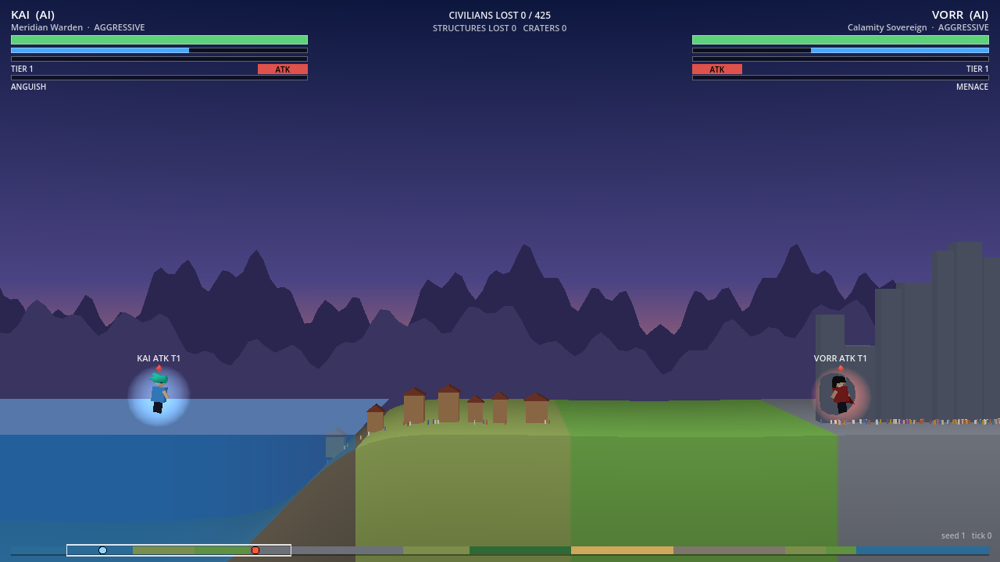 | 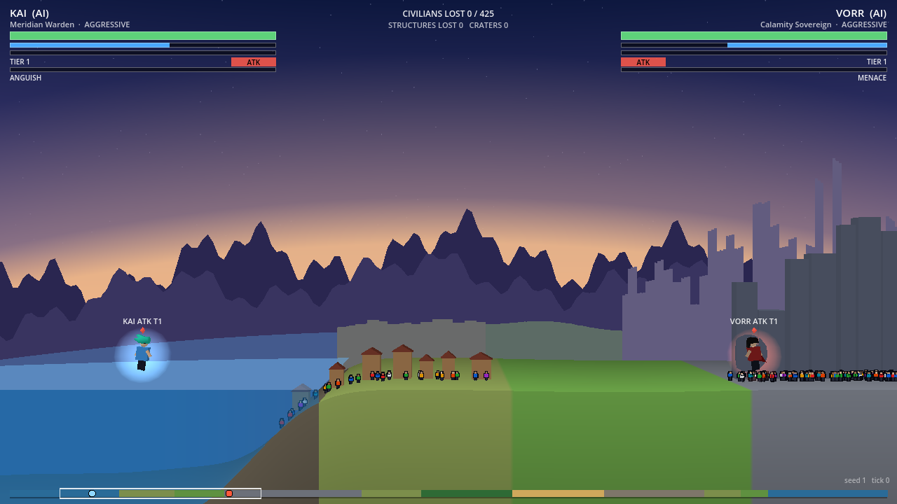 |

**Planet scale.** I picked the three cheapest cues that read at the zoom real fights use. In AI matches the zoom stays around 0.3 to 0.7 and the camera below about 850 units, so cues that only showed at extreme zoom would rarely be seen. All three are static meshes or shader uniforms, with no per-frame CPU work beyond a few uniforms.

1. **Horizon curvature** (`bend.gdshaderinc`). World geometry sags by `bend * x^2` across the screen, weighted by depth: nothing moves within 60 units of the fighter plane, and the weight is full from 1,260 units behind. So the fight, the ground under the fighters, the HUD mapping and the seam proof are exactly as before, while the world behind curves away like a horizon. The weight also divides out perspective, so every layer from 1,260 units back to the horizon sags by the same number of pixels at the screen edge: 3.5 % of screen height at close zoom and 10 % at wide zoom, plus up to 10 % more as the camera climbs (`CURVE_*`). It is a function of the camera-relative x, so it is identical in every planet copy and invisible at the seam.
2. **The rest of the planet, behind the fight.** The ground continues to the horizon as the same planet's terrain (see One world to the horizon, below). Depth shows a wider stretch of it than of the fighter plane, so the biomes ahead around the planet come into view before the fighters reach them.
3. **Atmosphere and the view from altitude.** The sky's gradient is anchored to the horizon, and the far ground hazes into it. As the camera climbs, the sky darkens to space, stars come up and the glow thins to a narrow rim along the horizon. The planet below is the real ground, curving away.

(The first version of cues 2 and 3 used a separate far-land silhouette, ridge cut-outs, a glow band and a limb painted in the sky. Orb found them disconnected from the playfield, and the next section replaces them.)

| Before | After |
| :---: | :---: |
| 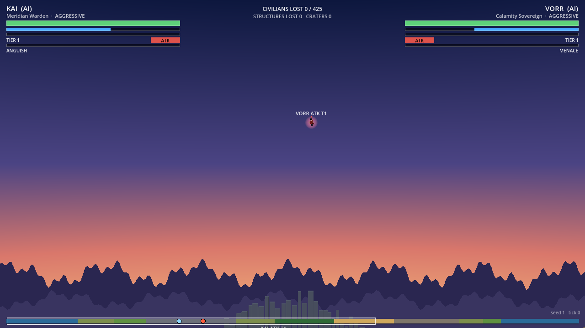 | 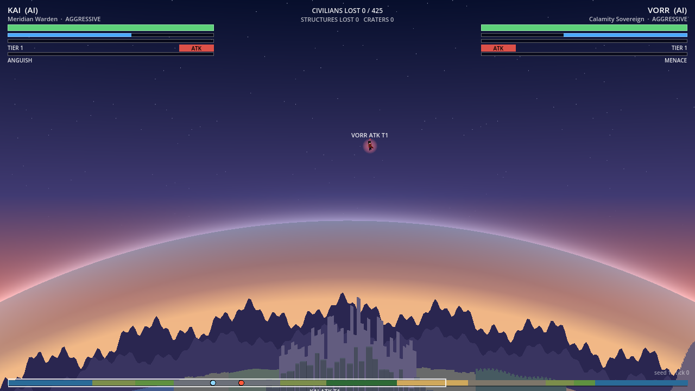 |

Both pairs come from `godot --path . --script res://render/tools/shots.gd -- --out=DIR`, which poses the fighters on a fresh match without stepping the sim. That keeps the pictures stable while the sim's behaviour changes. The "before" images are the committed renderer (2ebdb53) run on the same sim. Other poses: `city`, `wide`, `high`.

## One world to the horizon

Orb's notes on the live build: a mountain the fighters clip against was "replicated in the distance by a silhouette with a gap in between", there were "multiple shorelines", and at high altitude "a glowing circle" appeared. The cause was one design flaw: the backdrop was separate vertical cut-outs (far land, ridges, a glow band) behind a ground band that ended 520 units back, and the planet seen from above was a disc painted in the sky. All of that is gone. There is now one world:

- **One ground surface.** The ground grid keeps its crater rows (to `Z_TERRAIN_BACK`) and continues behind them in widening rows (`FAR_ROWS`) to 12,000 units. Behind the crater rows the height blends, over `FAR_BLEND`, into the far terrain. That is the same columns' own base height (`S.base`), scaled per biome, with smooth relief (`FAR_RELIEF`, smoothed across biome borders, in whole harmonics of the planet so it wraps). The mountain beside the fighters is the start of a massif that runs into the distance, and high peaks whiten (`SNOW_*`). So the far land doesn't run back in straight stripes, the column each far point reads wanders with depth (`MEANDER`), interpolated between columns. Heights and biome colours both follow it, so coastlines, ranges and forests meander. The crater rows and the fighter plane are untouched: the ground check still passes bit for bit.
- **One sea.** The water grid covers the same rows. In the crater rows it comes from `S.water`. Behind them it lies at sea level wherever the far ground is below it, in the sea's own columns (the sim's base-below-minus-30 rule). The sea therefore runs on to the horizon with one shoreline, and islands rise where the far sea floor does.
- **No edge.** Distant ground takes the sky's own colour in its own screen direction (`skycol.gdshaderinc`). The haze is thickest along grazing views near the horizon line and clears below it, there is a light haze with distance, and the last eighth before the far edge fades out completely. The ground's end never shows, even where the curvature drops it below the horizon line at the screen sides. The sky's gradient is anchored to that horizon, the elevation of the ground's far edge from the camera, so sky and ground meet with no seam at any zoom or height.
- **From altitude.** Nothing switches at a threshold. As the camera climbs, the horizon sinks toward the bottom of the screen and the curvature grows. The haze band and the sky's glow thin together to a narrow rim (`SKY_THIN`), and the sky above turns to space with stars. You see the actual planet below, with its biome colours and terrain, curving away.

| Before | After |
| :---: | :---: |
| 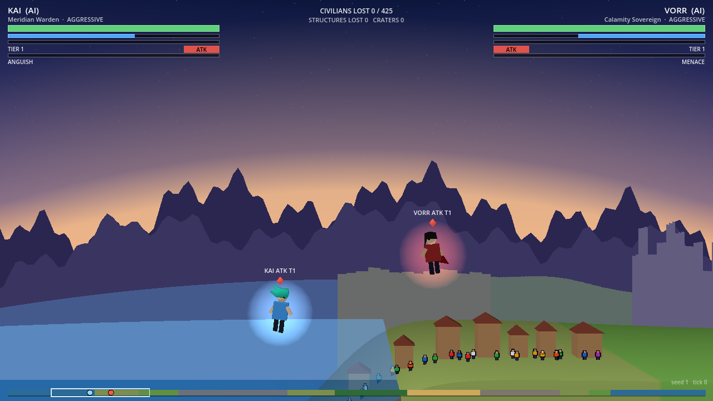 | 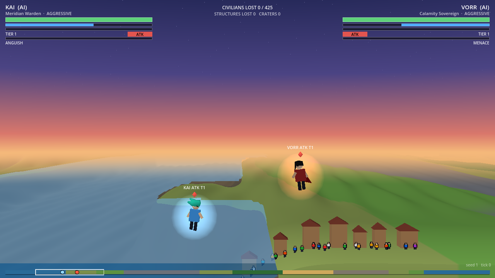 |
| 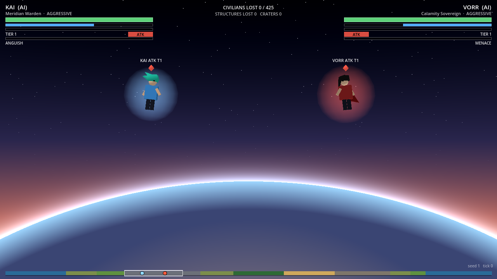 | 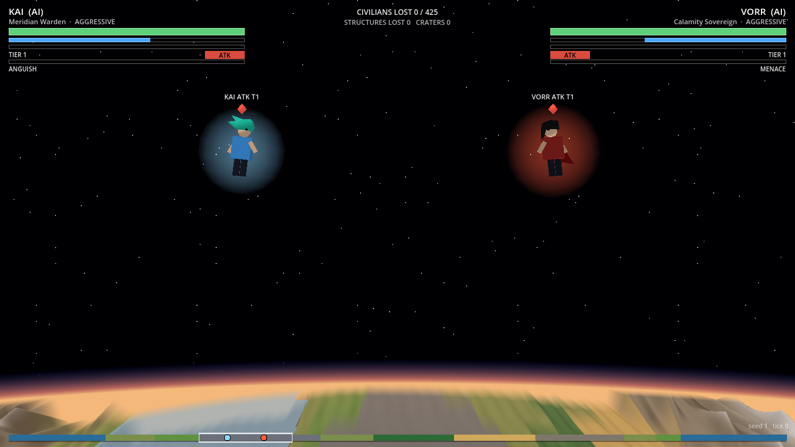 |

Poses `coast` and `max` in `tools/shots.gd`. Both columns use the committed sim (51cdbec). "Before" is the committed renderer.

## Craters, scorch and water

World's sim change (`docs/world/craters-scorch-water.md`) gives craters raised rims in the sim's own profile and adds three pieces of persistent state: `S.craters` (records), `S.scorch` (a permanent burn per column) and `S.water` (water depth per column). It also adds `crater` and `scorch` events. The renderer draws them as Orb asked ("craters, not canyons"; "beams should scorch and leave trails of destruction, more powerful beams... more intense").

**Bowls in depth.** The ground band is now a grid of terrain columns by 24 rows in depth (`RenderLook.BAND_ROWS`), dense near the fighter plane. The row that lies exactly on the fighter plane reads `S.deform` itself, so the ground the fighters stand on is the sim's, bit for bit. Every other row is summed on the GPU (`ground.gdshaderinc`):
- each nearby crater's `WorldCrater.profile`, taken at the round distance `sqrt(dx^2 + z^2) / r`: a bowl, a rim and an apron that fade away from the fighter plane in every direction;
- each glancing impact's furrow, a trench from the side the fighter came from into the bowl;
- the residual `G = deform - (the same sum at z = 0)`, spread across the band like a groove. It carries scorch grooves (which have no records), dents from records the sim dropped, and clipping.

At z = 0 the sum gives `deform` back, so the rows beside the fighter plane join it without a step (checked within 0.000002 units). Normals come from the formula's own gradient, so bowls shade smoothly. The CPU keeps, per column, the up-to-6 most energetic craters that reach it, plus the residual, updated only for columns that changed. `ground_field.gd` holds the layout and the CPU twin of the shader.

**Scorch.** The ground chars toward near-black by `S.scorch`, across the groove's width in depth. The sim's burn already scales with the beam power P, and so does the groove's width. Fresh grooves glow: each `scorch` event heats its columns to `0.35 + 0.28 P`, which then cools with a 1.6 s time constant. A strong beam's trail therefore starts yellow-white and stays lit for about 5.5 s, while a weak one is a dull red for about 3.6 s. Embers rise from each sample, more and brighter for strong beams. A crater's `crater` event throws ejecta sized by its energy, raises dust on its rim and sends a flat shock ring across the ground.

**Water.** Water is drawn from `S.water`: the sea and crater lakes. There is a surface grid at each wet column's standing level, depth-tested against the ground, so a lake shows only inside its bowl, plus a front face down to the ground. Off the sea, water also needs the ground there to be dug, so low coastal land beside a lake stays dry, as the sim has it. A splash on a water surface leaves ripple rings lying on it. A fighter skimming low and fast over water throws spray and marks the surface every few ticks, so a skim reads as a skipping stone.

**Rebuilt from state.** Bowls, char and water come only from state: `S.craters`, `S.deform`, `S.scorch` and `S.water`. When the crater list only grew, the new records are added; anything else (a new match, a replay seek, a snapshot restore, the sim dropping its oldest record) triggers a full rebuild from state. Only the transient effects need events: the glow of fresh grooves, ejecta, embers and ripples. A seek shows the marks without the glow, just as it shows no particles. Props (buildings, trees, civilians) stand on the ground as drawn at their own depth, so a bowl in depth does not leave them floating.

| Before | After |
| :---: | :---: |
| 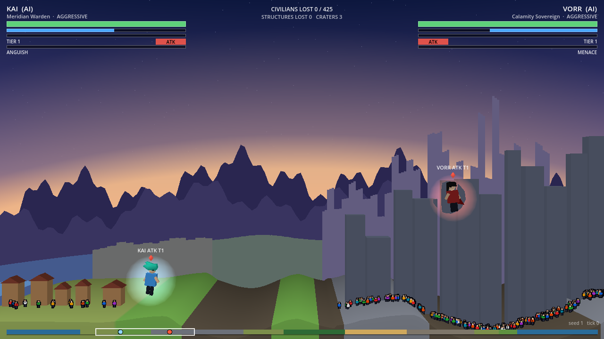 | 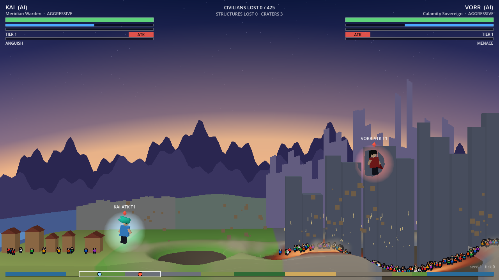 |
| 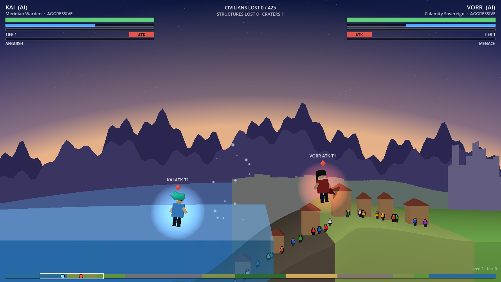 | 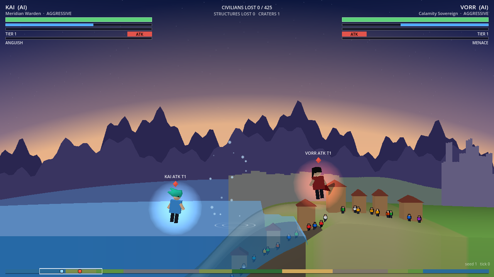 |

The staged damage comes from World's own functions on a posed state, in `tools/shots.gd` (`craters`, `lake`):
- a straight-down hit;
- a glancing hit with its furrow;
- a P = 4.2 beam trail ending in its strike crater;
- an E = 25 crater at the coast that the sea floods, with a splash on the new lake.

"Before" is the committed renderer (0bfc605) on the same sim.

## World scale (SC)

World's life-size scale (`docs/world/scale.md`: WS 8, PS 16, MS 12; a planet of 153,600 units, 4,800 columns of 32) is followed through `look.gd`. World sizes there are written at the original scale and multiplied by the sim's own knobs: buildings, trees, roofs, crater and groove widths and the ground's depth by WS; mountain snow by MS; the far land's meander by PS; fighter-scale sizes are not scaled. Civilians are life-size, as tall as a fighter (`CROWD_SCALE`), with the zoom boost keeping them legible when far out. The curvature's zoom range is on a log scale (`ZOOM_CLOSE` 0.3 to `ZOOM_WIDE` 0.015), the space and limb cue on fractions of the flight ceiling, and the horizon row is 120,000 units out, so the planet fills the lower screen even from the ceiling. The sim's sea, wet-depth and dent thresholds reach the shaders as uniforms from `WorldWater` and `WorldCrater`, not literals.

The ground mesh no longer covers every column at every depth. Rows are generated with spacing that grows with depth (`ROW_STEP0`, `ROW_GROWTH`), and columns coarsen in tiers (`TIERS`: every column to 400 units back, every 2nd to 2,000, every 4th to the back of the crater rows, every 8th beyond). The finer tier's boundary row snaps to the coarser stride, so tiers meet without a crack. The near and middle tiers are cut into 15 chunks of 320 columns that the frustum culls; the far tier is one light mesh per copy. The ground data texture keeps its byte layout but is laid out at most 2,048 texels wide (WebGL2's guaranteed minimum), `rpl` texture rows per data row.

The seam sweep's position tolerance is float32 rounding at the largest copy offset (0.0625 units at this W, about 0.07 px at the closest zoom). The worst measured join is 0.0156 units (0.018 px). Its separations are fractions of half the planet, up to 0.998.

## Hosting UI's HUD and Audio

Both are other directors' work, hosted here as their docs ask (`docs/ui/hud-spec.md` section 14, `audio/README.md` "Hooking it up"). Both only read.
- **UI's HUD.** `main.gd` adds `ui/hud/ui_hud.tscn` under the `HUD` layer and calls `setup(ids, names)` at match start (`UiSimBridge.fighters`). `anchor_fn(slot)` returns the fighter's torso on screen, through the 3D camera, and its height in pixels (`FighterView.HEIGHT` times the zoom). `strip_fn()` returns `UiSimBridge.strip_data(S, cam_x, view width)`. Each tick, `SimHost.drained(events, lines)` fires just before `S.out.fx` is cleared, and the HUD takes the events (`consume_all`) and feed lines. Each frame it gets `UiSimBridge.patch`, and `advance(delta)` (0 while paused). The greybox HUD stays behind F2.
- **Audio.** `SimHost` owns an `AudioCues`, reseeded per match, that reads each tick's events before they are cleared into `pending_cues`. `main.gd` adds an `AudioVoices` pool and plays the frame's cues relative to the camera's x and zoom. The bank renders every sound once at startup (about 0.3 s on desktop), so none renders mid-fight; headless tools skip that and render lazily. On the web, the page's AudioContext starts suspended and Godot resumes it on the first key or click, which is also the greybox's take-over key. This was checked in Chrome with a DevTools key press: "suspended" before, "running" after, and 23 sounds played.

## The sim boundary

Rendering reads and never writes. The views read `S`, the fx consumer (`sim/core/view/fx.gd`) and the reference camera. Only `SimHost` steps the sim, toggles AI, starts matches and drains `S.out`, which is exactly the host's job in `docs/architecture/overview.md`. How many ticks run per frame is the only thing that depends on frame timing, so the tick sequence and every gameplay hash are the same at any frame rate.

## Verification

All commands run from the repo root; each exits 0 on success.

| Check | Command | Result (2026-09-29) |
| :--- | :--- | :--- |
| Seam sweep | `godot --headless --path . --script res://render/tools/seam_sweep.gd -- --size=1280x720` | passed at 1280×720, 2560×720 and 720×1280 |
| Determinism | `godot --headless --path . --script res://render/tools/determinism.gd` | passed (seeds 12345 and 4) |
| Ground check | `godot --headless --path . --script res://render/tools/ground_check.gd` | passed (seeds 4, 12345, 7) |
| Sim parity (Simulation's) | `godot --headless --path . --script res://sim/core/tools/parity.gd` | still passes |

**Ground check.** It runs three matches through the full scene and checks every 120 ticks:
- the GPU's base, deform, scorch and water rows are the sim's bytes;
- the fighter-plane row reads `S.deform` directly, and the bowl formula at z = 0 is within 0.000002 units of it;
- a field rebuilt from state alone, as for a seek or a snapshot restore, equals the one kept up to date frame by frame, bit for bit.

A crater dug on the seam (x = 0) is exactly symmetric across it at every depth. The mesh has one exact row per column. Three matches gave 49 craters, 12 of them with furrows.

**Seam sweep.** The tool poses the two fighters by hand (it never steps the sim) and runs the real scene on 1,331 frames. It covers flying together through the seam at separations 0, 1, 60, 400, 1500, 3000, 4500 and 4790; meeting head-on on the seam; the smallest zoom (one fighter under the sea, one at the ceiling); and one fighter lapping the planet. Per frame it checks four things:
1. Each fighter lands on the prototype's `w2s()` pixel (worst 0.0005 px).
2. Its frame-to-frame screen motion matches the reference motion (worst 0.0005 px), with no step over 120 px.
3. The ground drawn under it is the sim's ground at its own x (worst 0.0005 world units).
4. The planet copies meet exactly one planet apart (worst 0.001 units) and cover the whole view. At 2560×720 the view is 14,889 units wide against a 9,600-unit planet.

`-- --shots=DIR` (without `--headless`) also saves frames around each seam crossing; those were inspected by eye, and nothing marks the seam.

**Determinism.** For each seed the tool compares gameplay hashes every 60 ticks and at the end, across the sim alone and the full scene at 1/60 s frames, 1/144 s frames and irregular 2 to 50 ms frames (twice). All are identical. `--negative-control` nudges a fighter by 0.001 once, as a renderer write would, and the check then fails at the next checkpoint. `--live` without `--headless` also renders every frame on the GPU; it passed for seed 4. The web build reproduces the desktop gameplay hash (seed 4, tick 2400: `60432212cae42156`).

**Performance** (seed 4, one tick per frame, vsync off; frame time is wall clock per frame; Ryzen 7 9800X3D and RTX 5070 Ti, a high-end machine):

| Build | Frame mean / p95 / p99 | Sim tick mean | View update mean | Draw calls |
| :--- | :--- | :--- | :--- | :--- |
| Desktop, Compatibility, 1280×720 | 0.98 / 1.38 / 2.11 ms | 0.056 ms | 0.12 ms | about 85 |
| Desktop, Compatibility, 1920×1080 | 0.99 / 1.39 / 2.14 ms | 0.056 ms | 0.12 ms | about 85 |
| Web (Chrome 154, WebGL 2 over D3D11), 1280×720 | 1.83 / 2.50 / 3.30 ms | 0.12 ms | 0.18 ms | about 82 |
| Desktop 1280×720, after the scale pass | 0.97 / 1.32 / 2.05 ms | 0.057 ms | 0.11 ms | about 80 |
| Web 1280×720, after the scale pass | 1.82 / 2.20 / 3.10 ms | 0.13 ms | 0.16 ms | about 79 |
| Desktop 1280×720, craters, scorch and water | 1.03 / 1.42 / 1.82 ms | 0.082 ms | 0.13 ms | about 77 |
| Web 1280×720, craters, scorch and water | 1.81 / 2.30 / 2.80 ms | n/a | 0.17 ms | about 80 |
| Desktop 1280×720, one world to the horizon | 1.03 / 1.42 / 1.80 ms | n/a | 0.14 ms | about 75 |
| Web 1280×720, one world to the horizon | 1.93 / 2.30 / 2.80 ms | n/a | 0.19 ms | about 76 |
| Desktop 1280×720, with UI's HUD and Audio | 2.88 / 3.66 / 4.14 ms | n/a | 0.18 ms | about 303 |
| Desktop 1280×720, Audio, greybox HUD (`--legacy-hud`) | 1.08 / 1.52 / 2.03 ms | n/a | 0.17 ms | about 73 |
| Web 1280×720, with UI's HUD and Audio | 5.09 / 6.30 / 7.70 ms | n/a | n/a | about 300 |
| Web 1280×720, Audio, greybox HUD (`--legacy-hud`) | 2.00 / 2.80 / 3.70 ms | n/a | n/a | about 72 |

These four rows are on the committed sim after S1 (b2e30a5 and later), same seed, and each pair ends on the same gameplay hash. UI's HUD drawing costs about 1.8 ms a frame on desktop (GPU 0.18 to 0.67 ms) and about 3 ms on the web, plus about 230 canvas draw calls: it redraws every frame in GDScript (`_draw`). Audio's share is small (86 cues over the desktop run, none dropped). Optimising the HUD is UI's, for example by caching the plates and redrawing only what changed.

One world to the horizon, against the committed renderer on the same sim: desktop before was 1.07 / 1.47 / 1.74 ms with a 0.177 ms GPU frame; after, the GPU frame is 0.183 ms. The first run after a fresh import had one 169 ms shader-cache hitch, which did not repeat. Draw calls fell slightly: the backdrop meshes are gone, and the extra ground and water copies are frustum-culled except in very wide views.

Craters, scorch and water, against the committed renderer on the same sim: desktop before was 0.95 / 1.24 / 1.62 ms, with a 0.099 ms view update and a 0.168 ms GPU frame; after, the GPU frame is 0.171 ms. The ground field adds about 0.03 ms of view update a frame and no measurable GPU time here. Both renderers end the match on the same gameplay hash, and the web build reproduces the desktop hash (seed 4, tick 2400: `01e6e465b88a1b05`).

The scale pass was measured against the committed renderer on the same sim, the same day. Desktop before was 1.05 / 1.56 / 2.30 ms, with a 0.115 ms view update and a 0.178 ms GPU frame; after, the GPU frame is 0.166 ms. The rendering cost is unchanged within noise. The sim numbers moved because Encounter Systems is changing the director. The first three rows came from an earlier sim, so compare their rendering columns only.

The fx consumer and camera cost 0.06 ms per tick on desktop (p99 0.8 ms in explosion ticks). The web build has one 176 ms hitch on first use (shader compilation) and downloads about 10.1 MB gzipped (wasm) plus a 0.16 MB pack. Not yet measured: minimum-spec hardware (an old laptop, integrated GPU, mobile).

To reproduce the desktop numbers:

```
godot --path . --fixed-fps 60 --resolution 1280x720 -- --seed=4 --frames=4800 --bench
```

For the web: export with a Web preset (single-threaded) and pass `--fixed-fps 60 -- --seed=4 --frames=2400 --bench` in the page's engine `args`. Then drive the page with `node research/engine-spike/tools/bench-browser.mjs`, which reads the `window.__benchResult` the bench publishes. The repo has no export preset yet; the smoke test used a scratch copy of the project.

## What is placeholder

- Every visual: primitive-box fighters, box buildings, cone trees, box-figure civilians, flat colours, the sky gradient, and the far terrain's relief and meander. Art's palette and the cel-shaded look replace `look.gd` and the flat shaders.
- The planet-scale cues are tuned by eye (`CURVE_*`, `FAR_*`, `MEANDER`, `FOG_*`, `SKY_*`). The curvature is a presentation lens, not the planet's true radius: at 9,600 units around, the true curve would be far stronger. All of them are `look.gd` numbers, for the coming rescale (`docs/world/scale.md`).
- The far terrain is decoration beyond the crater rows. Nothing there is in the sim, so craters, scorch and the crowd live only in the rows near the fighter plane. Where the meander carries a biome border diagonally across the sparser far rows, its colour edge is slightly saw-toothed. There are no far towers yet: the city's distant stretch is flat ground.
- Known issue: the crowd's idle hop runs on the shader's `TIME`, so civilians keep hopping while the game is paused. Accepted for the greybox; drive it from sim time when it matters.
- Known issue: the web build's fallback font has no arrow glyph, so the feed shows a box for the director's "→".
- Crater limits: the GPU sums at most 6 craters per column (the most energetic). Dents of any others, and of records the sim dropped, still match the sim on the fighter plane and spread across the band like a groove. The shader repeats the crater profile's polynomials; every size is a uniform fed from `WorldCrater` and `RenderLook`, so a world-scale change needs no shader edit. Buildings on a rim sit on the lowest ground under their footprint.
- The prototype's palette and the fx event colours (CSS hex strings) are used as they are.
- The camera is the reference camera. Camera will own framing. When the fighters' separation passes half the planet, it re-targets the other arc and pans across (up to about 80 to 180 px per frame, depending on the window size). That is reference-camera behaviour, not a render pop.
- The HUD is a debug HUD drawn with the fallback font. UI will own the real one.
- No window lights on towers, no damage state on towers beyond height and colour, no burning trees, no debris volume.
- Particles follow the reference consumer (`sim/core/view/fx.gd`) exactly, one quad each. VFX will own the real effects.

## Next

- Rendering: `docs/rendering/pipeline.md` and the procedural generator specs (the extruded-outline path in `fighter_view.gd` is the seed of it), LOD and draw-call budgets once Performance sets them, and a measured run on minimum-spec hardware.
- Others, through the EP: a repo Web export preset (Tools), the half-planet camera re-targeting (Camera), and the palette and cel look (Art).
