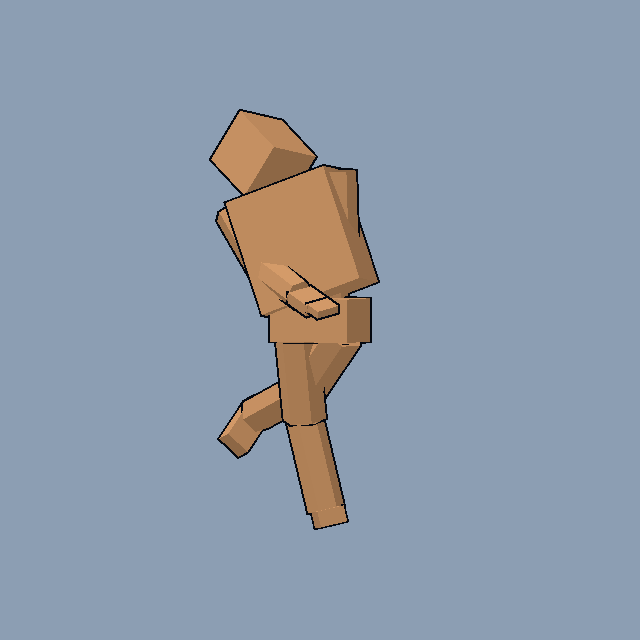

# Fighter outlines: smoothed hull normals

Rendering's plan for Animation's A0 choice (`render/anim/spike/`, d9d30e3): one rigid-skinned mesh per fighter, with an inverted-hull outline as a `next_pass` (2 draw calls a fighter). Status: built and checked (2026-09-30), ahead of Animation's A1, on a stand-in mannequin; A1's mesh plugs into the same bake and check. One change from the first plan, below: the direction lives in NORMAL, not TANGENT.

## The problem

The body is faceted: every triangle carries its own face normal, so the vertices are split per face. The spike's hull pushes each vertex along that `NORMAL`. At every hard edge, two coincident vertices then move apart in different directions, and the hull opens a crack along the edge (worst at the palm and finger slabs' box corners).

## The fix: bake one outline direction per position

**The rule: one displacement per position.** Every copy of a vertex (one per face that meets there) must move by the same vector. The hull then stays closed, whatever the faces' normals are.

**The bake**, `OutlineBake.bake(mesh) -> ArrayMesh`: a Rendering utility in `render/core/`, run once when a fighter mesh is built. It also serves any mesh imported later.
1. Group the vertices by bone (rigid skinning: `ARRAY_BONES[0]`) and by position, quantised to 0.001 units. Parts are never smoothed across bones: a seam between two bones opens as they rotate.
2. **The smoothed normal** `n` of a group is the sum of the unit face normals of its faces, each weighted by that face's corner angle at the vertex. Angle weighting keeps a long thin triangle from dominating.
3. **The push factor** `f` of a group is `1 / min(dot(n, n_face))` over its faces, clamped to 2.5. With it, every face plane that meets there moves out by the full width. Without it, a box corner (`f` = 1.73) draws the outline 42% thinner. A needle-sharp spike clamps at 2.5 rather than shooting out.
4. **Where they go:**
   - `n` replaces the vertex **NORMAL**, which skinning turns with the bone. The first plan put it in TANGENT, but the outline check showed that the Compatibility renderer's skinning rebuilds the tangent square to the normal. That destroys a smoothed direction kept there, and a posed mannequin cracked worse than the unbaked control.
   - `f` is written to **UV2.x**. A scalar needs no skinning.
   - **The body takes its facets from the screen**, since its NORMAL now belongs to the outline. `fighter_body.gdshader` computes each face's normal from the screen-space derivatives of the view-space position (`cross(dFdx(VERTEX), dFdy(VERTEX))`, turned toward the camera). That is exact per face, whatever the skinning does, and needs no stored data.

**The hull shader** (`render/shaders/fighter_hull.gdshader`, mine):
```
vec3 v = VERTEX + NORMAL * UV2.x * world_per_px * outline_px;
POSITION = ortho_clip(MODEL_MATRIX, VIEW_MATRIX, PROJECTION_MATRIX, v);   // ortho.gdshaderinc, as the body
```
- VERTEX and NORMAL arrive already skinned, in model space.
- `world_per_px` uses the absolute value of `PROJECTION[1][1]`: when the Compatibility renderer draws into a SubViewport (the panes), it flips the projection's y, and the outline would push inward. The check caught this too.
- The width is in pixels. Under the hybrid projection a fighter is orthographic at its anchor's scale, so `world_per_px = 2 * ca.w / (PROJECTION[1][1] * VIEWPORT_SIZE.y)` is one number for the whole fighter. It is computed in the vertex stage from the anchor clip that `ortho_clip` already has, so the outline is the same thickness at the centre and the edges and at every zoom.
- `outline_px` is `RenderLook.OUTLINE_PX` (placeholder 1.5, at least 1 px; Art sets the final width).
- `cull_front` and depth are as in the spike. The body's front faces always win, so the hull never z-fights.

## Checks

- **Crack sheet (new tool):**
  - Render each fighter over a magenta ground at close zoom, through every CUE_POSES pose and a sweep of bone rotations, at 1 and 2 dp.
  - For each frame, draw the body's silhouette alone, then the hull alone, and require the hull to cover the whole silhouette grown by `outline_px - 0.5`. Any gap pixel is a crack.
  - Also run it with the spike's per-face normals, as the negative control, which must fail.
- **Seam and pane:** a fighter on the seam and in both panes draws one outline (the material state is per pane).
- **Cost:** UV2 adds 8 bytes a vertex, about 65 KB a fighter at the spike's 2,700 triangles; NORMAL is already there. The hull's vertex stage gains a few ALU, and the body's fragment stage two derivatives and a cross product. There are no new draw calls: still 2 a fighter.

**Result** (`render/tools/outline_check.gd`, desktop Compatibility): 24 poses (a third far, a quarter in plain perspective, the rest with the hybrid projection) give **0 crack pixels** with the bake, against **9,024** for the unbaked control. The faceted body and its outline: 

## For A1's review (when it lands in `render/anim/`)

I'll check:
- the skinned mesh under `ortho_clip`: skinning happens before `vertex()`, so VERTEX is already posed;
- that the anchor uniform is set per pane, as FighterView does today;
- that CUE_POSES blending maps onto the layer stack without a second pose path;
- that the bake runs after every mesh build.
