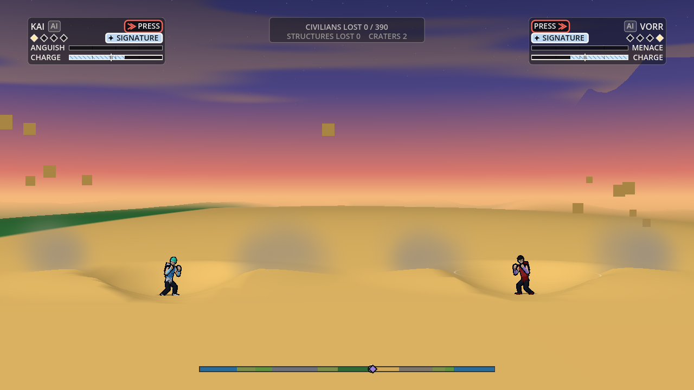
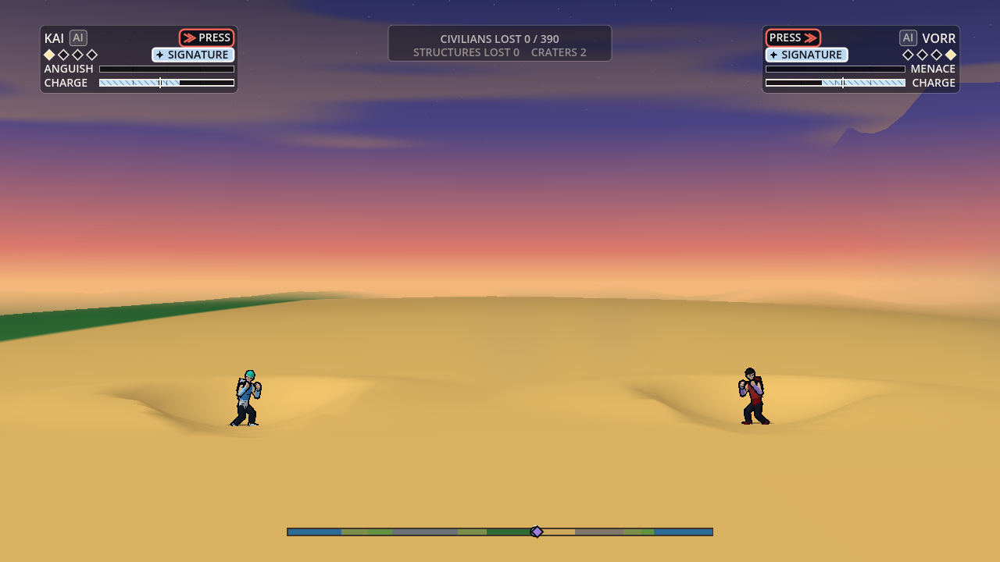

# The tumble and the intro's sky shot: Rendering's plan

Owner: Rendering and Technical Art. Status: plan, 2026-10-02. Section 2.3 (the host's side of the intro) is built and tested against Simulation's parked intro code; the rest is not built. It covers Rendering's part of two things other directors have planned:
- the tumble (World's `docs/world/ground-contact.md`: skid, bounce, tumble, rims; Animation's active ragdoll);
- the entrance (Camera's `docs/camera/rule-of-cool-shots.md` row 7; Simulation's `docs/architecture/intro-phase.md`).

Rendering reads the sim and writes nothing in both.

## 1. The tumble

**Who draws what.** The body's pose is Animation's (the ragdoll reads `mode`, `spin` and `bounces`). Dust, the contact flash and tumble blur are VFX's. Rendering has the fighter's place on screen, his shadow, the ground he marks and the rims he flies off.

### 1.1 The body touches the ground at a bounce

The host draws a fighter between his last two ticks. A bounce turns him round inside one tick, so the straight line between the two ticks cuts the corner and the body never reaches the ground.
- **How far off:** at most a quarter of a tick's travel in and out. A 1,500 units a second landing that rebounds at 675 is drawn up to 9 units above the ground at the bounce, 12% of a fighter's height. At twice the speed it is 18 units.
- **The fix:** on a tick with a `bounce` or `land` event the host draws prev, then the contact point, then cur, in two straight pieces. The events already carry the contact's `x`, `y` and `z`.
- **What it needs:** the share of the tick at which the contact happened (a field `u`, 0 to 1, on `bounce` and `land`). Without it I split the tick by the two speeds, which is close.
- **Not needed if** the sim leaves the fighter on the contact point at the end of the bounce tick. World should say which it is.

Spin needs nothing: `rot` is not wrapped in the sim, so the plain blend between ticks turns the right way at any spin World allows (3 turns a second is 18 degrees a tick).

### 1.2 The shadow

The ground shadow already follows the ground as drawn, fades to a quarter and widens by half with height, and sits on water. Two changes for bounces:
- **Height above the ground under him, not above his start.** A bounce over a rim or a slope changes the ground under the arc, so the shadow's fade must come from the gap to the ground at his x and depth each frame. It does today; a check is added to the pane check for a body over a rim.
- **A tumbling body's shadow is round.** Today's ellipse is as wide as a standing fighter. In a tumble or a skid it takes the body's drawn extent along the ground (Animation's pose bounds), so a body lying flat has a long shadow.

### 1.3 Marks on the ground

- **The trench of a skid** is sim terrain and is drawn today.
- **A tumble's scuffs** (Game Design: one scuff a contact, at most three a second, no trench). If World records them (as it records scorch), the ground shader draws them from state and they survive a replay seek. If they are cosmetic, they are VFX's decals. I prefer the record: marks that stay are pillar 4, and the shader path costs no draw call. World and VFX should settle which.
- **Wider rims** (World's G1: a lip 0.5 R wide, a crest up to 0.40 of the depth). The renderer rounds each crater into a bowl in depth from its record, and the rim must come out as a ring, not a wall across the band. The bowl function needs World's new rim profile. It must be the same pure function the sim uses, or the drawn lip and the one a skid leaves from will differ.

### 1.4 What stays as it is

- **The cut-away** follows a tumbling fighter behind buildings as it follows any fighter.
- **The lane cue** shows while his depth changes; the events' `z` is the body's depth.
- **Battle damage** comes from wounds only. A tumble adds no marks to the body unless the sim's wear says so.

### 1.5 Cost

Nothing per pixel. The contact point is a few numbers a tick. The rim term is part of the bowl function that already runs when a crater is dug.

## 2. The intro's sky shot

Camera's beat: a low wide angle on the empty landing spot (pitch -6 degrees, the fighter 7% of the screen's height), the sky above, a speck falls into frame, he lands in a crater.

### 2.1 What works today

- **The low angle.** A negative pitch is checked on the real renderer (`README.md`, "The camera's pitch").
- **The landing's crater** is a real dig, drawn like any crater at the tick it happens.
- **The fall's motion.** The fall is fast (a body height or more a tick) but straight, so the blend between ticks is smooth.

### 2.2 What needs building

- **No speck is needed.** I planned a small bright point for a fighter too far up to see. At Camera's framing (the fighter 7% of the screen's height) he is 50 pixels tall the moment he enters the frame, and he is never small: he is simply above the frame until the last ticks of the fall (6,000 units up, 36 ticks). What he needs is to read at speed, over 100 pixels a frame at the end, and that is a trail or a smear: VFX's and Animation's. A far point would matter for orbit launches (row 19) and is left for then.
- **The sky stays plain for the entrance** (EP's ruling, 2026-10-02). I had proposed that the clouds part round the falling fighter with the tier-3 opening. It is not built and will not be: Legal's stacking rule keeps the opening's sky plain, and the tier-3 reaction is its own thing.
- **Clouds at the low angle.** At -6 degrees the top of the frame looks higher than the fight ever does, where the cloud band has faded out. I will check the frame and, if the top is bare, lift the band's upper edge for the shot.
- **No head badges before the clock (built).** The badge is a HUD-space marker. Each pane switches its fighters' markers off while the intro runs, as UI hides the HUD.
- **A clock for easing (nothing to build).** The sky's opening and the lane cue ease on tick time. `S.tick` advances on pre-clock ticks in Simulation's code, so they run through the intro as they are.

### 2.3 The host (`sim_host.gd`, `main.gd`): built

Built on 2026-10-02 and tested through the real main scene against Simulation's parked `SimIntro` (`docs/architecture/pending/intro.py . code`, applied to a scratch copy; 25 checks). On a sim without the phase all of it is inert.

- **Who gets an intro.** `--intro` plays it: `main._match_setup()` adds `"intro": true` to the match setup. Without the flag nothing is added and the sim's own default stands (it starts from the intro's end state: both entrance craters dug, no pre-clock tick), until Camera, Animation and UI have their sides. A tool that drives the scene itself never adds anything, so its matches are the ones its own reference sim plays. `start_match(seed, ai, setup)` takes a setup of its own for tests.
- **Pre-clock ticks.** `SimHost.intro_running()` says whether the intro runs. On a pre-clock tick the host passes the intents as on any tick (the sim reads them only to skip), then drops the input edges, and on the intro's last tick reads every hold as if it began then. So a press is seen on its own tick, and the press that skipped fires nothing at the clock.
- **Events** reach the host's drain on pre-clock ticks as on any tick: the test saw `intro_start`, both `entrance_fall` and `entrance_land`, `staredown_start` and `clock_start` on their ticks.
- **The demo.** The key, click or button that takes player one over also skips a running intro (`SimHost.skip_intro()`): an AI's intent never skips, so the host puts a press into the new player's intent on the following pre-clock ticks until the intro ends. A take-over before the sim's `skipFrom` tick waits for it.
- **Overlays.** The host's pause (the first-run card, the pause menu) holds the intro; it runs on when the pause ends.
- **Markers.** No head badge while the intro runs.
- **What it looks like today** (`--intro`, before the others' sides): the reference camera follows the midpoint of the two fighters, so it sits in the sky while one is still 6,000 units up; UI's plates show; the fighters stand in their fight pose. That is why it ships as "skip".

### 2.3b Found against Simulation's parked code

- **The landing's dust and debris hang in the air until the clock.** The parked `sim.gd` marks an intro tick as frozen for effects (`SimFx.tickMark(S, dt, true)`), and every effects consumer steps frozen ticks at a tenth speed (the hit-stop's slow motion). Fighter A lands at tick 36; at tick 200 his crater's debris is still airborne. Marked live (`false`) in my scratch copy, the dust and debris settle as they should, and my host test still passes. **Ask for Simulation:** mark intro ticks live for effects. The fight's clock is stopped, but the entrance is a live presentation.

Tick 200 with the parked code, and with intro ticks marked live:  

### 2.4 Cost and the reduced version

- Nothing is added: no speck, and the sky does not react to the fall.
- **Reduced:** with reduced motion the sky is calm (the clouds stand still and do not part), as in a fight.

## 3. What I need, in one list

| From | What |
| :--- | :--- |
| World | Whether a bounce tick ends on the contact point; if not, `u` on `bounce` and `land`. The rim profile as a shared pure function. Whether a tumble's scuffs are recorded |
| VFX | Agreement on who draws scuffs |
| Animation | The pose's extent along the ground, for the shadow |
| Game Design | Nothing: the sky stays plain for the entrance (ruled) |
| Simulation | Intro ticks marked live for effects (section 2.3b). The tick count and the events are fine as parked |
| Controls | Nothing: the take-over press also skips the intro in the demo (EP's ruling: it matches "any press skips") |
| UI | Nothing new (the HUD hides itself) |

## 4. Build order

1. With World's G3 (the contact events): the contact point in the blend, the shadow's extent, the pane check for a body over a rim.
2. With World's G1 (rims): the rim term in the bowl function.
3. With Simulation's intro slice: the host's side is built (section 2.3). Left: the cloud band's top at the low angle, and passing `"intro": true` by default when the others are ready.
