# HUD spec: the fight with no health bars

Owner: UI and UX. Status: revision 2, 2026-09-29 (Orb's transient-HUD feedback). Draft for the EP. Numbers are starting values. Colours are semantic roles with provisional hex; Art owns the palette. Pictures are the greybox demo (`ui/demo/hud_demo.tscn`) driven by a mock event feed, not real art and not the live sim.

**Sources.** `docs/design/spec-wounds.md` (binding: no health meters, the readout rows, §4 events, §8 cinematics), `docs/design/pitches.md`, `docs/narrative/line-system.md` and `glossary.md`, `docs/architecture/fx-events.md` (the S1 events), `docs/legal/originality-rules.md` (no scanner, no numeric power readout, no hair-colour cue, "ki" internal only).

## Revision 2: what Orb asked, and what changed

Orb: "if the rings pop up momentarily then fade back it looks good as far as I can tell. I don't want clutter in the way of the actual fight choreography." The rule now is **at rest, the fighter area is clean. Only a momentary pop is allowed over the fighters.**

| Layer | Before (revision 1) | After (revision 2) |
| :--- | :--- | :--- |
| Aura crown | Always drawn around both fighters | **Transient, and it owns wear only.** Pops for a stage change, brink enter or exit, a Rally, the facade crack and a boil-over, then fades in about 1 to 1.5 s. Not for a plain hit (Art's head flashes own emotion and sense). Down during a transformation cinematic. At rest: nothing |
| Brink | Part of the crown | The one persistent cue: a **thin, faint, slow ring** (alpha 0.16 to 0.38, about 1.2 Hz), only while a fighter is on the brink. Plus a small icon on the plate |
| Stance and hidden marker over the fighter | Always | Only while the crown is up |
| Nameplate | 440 by 166 (15% of the height), five rows, tier names | **380 by 114 (11%)**, four rows: the stance chip shares the name's row, the state chips share the pips' row. Lighter scrim, no tier-name text |
| Wound cards | 1.5 s, up to three per side | **1.2 s** (1.8 s for a break, 0.7 s for a bruise), up to **two** per side, smaller |
| World toll chip | Always bright | Dim (50%) at rest; bright for 2.5 s after it changes |
| Silhouette | On in the greybox demo | **Off by default.** An option: on in `training` and as the accessibility default |
| Empress numeral on her silhouette | On | **Off by default**, still removable by data (`numeral` in her profile) |
| Bark panels | 66% scrim | 55% scrim |

Before and after, the same moment of the mock fight:

| Before | After |
| :---: | :---: |
| 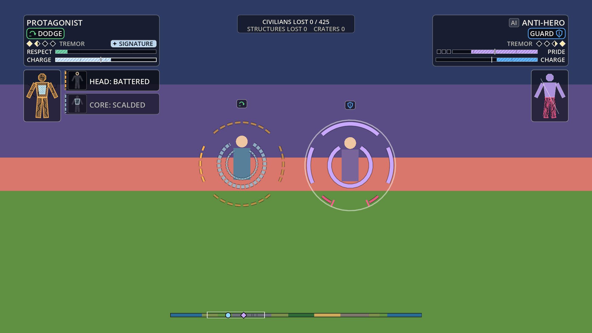 | 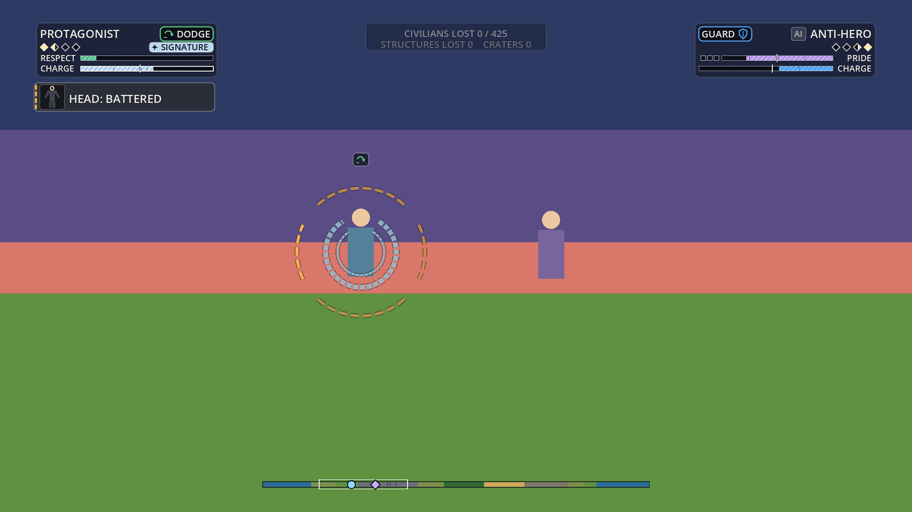 |
|  | 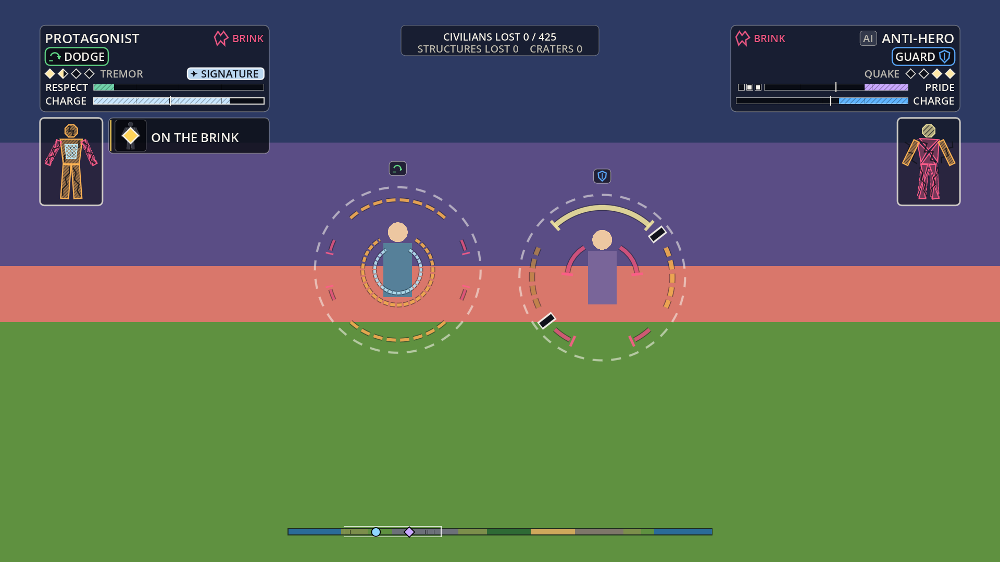 |
| 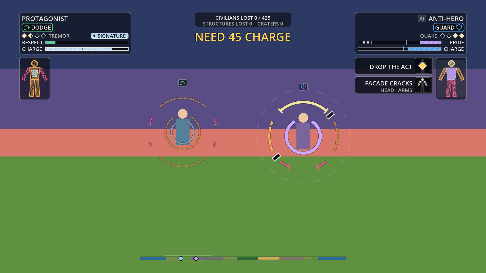 | 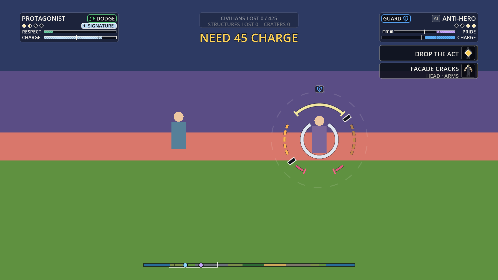 |
|  | 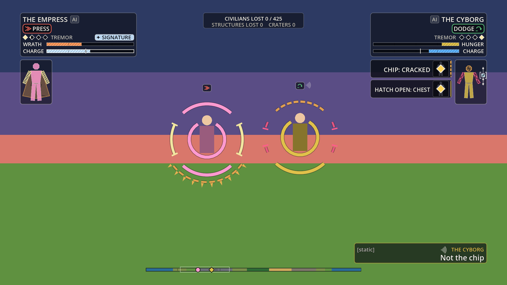 |

At rest, and a moment after a stage change (the crown has popped and is fading back):

| At rest | A stage change (arms battered), the crown popped |
| :---: | :---: |
| 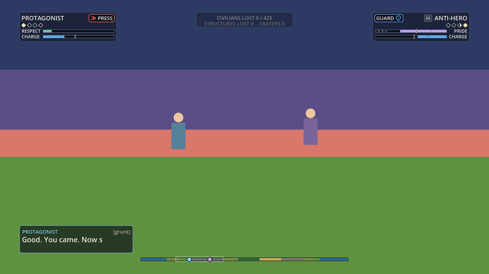 | 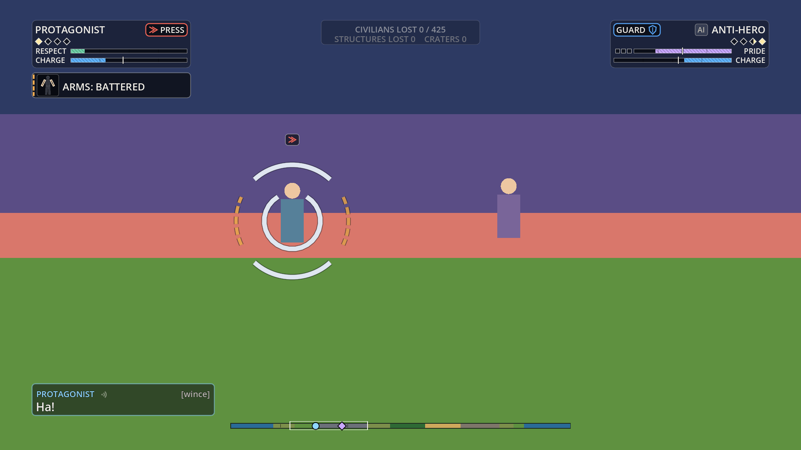 |

## 0. The idea in one screen

- **Damage is read on the body, briefly.** Each fighter's **aura crown** pops around the body when something happens, then fades. A **silhouette** (an option) shows the same state as a small figure. A **wound card** announces each change for about 1.2 s. There is no HP number anywhere.
- **The plate says what the fighter is doing.** A small strip in the screen corner: name, stance, tier pips, the ego meter (Respect, Pride, Wrath or Hunger), charge.
- **Words are barks.** Lines of dialogue appear in a lane at the bottom corner on the speaker's side, carried by a grunt mark and, with captions on, a bracketed tag such as `[wince]`.
- **The HUD gets out of the way.** In a hazard it thins. In a respected cinematic it recedes and a letterbox band carries the set piece. Nothing persistent sits in the fighters' space.

## 1. Audit of the prototype and greybox HUD

What `prototype/index.html` `drawHUD()` and Rendering's `render/core/hud.gd` draw today, and what happens to each.

| Element today | Verdict | Why |
| :--- | :--- | :--- |
| HP bar (12 px, green, amber at 50%, red at 25%) | **Cut** | Orb: no health meters. Colour-graded bars also fail for colour-blind players. Replaced by crown, silhouette and cards |
| Damage numbers over hits (`damage` events) | **Cut** (an option in `training`) | A number over every hit is an HP readout in disguise. The event now pops the crown; its `number` flag is ignored |
| Ki bar (7 px), "NEED 45 KI" | **Change** | Becomes **Charge**, a labelled bar with a tick at the signature's cost. "ki" stays an internal label |
| Unlabelled power bar and "TIER n" text (10 px) | **Change** | Four **tier pips**; the next pip fills with momentum. No number, no tier name on the plate (originality rules: no numeric power readout) |
| Menace or anguish bar | **Change** | The fighter's **ego meter** (Respect, Pride, Wrath, Hunger; the greybox fighters keep Menace and Anguish). Labelled, striped, ticked |
| Stance as text only (ATK, DEF, EVA, ESC) | **Change** | A **stance chip** with an icon and the glossary word (PRESS, GUARD, DODGE, ESCAPE) |
| Floating label over each fighter | **Cut** | Nothing over the fighters at rest. The stance icon rides with the crown pop |
| "HIDDEN" ripple and the "?" strip marker | **Keep, make shape-coded** | `HIDDEN` chip with an eye-slash icon on the plate; a hollow strip marker with a ping at the last seen spot |
| CIVILIANS LOST, STRUCTURES LOST, CRATERS | **Keep, dim at rest** | A top-centre chip. Bright for 2.5 s after a change. Portrait keeps only the civilians line |
| Chain counter (22 px, centre) | **Change** | `CHAIN ×N` chip on the plate plus chevrons on the crown while the window is open |
| Centre banner at 28% of the height | **Move** | To the top, under the toll chip. Wording renamed by the glossary |
| Planet strip | **Keep, make shape-coded** | Circle for the left fighter, diamond for the right. Optional region label |
| Director feed | **Keep as a debug toggle** | Capped by mode; the "→" is a vector arrow (section 9) |
| Seed, tick, PAUSED text; take-over prompt naming KAI and VORR | **Dev only / cut for public capture** | Narrative flags them (glossary §12) |
| Parry window, chain window, signature cost | **Missing today, added** | Sections 3 and 6 |

## 2. Layout

Everything scales by `s = min(width / 1920, height / 1080)` (landscape) or `min(width / 1080, height / 1920)` (portrait), clamped to 0.45 to 2.5. Design sizes are at s = 1. Numbers come from `ui/core/ui_layout.gd` and `ui/core/ui_look.gd`; a headless check proves them (`ui/tools/hud_check.gd`).

**Rules.**
- **Minimum text is 14 real pixels** for anything a player reads (debug text 12). Design sizes are 18 or more (name 24, stance 20, cards 24, barks 28, set pieces 34).
- **Safe area:** 4% of the width and 4.5% of the height, floors 24 and 16 px (portrait 14 and 16).
- **Fighter-clear zone:** a rectangle in which nothing persistent and nothing transient draws. Camera should keep fighters inside it. The crown pop and the brink ring belong to the fighter and ride with it.
- **Edge-anchored:** every persistent piece hugs a screen edge (the plates in the top corners, the strip at the bottom, the toll chip at the top). The middle is the fight.

### 2.1 Landscape (16:9 and wider)

| Piece | 1920 by 1080 | 1366 by 768 | Notes |
| :--- | :--- | :--- | :--- |
| Safe area | x 77, y 49, 1766 by 983 | x 55, y 35, 1257 by 699 | |
| Nameplate (each side) | 380 by 114 at the top corner (**11% of the height**) | 270 by 88 (11.5%) | Mirrored. Bars fill from the outer edge inward |
| Silhouette panel | 120 by 168 under the plate | 85 by 119 | Off by default |
| Wound-card column | beside the silhouette (or under the plate), up to 2 cards of 60 px | 43 px cards | Newest on top |
| World toll chip | 380 by 58, top centre | 270 by 46 | Dim at rest |
| Banner slot | centre x, y 147 | y 109 | One line. A world card (the fold) takes the same slot |
| Bark lanes | 601 by 120 at each bottom corner | 427 by 86 | Panels grow upward from the lane's bottom edge |
| Planet strip | 813 by 20, bottom centre | 578 by 14 | |
| Letterbox | top and bottom bars, 9% of the height each | | Only during a cinematic |
| Director feed (debug) | 520 by 324 at the left, under the cards | | Off by default |
| **Clear zone** | **x 469 to 1451, y 193 to 865: 51% by 62% of the screen** | x 333 to 1032, y 142 to 615 | Between the plate columns, under the banner, above the bark lanes |
| Frame rect | full safe width, y 331 to 865 | y 242 to 614 | Below the plate columns (the plates are shorter now, so it is taller) |

### 2.2 Portrait fallback (phones)

Designed against 1080 by 1920. From the top: two half-width plates (name, stance, pips, ego, charge on separate rows: a phone plate is too narrow to share a row), the planet strip, one row of [silhouette, card, card, silhouette], the toll chip (civilians only), the clear zone, the bark lane, and a **touch-controls reserve** of the bottom 22% for Controls.

| Piece at 390 by 844 | Rectangle |
| :--- | :--- |
| Plate (each) | 176 by 104 (12% of the height) |
| Card (one per side) | 113 by 40; a title that does not fit splits in two ("CORE" over "BROKEN") |
| Silhouette | 57 by 80 (on); dropped under 700 px tall |
| Clear zone | full safe width, **31% of the height** (25% at 360 by 640) |
| Touch reserve | y 658 to 844 |

Recommendation: **landscape is the phone default**; portrait is a fallback. The brink icon and the SIGNATURE star replace their words on narrow plates.

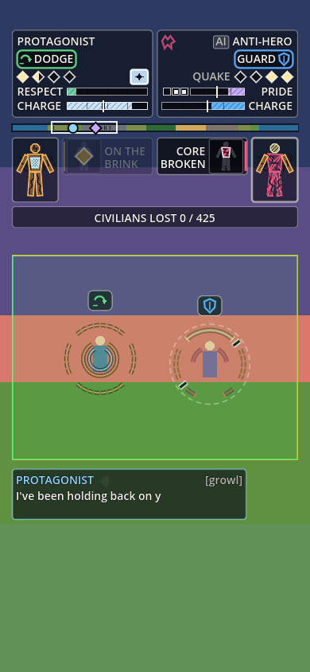

## 3. The aura crown (transient)

The crown is Orb's readout, made momentary. It is drawn on the HUD layer around each fighter's screen position (a host callback gives position and height), so Rendering does not build it in 3D.

**When it pops.** The crown owns **wear** and nothing else. Art's head flashes (`docs/art/marked-aura.md`) own emotion and sense, and a flash and a crown are never up together on one fighter. Each pop sets the fighter's `crown_hold`; a second pop extends the hold, never shortens it.

| Event | Hold (plus 0.1 s rise and 0.5 s fall) | Total |
| :--- | :--- | :--- |
| A region got worse (`region_stage`, a bruise or more; also internal core wear) | 0.60 s | about 1.2 s |
| A break, brink enter or exit, a Rally, a boil-over, the facade crack | 0.90 s | about 1.5 s |
| **A plain hit** (`damage`), a tier-up, a heat stage, Drop the Act on its own | **none** | |
| A recovery (a region improving) | none: quiet | |
| A stage change hidden by the Anti-hero's Pride mask | none (the front holds) | |
| **During a transformation cinematic** (`transformation`, `revision`) | **none, and a crown showing fades out in 0.1 s**: the surge owns the fighter | |

A hit still marks its region (the silhouette flashes it if it is on); it just does not pop the crown. The region that got worse flashes at double thickness for 0.3 s.

**Flash arbitration: `crown_up(actor) -> bool`.** `UiHud.crown_up(actor)` is true while that fighter's crown is popped for wear or still fading, and false at rest, false for the faint brink ring, and false during a transformation cinematic. Rendering's FlashView calls it: a flash due while the crown is up waits up to 0.25 s and is then dropped; a wear event arriving while a flash is up fades the flash in 0.1 s (the crown pops on the same event). **With the `crown_always` accessibility option `crown_up` is always false**: an accessibility option must never remove a whole information channel, so that player still gets the flashes. Instead the always-on crown **dims to 30% under a flash**: Rendering reports it with `UiHud.set_flash_up(actor, up)` each time a flash starts or ends on a fighter, and the crown (which is at full opacity the rest of the time) steps back so the flash reads. Chosen over drawing the flash above the crown because the crown's ring sits around the head anchor and would overlap it.

**Colours.** Crown strokes use **neutral role colours only** and never a fighter's accent: fresh is a pale neutral (`#dfe6f0`), then the wound roles (bruised, battered, broken). Art's flashes carry the accent. The silhouette and the cards' body glyph still take the fighter's colour for fresh regions; if Art wants them neutral too it is one constant.

**At rest.** Nothing. The one exception is **brink**: a thin ring at 1.1 R, alpha 0.16 to 0.38, breathing at about 1.2 Hz. Justification: brink is the only state that must be findable at a glance at any moment (spec §5 test 8, "who was closer to losing"; the finisher follows it), it is a state and not an event, and a slow, low, thin ring costs almost nothing over the choreography. It sits with the plate's brink icon, the `ON THE BRINK` card and the silhouette panel, which are all at the edge. It is an option (`brink_cue`, on by default); under reduced motion it is a static dashed ring. When the crown pops on a brink fighter the ring gives way to the full crown's own gutter.

**Geometry.** Radius `R = 0.78 × the fighter's height on screen`, floored at 46 design px and capped at 150, so a pop is readable at the widest zoom (spec §5, test 10). Arc thickness is 8.5% of R, at least 3 px, times the thickness option (0.75, 1.0 or 1.5).

| Region | Arc |
| :--- | :--- |
| Head | top arc, 84 degrees |
| Arms | a matched pair of side arcs, 50 degrees each |
| Legs | bottom arc, 84 degrees |
| Core | an inner ring at 0.5 R |
| Mantle (Empress) | a hem arc at 1.2 R under the legs, with blade teeth; never counts toward the brink |

**Stage language.** Shape carries the stage; colour repeats it.

| Stage | Shape | Motion | Colour role |
| :--- | :--- | :--- | :--- |
| Fresh | solid arc | none | a neutral (pale) |
| Bruised | solid, thinner, a tick at each end | none | pale |
| Battered | dashed, thinner | flickers about 4 Hz | amber |
| Broken | two short stubs and a spark tick: **a gap** | none | rose |
| Any change for the worse | a bright flash at double thickness, 0.3 s | one-off | white |
| Any mend | a bright dot runs along the arc, 0.5 s | one-off | white |

Every arc has a dark under-stroke. A hidden fighter's pop is at 35% opacity.

**Per fighter** (`ui/data/readout_profiles.json`):

| Fighter | Crown |
| :--- | :--- |
| Protagonist (spread) | All arcs thin together as wear spreads (from the sim's `wear`, or the stage). The core ring thickens and shimmers with each heat stage; a thin inner ring shows internal wear in cool white, never red |
| Anti-hero (pride mask) | While Pride holds, bruised and battered are masked: the popped crown is whole, with a thin unbroken **front ring** outside it. Broken regions show. Each shame stack adds a dark notch. On the facade crack the front ring shatters outward and the crown drops to its true state at once |
| Empress | Ordinary arcs plus the mantle hem. No paperwork and no processing gauge |
| Cyborg (regrowth) | A mending arc shows a slowly rotating dash, so regrowth reads while the crown is up |

**Windows on the crown** stay drawn while they last (they are short by nature, and useful only then):
- **Parry window.** A bright ring closes from 1.75 R to 1.25 R over the window, with four bracket ticks. It draws only when the sim reports a window (section 11), which fixes "a parry window with nothing parryable".
- **Chain window.** A warm arc shrinks to nothing over the window, with one chevron per link. The plate shows `CHAIN ×N`.
- Reduced motion: the parry ring is fixed at 1.32 R; the chain arc is a fixed three-fifths circle.

**Accessibility option:** `crown_always` keeps the crown up (low vision: the pitches noted the crown is weakest for low vision). Off by default. It does not disable head flashes: `crown_up` returns false for it and the crown dims under a flash (see the arbitration paragraph). It costs a redraw of the crown layer every frame while on.

**Options as data.** All player-facing HUD options and their defaults are in `ui/data/options.json` (label, help, group, an `accessibility` mark). `UiHud` loads the defaults over its own. **`info_flashes`** (danger sense, found, searching; on by default) is there for Rendering's FlashView: read `ui_hud.opts["info_flashes"]` or call `ui_hud.info_flashes()`. Turning it off hides only those flashes; emotion flashes and the wear crown are separate.

**Unaided discovery.** The first hit a new player takes shows the whole crown, with the hit region flashing, beside a card naming it. That pairing teaches the mapping without a tutorial screen.

## 4. Wound cards

A card is a small callout in the fighter's outer column under the plate: a body glyph with the region ringed and patterned by stage, and one line such as `ARMS: BROKEN`. Never over the fighters. The stage is also on the card's edge: solid = broken, dashed = battered, dotted = bruised, thin = a state card.

**Timing** (brief, Orb):
- Shown **1.2 s**, **1.8 s** for a break, **0.7 s** for a bruise. It fades in 0.08 s and out in 0.25 s. The stamp-in is a 0.18 s flash and a small slide (a still under reduced motion).
- **Merge, do not stack.** A card for the same region on the same side updates in place and restarts its timer.
- **Priorities.** 1 = a break, the brink, a Rally, a boil-over, the facade crack, Drop the Act, a cracked chip. 2 = a battered region, a heat stage, a hatch. 3 = a bruise, a one-line toast shown only when nothing else is showing on that side.
- **Queue.** A new card waits if the side is at its cap. A break may push out a lower-priority card that has had 0.35 s on screen, or an older break that has had 0.8 s. A queued stage or toast is dropped after 2.5 s; a queued break waits up to 6 s.
- **Recovery is quiet.** No card when a region improves. A Rally announces itself.
- **No card carries a number.**

**Caps** (section 8): two cards per side in normal play, one in a hazard, one in a cinematic, one in portrait.

**Withheld cards (Anti-hero).** While Pride holds, his bruised and battered cards are withheld. When the front cracks, **one** compressed card fires: `FACADE CRACKS`, with a sub-line of the regions that changed (`HEAD · ARMS`). `DROP THE ACT` fires beside it.

**Card text** is data (`ui/data/terms.json`):

| Event | Card |
| :--- | :--- |
| A region stage | `ARMS: BATTERED`, `ARMS: BROKEN` (head, core, arms, legs, and `MANTLE` for the Empress; the wording is Narrative's) |
| Brink | `ON THE BRINK` |
| Rally | the fighter's own name: `SECOND WIND`, `SPITE`, `ENCORE`, `REBOOT` |
| Protagonist heat | `BLOOD: HEATED`, `BLOOD: SIMMERING`, `BLOOD: BOILING`; `CORE: SCALDED`; `CORE: BOILED OVER` |
| Anti-hero | `HUMBLED` (a toast), `FACADE CRACKS`, `DROP THE ACT` |
| Cyborg | `HATCH OPEN: HIP`, `CHIP: CRACKED` |
| Empress | **none for paperwork** |
| Fold | world cards at the banner slot: `FOLD FLICKERS`, `THE FOLD`, `THE PLANET RETURNS` |

## 5. The silhouette (an option)

A small body figure per fighter, built from generic convex polygons: no hair, no costume, no identity colour beyond the wound stages. Each region is drawn with a **pattern**: clean (fresh), hatched (bruised), cracked and hatched (battered), shattered (broken).

- **Default: off.** On in `training` and as the accessibility default. A host flag (`silhouette`). It is the one readout that stays up, which is why it is an option: it sits at the screen edge, never near the fighters.
- **Brink.** The panel's edge pulses; under reduced motion it is a static double outline.
- **Protagonist.** An even wash; the core fills from inside with a **cross-hatch** (surface wear is a single diagonal).
- **Anti-hero.** While Pride holds, a hairline "front" crosses the figure; broken regions show. The crack drops it to the true state.
- **Empress.** A fifth region, the mantle. A real revision reprints the figure with a **plaster mark** on the mended region. The **numeral badge is off by default** (Orb did not answer whether a plain numeral reads as paperwork); turn it on with `numeral: true` in her profile.
- **Cyborg.** A **rail** beside the figure with four stations; the chip is a small square that shows scratched, cracked or split by pattern, with open brackets while the hatch is open.
- Dropped on portrait phones under 700 px tall.

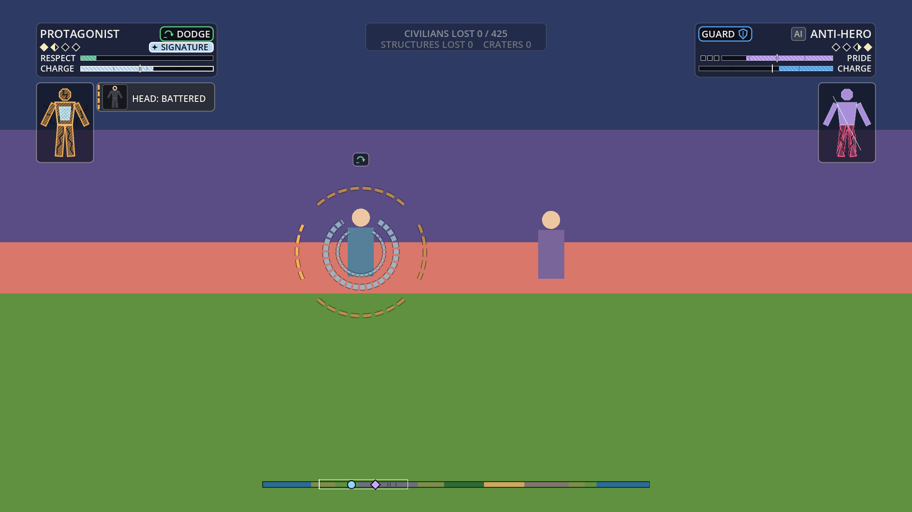

## 6. The nameplate: stance, tier, meters, states

A quiet strip in each top corner. Rows, top to bottom (mirrored for the right fighter). Landscape:

| Row | Content | Cue that is not colour |
| :--- | :--- | :--- |
| 1 | Name, an `AI` tag, a **brink icon** if on the brink; the **stance chip** (icon and word) on the far side | Stance icons: press = forward chevrons, guard = shield, dodge = curved slip arrow, escape = bracket with an arrow leaving it. Brink = a jagged-edge icon |
| 2 | **Tier pips**, then state chips; `SIGNATURE` on the far side when ready | Diamond pips filled from the near side; the next pip fills with momentum |
| 3 | **Ego meter**: label and bar | Striped fill, quarter ticks. The Anti-hero's bar has a taller marker at half Pride; shame shows as up to three squares |
| 4 | **Charge**: label and bar | Striped fill, and a **tick at the signature's cost** (45 in the greybox). Past the tick the bar brightens and the SIGNATURE chip appears with a star |

Portrait plates keep five rows (the stance chip and the state chips on their own rows) and swap the brink and SIGNATURE words for icons when narrow.

**State chips:** `HIDDEN` (eye with a slash), `TRAIL LOST` (a trail that stops short), `CHARGING` (two upward carets), `CHAIN ×N` (a chevron). They take the row's spare width and never cover `SIGNATURE`.

**Unaided discovery.**
- Stance: icon and word on the plate, and the opponent's stance is public. Tap a stance, see the chip change.
- Signature: the tick shows the cost before the bar reaches it; the chip and star show the moment it is ready; `NEED 45 CHARGE` answers a failed try.
- Tier: pips, not numbers; the next pip filling shows progress; a banner names a tier-up.

## 7. Barks, captions and grunt cues

From `docs/narrative/line-system.md` (sections 4 and 9). No voice acting: the text and the grunt carry it.

- **Lanes.** Each fighter's barks appear in its side's bottom-corner lane, in a light panel (55% scrim) edged in the fighter's colour. One line per fighter at a time; two on screen at most.
- **Timing.** Reveal speed follows the line's intensity: 30 characters a second plus 11 per intensity step, pauses on punctuation (0.14 s comma, 0.26 s full stop or question mark, 0.30 s ellipsis). It then holds about 0.9 s plus 0.035 s a character, so a bark shows 1.2 to 3.5 s. A line's own `dur` overrides the hold. Reveal is a function of the line and its age, so a replay seek shows the right text.
- **Priority.** Finisher 5, transformation 4, set piece 3, reaction 2, ambient 1. A higher priority cuts a lower one from the same fighter; an equal or lower one waits up to 1.5 s.
- **Cues.** Each cue fires a **grunt burst** mark beside the speaker's name. With **captions on** (default), the latest cue shows as a bracketed tag on the panel's top edge (`[wince]`, `[short laugh]`). Captions are an accessibility requirement.
- **Set pieces.** A finisher or transformation line runs 3 to 6 s in the bottom letterbox band, centred, 34 design px.
- **A speed setting** (Accessibility): not built yet; the reveal takes a speed factor.

## 8. The readability cap

Three modes, chosen from what the sim reports, each with hard limits.

| | Normal | Hazard | Cinematic |
| :--- | :--- | :--- | :--- |
| Entered by | default | a `shake` event with k at or above 14 (the sim's power-ups, beams, collapses and heavy launches), for 1.2 s | a respected cinematic (transformation, fold, finisher, break) or a KO, for its length |
| Wound cards per side | 2 | 1 | 1 (portrait: 1 always) |
| Toasts (bruises) | 1 | 0 | 0 |
| Bark lines on screen | 2 | 2 | 1, set pieces only |
| Feed lines (debug) | 14 | 6 | 0 |
| Plates | full | full | 45% opacity (the subject's stays full) |
| Planet strip | shown | shown | hidden |
| Letterbox | no | no | closes over 0.25 s |

**Other guarantees.**
- Everything transient fades; the highest priorities survive; nothing is lost that the crown or silhouette do not still show.
- Every text has a dark outline and every panel a scrim, so nothing depends on the background staying dark in a bright explosion.
- The hub counts what it shows, withholds and drops (`stats`), so QA can test the caps from a replay.
- The check runs the mock `stress` scenario (seeded floods): cards never exceed the cap for the mode, at most two barks, no card outlives 1.8 s.

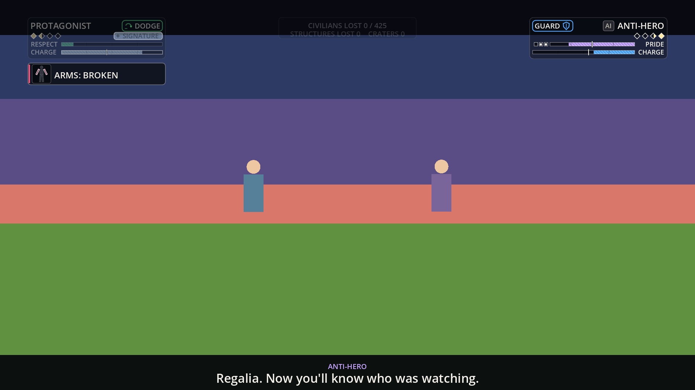

## 9. The director feed (debug toggle)

- **Toggle:** `F4` (Rendering has wired it; `F3` is the performance overlay). `Shift+F4` is reserved for the full decision overlay.
- **Content today:** the sim's feed lines (time, tag, sub), newest at the bottom, fading with age, and a header with the mode, card and bark counts and the match time. The mode caps apply.
- **The arrow fix.** The web build's fallback font (Godot's built-in Open Sans SemiBold) has no "→". `UiText` never asks the font for it: the arrow is drawn as a vector arrow inside the line, and other missing glyphs fall back to ASCII. No font was bundled; see `font-note.md`.
- **Not yet:** the full overlay (template chosen, launch candidates and scores, window opened and why) waits for Encounter's overlay spec.

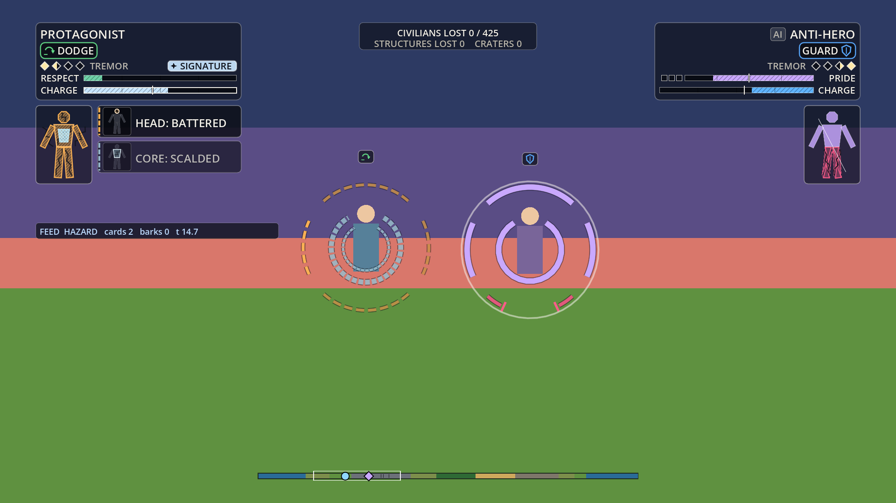

## 10. The planet strip, and what the hiding options do to the HUD

The strip is kept (it is edge-anchored and thin): circle marker for the left fighter, diamond for the right, a hollow marker with "?" and a ping at a hidden fighter's last seen spot, a camera box, ticks for fallen buildings, an optional place label. It hides during a cinematic.

Hidden information is Research's and Camera's decision. **No option is chosen here.**

| | Split-screen | Picture-in-picture | Fog |
| :--- | :--- | :--- | :--- |
| Layout change | Two viewports; each keeps its own plate and cards at its own top corner; the toll chip and strip move to the seam | One main view and a small inset with a compact plate | No layout change. The hidden fighter's pop, marker and chips are withheld from the other player |
| Planet strip | Shared, on the seam | Shared | Last seen spot only, for the hunter |
| Clear zone | Each view needs its own, at half width | The inset sits in a corner outside the zone | Unchanged |
| Risk | Halves the fight window in portrait | The inset competes with the plate column | The HUD must not leak: a card or pop for the hidden fighter would give the position away |
| Space to reserve | a 1% seam | 22% by 25% inset, bottom right, clear of the bark lane | none |

**Edge indicators for distant fighters.** If Camera adds them, the HUD reserves a 24 px band inside the safe area around the clear zone, outside the plate columns and bark lanes, using the strip's circle and diamond shapes.

## 11. The event contract

The hub (`ui/core/ui_event_hub.gd`) takes Dictionaries or objects with the same field names (the sim's `FxEvent`; slots arrive as floats and regions as strings, and both work). It never writes to the sim and draws no random numbers.

**Confirmed against the live sim (S1, 67b9e7e):** `region_stage {actor, region, stage}` (recoveries included), `region_broken {actor, region}`, `brink_enter` and `brink_exit {actor}`, `damage {attacker, victim, region, kind, number}`, `tier_up {actor, tier}`. The bridge also reads the fighter's `wear` (1/6000 of a wear point per region) for the Protagonist's smooth thinning. `hud_check` pushes wear through S1's own code and checks that the events reach the HUD.

| Event | Fields | HUD effect |
| :--- | :--- | :--- |
| `damage` | attacker, victim, region, kind | marks the region (the silhouette flashes it); no crown pop, no number |
| `region_stage` | actor, region, stage (0 to 3 or a name); optional `internal` | model, silhouette; card and pop if worse; quiet if better |
| `region_broken` | actor, region | merges with the stage card |
| `brink_enter`, `brink_exit` | actor | icon, faint ring, card, pop |
| `tier_up` | actor, tier | no crown pop (the banner names it)|
| `rally` | actor, region | mend sweep, the fighter's own card, pop |
| `heat_stage`, `boil_over` | actor, stage | heat cards, core ring; a boil-over pops the crown, a heat stage does not |
| `facade_crack`, `shame_stack`, `drop_act` | actor, n | unmask, notches, cards; the facade crack pops the crown |
| `revision_reprint` | actor, revision, region | silhouette patch; no card |
| `hatch_open`, `hatch_close`, `chip_stage` | actor, station, stage | rail, cards |
| `fold_flicker`, `fold_start`, `unfold` | | world card; `fold_start` is a cinematic |
| `finisher_start`, `ko` | actor, winner, loser, dur | cinematic mode |
| `window_open` | actor, kind (parry or chain), dur, n | crown windows |
| `chain`, `lock_lost` | actor, n, dur | chain chip, `TRAIL LOST` chip |
| `cinematic_start`, `cinematic_end` | actor, kind, dur | cinematic mode; a `transformation` or `revision` holds the crown down |
| `bark` | speaker, text, cues, priority, dur, setpiece | bark lane or letterbox band |
| `banner`, `shake` | text, col, dur; k | banner (renamed); hazard mode |
| `state` | actor and a patch of stance, tier, momentum, charge, ego, hidden, charging, aura, name, wear | plate |
| `world` | civilians, pop0, structures, craters | toll chip (brightens on change) |

**Ignored on purpose:** `revision_fill_reset`, `encore_start`, `encore_end`, `guard_fall` (paperwork and the Encore gauge are diegetic only, Orb), `finisher_contest` (no chance shown), and all particle events.

**Wish-list** (nothing here changes the sim's rules):
- **Simulation and Encounter:** `window_open {actor, kind, dur}` when a parry or chain window really opens, and only then; `cinematic_start` and `cinematic_end` with the kind and length; a `hatch_close`; an `internal` flag on core wear from heat.
- **Narrative:** confirm the card words (`CORE: SCALDED`, `MANTLE`, `STRAINED`, `BOILED`, the chip stages) and whether `HUMBLED` is a card.
- **Camera:** frame both fighters inside `clear_zone`; say whether edge indicators are wanted.
- **Controls and Game Feel:** per-device prompt glyphs for stances, parry, chain and signature; the portrait touch reserve (22%).

## 12. Terms and data

Every word the HUD draws is data in `ui/data/terms.json`, from Narrative's glossary: PRESS, GUARD, DODGE, ESCAPE; Charge (not "ki"); Momentum; Tremor to Cataclysm (named in the banner on a tier-up, not on the plate); TRAIL LOST; CHAIN ×N; NEED 45 CHARGE. Rules from Legal and Narrative:
- No numeric "power level" text, no scanner device. Tiers are pips.
- No hair-colour cue.
- `HEAVY CLASH — WON` and `COUNTERED` do not say whose win (glossary §8); the sim's feed still does. Proposal: name the winner in the tag. A change for Encounter.
- Dev text that names the prototype is not in this HUD; strip it from `render/core/hud.gd` and the page before any public capture.

## 13. For the Accessibility director (through the EP)

| Item | State | Ask |
| :--- | :--- | :--- |
| Colour-only cues | None by design: stance icons, crown shapes, silhouette patterns, card edge accents, striped fills with ticks, marker shapes | Review the roles below in a colour-blind simulation. Fighter identity colours must stay clear of the wound roles (the greybox Empress is pink; the broken role is rose) |
| Contrast | Text outline; light panel scrims (50 to 55%); arc under-stroke | Set minimum contrast per role. The scrims are lighter now, so this matters more |
| Motion | Pops (a rise and fall), flicker (4 Hz, battered), brink ring (1.2 Hz), heat shimmer, shrinking rings, slide-ins | Confirm safe rates. `reduced_motion` stills them all; every cue keeps a shape |
| Text size | 14 px floor; design sizes from 18 | Confirm; add a text-size option |
| Captions | On by default | Set levels and the speed setting |
| Crown | Transient; `crown_always` (flashes still show; the crown dims to 30% under one) and thickness 0.75, 1.0, 1.5 | Confirm the dim level; consider making `crown_always` part of the accessibility default with the silhouette |
| Silhouette | Off by default; the accessibility default (on) | Confirm |
| Screen readers | Not built | A spoken line per card and chip; card text is one string |
| Cinematic thinning | Automatic | Confirm, or add "keep the HUD" |

**Colour roles** (provisional hex, all in `ui/core/ui_look.gd`): `crown.fresh` `#dfe6f0` (neutral, never a fighter accent); `stage.fresh` (silhouette and cards) the fighter's colour; `stage.bruised` `#f2e6a0`; `stage.battered` `#ffb454`; `stage.broken` `#ff5c8a`; `internal` `#bfeeff` (never red); `charge` `#5fb4ff`; `charge.ready` `#c8e6ff`; ego roles `respect` `#6fd1a8`, `pride` `#c9a8ff`, `wrath` `#ff9a5c`, `hunger` `#e0c14a`, `menace` `#b05cff`, `anguish` `#3fd6c5`; stance roles `#ff6a5a`, `#5aaaff`, `#62d986`, `#b892ff`; `tier.pip` `#ffe9a8`; `hidden` `#bedcff`; `warn` `#ffd45a`.

## 14. Implementation, hosting and what is missing

**Files** (under `ui/`): `hud/ui_hud.tscn` and `ui_hud.gd`; `core/` (layout, look, data, model, event hub, bark timing, text, icons, body, sim bridge); `widgets/` (crown, silhouette, plate, cards, barks, centre, strip, feed); `data/` (terms, readout profiles); `mock/ui_mock_feed.gd`; `demo/hud_demo.tscn`; `tools/hud_check.gd`. `ui/README.md` has the how-to.

**Hosting.** Rendering already hosts `ui/hud/ui_hud.tscn` (setup, `anchor_fn`, `strip_fn`, `UiSimBridge.patch`, `consume_all` from `SimHost.drained`, `advance`). **Revision 2 does not change the hosting interface.** The differences a host may notice: the silhouette option now defaults to off (call `set_option("silhouette", true)` in training and for the accessibility default); two new options, `crown_always` and `brink_cue`; the HUD reads the fighter's `wear` through the bridge.

**Verification.** `godot --headless --path . --script res://ui/tools/hud_check.gd`: 734 checks pass. For the options: `info_flashes` is in the data, on by default and switchable; the accessibility options are marked; with `crown_always`, `crown_up` is false, the crown is at full opacity with no flash, dims to 30% under a flash on that fighter only, comes back after, and a transformation cinematic still holds it down. For the crown: it is down at rest; a plain hit, a tier-up, a heat stage and Drop the Act on their own do not pop it; a stage change, the brink, a Rally, a boil-over and the facade crack do; a recovery and a Pride-masked stage change do not, a break does; `crown_up` is true while popped or fading and false otherwise; a transformation cinematic fades it out in 0.1 s and keeps it down until it ends (a finisher does not lock it); the stroke colours are neutral roles and never a fighter accent; the parry window's ring draws with no pop showing; the sim's own `FxEvent` objects are read as they are; a real S1 stage change reaches the model and pops the crown; the dense scripted fight has a crown up in 27% of the time (the live sim, with far fewer stage changes, will be much lower).

**Performance (2026-09-29).** The HUD is a stack of cached layers (`ui/hud/ui_layer.gd`): each keeps its draw commands until a small signature changes (a few numbers computed every frame, 0.03 ms in all), so at rest the HUD redraws nothing and the crown, card, bark and banner layers draw nothing at all. The plates redraw when a bar moves a whole percent or a chip changes; the strip's moving marks when a fighter or the camera moves half a pixel; the crown, cards and barks every frame while they show. Also: bar stripes are one tiled texture instead of a line per stripe, the strip's segments and ticks are one multi-line each, and plate text drawn last so shapes and text do not interleave. Measured with `ui/tools/hud_bench.gd` (the live build, seed 4, HUD shown against hidden in alternating blocks of 300 frames, vsync off, RTX 5070 Ti, Compatibility renderer):

| | Wall time per frame | Render CPU | Render GPU | Draw calls |
| :--- | :--- | :--- | :--- | :--- |
| 1280 by 720, cached (now), all frames | **+0.29 ms** | +0.23 ms | +0.11 ms | +115 |
| 1280 by 720, cached, rest frames (70% of the frames) | **+0.24 ms** | +0.22 ms | +0.11 ms | +111 |
| 1920 by 1080, cached, all / rest | +0.31 / +0.27 ms | +0.23 ms | +0.08 ms | +119 / +116 |
| 1280 by 720, every layer redrawn every frame (`--force`: what caching saves) | +1.16 ms | +0.27 ms | +0.14 ms | +115 |

The wall-time cost of redrawing everything each frame is about +1.1 ms; caching takes it to about +0.25 ms, under the +0.5 ms target. **Web is not measured here** (there is no web build in this tree); the GDScript part that dominated is now near zero, and the projection from Rendering's desktop-to-web ratio is about +0.5 ms, inside the +1 ms target. Rendering should confirm with F2 on and off in the web build. The draw calls are per command, not per batch; +115 is the cost of the plates (about 40 commands each), the toll chip and the strip. If a weak GPU or the web build needs fewer, the next step is to bake the plates' static frame and labels into one texture; it was not needed here.

**Polygon errors.** "Invalid polygon data, triangulation failed" was reproduced in the live build (one in 4,800 frames with raw polygons) and is gone with the guard: every filled shape goes through `UiIcons.fill_poly`, which drops NaN and duplicate points and slivers under 0.05 px squared and skips any shape the triangulator rejects. `hud_bench --rawpolys` shows the difference.

**Not built.** The menu flow, character select, pause, settings and results; the full debug overlay and scrub; training's hint line and toggles; the caption levels and speed; a text-size option; screen-reader lines; controller and touch prompts; a bundled font.

**Risks.**
- **The crown is now rare.** It pops only for wear, so in the live sim it may almost never show until S2 retunes the wear rate; the plate, the cards and Art's flashes carry the fight until then. The spec's test 9 ("name the region most recently broken") relies on the crown and cards, so recheck it once wear is real.
- **The crown at the widest zoom** (spec §5, test 10) is floored at 46 px, but two fighters in melee overlap their pops.
- **The brink ring** is faint by design; on a bright background it may need a stronger role. Art and Accessibility.
- **Phone portrait's fight window** is 25 to 31% of the height; landscape should be the phone default.
- **The event shapes for wish-list items are assumed;** if the sim's differ, only `ui_event_hub.gd` changes.
- **Region mapping** (head top, legs bottom, arms sides, core inner ring) is a proposal for Orb.
