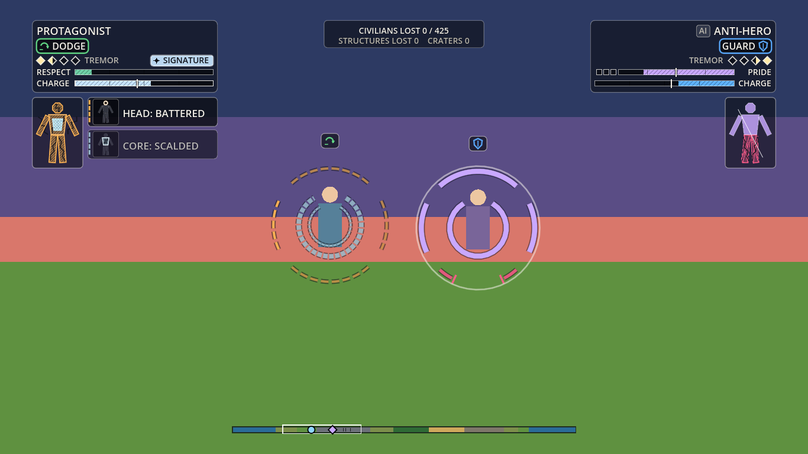

# HUD spec: the fight with no health bars

Owner: UI and UX. Status: first implementation, 2026-09-29. Draft for the EP. Numbers are starting values. Colours are semantic roles with provisional hex; Art owns the palette. Pictures are the greybox demo (`ui/demo/hud_demo.tscn`) driven by a mock event feed, not real art and not the live sim.

**This replaces the wave-1 brief** (HUD audit, debug overlay layout, menu flow). What still fits is folded in: the audit of the prototype HUD (section 1), stance, parry and chain cues, the signature-ready state and the hidden and lost-trail cues (sections 5 and 6), the hiding options (section 10), the accessibility list (section 13) and the fighter-clear zone (section 2). The menu flow and the full debug overlay are not written; see section 14.

**Sources.** `docs/design/spec-wounds.md` (binding: no health meters, the readout rows, §4 events, §8 cinematics), `docs/design/pitches.md` (the readout options), `docs/narrative/line-system.md` and `glossary.md` (bark display, terms), `docs/rendering/README.md` and `render/core/hud.gd` (today's debug HUD), `docs/legal/originality-rules.md` (no scanner, no numeric power readout, no hair-colour cue, "ki" internal only).

## 0. The idea in one screen

- **Damage is read on the body, not in a bar.** Each fighter wears an **aura crown**: arcs around the body, one per region. A **silhouette** panel shows the same state as a small figure. A **wound card** announces each change for about 1.5 s. There is no HP number anywhere.
- **The plate says what the fighter is doing.** Name, stance, tier pips, the ego meter (Respect, Pride, Wrath or Hunger), charge, and a few state chips.
- **Words are barks.** Lines of dialogue appear in a lane on the speaker's side, carried by a grunt mark and, with captions on, a bracketed tag such as `[wince]`.
- **The HUD gets out of the way.** In a hazard it thins. In a respected cinematic it recedes and a letterbox band carries the set piece. Nothing persistent sits in the fighters' space.

## 1. Audit of the prototype and greybox HUD

What `prototype/index.html` `drawHUD()` and Rendering's `render/core/hud.gd` draw today, and what happens to each.

| Element today | Verdict | Why |
| :--- | :--- | :--- |
| HP bar (12 px, green, amber at 50%, red at 25%) | **Cut** | Orb: no health meters. Colour-graded bars also fail for colour-blind players. Replaced by crown, silhouette and cards |
| Damage numbers over hits (`damage` events) | **Cut** (an option in `training`) | A number over every hit is an HP readout in disguise. Not drawn; the event is ignored |
| Ki bar (7 px), "NEED 45 KI" | **Change** | Becomes **Charge**, a labelled bar with a tick at the signature's cost. The bar's label and the banner use the glossary word. "ki" stays an internal label |
| Unlabelled power bar and "TIER n" text (10 px) | **Change** | Four **tier pips** with the tier's name (Tremor, Quake, Upheaval, Cataclysm). The next pip fills with momentum. No number (originality rules: no numeric power readout) |
| Menace or anguish bar | **Change** | Becomes the fighter's **ego meter** (Respect, Pride, Wrath, Hunger; the greybox fighters keep Menace and Anguish). Labelled, striped, ticked. The Anti-hero's has a half-Pride marker and shame pips |
| Stance as text only (ATK, DEF, EVA, ESC) | **Change** | A **stance chip** with an icon and the glossary word (PRESS, GUARD, DODGE, ESCAPE), and a small icon over the fighter. New players find it by the icon |
| Floating label over each fighter (name, stance, tier, 11 px) | **Change** | A stance icon chip only. Name and tier live on the plate. Less text over the fight |
| "HIDDEN" ripple and the "?" strip marker | **Keep, make shape-coded** | `HIDDEN` chip with an eye-slash icon; a hollow strip marker with a ping at the last seen spot |
| CIVILIANS LOST, STRUCTURES LOST, CRATERS (12 and 11 px) | **Keep, restyle** | A top-centre chip, two lines, 20 design px. Portrait keeps only the civilians line |
| Chain counter (22 px, centre) | **Change** | `CHAIN ×N` chip on the attacker's plate plus chevrons on the crown while the window is open |
| Centre banner at 28% of the height | **Move** | To the top, under the toll chip, so it never covers the fight. Wording renamed by the glossary |
| Planet strip (camera box, fighter dots, "?", dead-building ticks) | **Keep, make shape-coded** | Circle for the left fighter, diamond for the right. Optional region label from Narrative's places |
| Director feed, 14 lines, tag and sub | **Keep as a debug toggle** | Legible, capped by mode, and the "→" is a vector arrow (section 9) |
| Seed, tick, PAUSED text | **Dev only** | Not in the player HUD |
| Take-over prompt and help text naming KAI and VORR | **Cut for any public capture** | Narrative flags them (glossary §12); they name the prototype |
| Parry window, chain window | **Missing today, added** | Section 6 |
| Signature cost | **Missing today, added** | A tick on the charge bar and a SIGNATURE chip when it is ready |

## 2. Layout

Everything scales by `s = min(width / 1920, height / 1080)` (landscape) or `min(width / 1080, height / 1920)` (portrait), clamped to 0.45 to 2.5. Design sizes below are at s = 1. Numbers come from `ui/core/ui_layout.gd` and `ui/core/ui_look.gd`; a headless check proves them (`ui/tools/hud_check.gd`).

**Rules.**
- **Minimum text is 14 real pixels** for anything a player reads. Debug text is 12. Design sizes are 20 or more (name 26, stance 22, cards 24, barks 28, set pieces 34), so at 1366 by 768 (s = 0.71) the smallest text is 14.
- **Safe area:** 4% of the width and 4.5% of the height, floors 24 and 16 px (portrait: 14 and 16). The host can add notch insets.
- **Fighter-clear zone:** a rectangle in which nothing persistent and nothing transient draws. Camera should keep fighters inside it (the crown and marker belong to the fighter and ride with it).
- **Reduced clutter:** no HUD element sits over the middle of the screen. The crown is the only thing near a fighter.

### 2.1 Landscape (16:9 and wider)

| Piece | 1920 by 1080 | 1366 by 768 | Notes |
| :--- | :--- | :--- | :--- |
| Safe area | x 77, y 49, 1766 by 983 | x 55, y 35, 1257 by 699 | |
| Nameplate (each side) | 440 by 166 at the top corner (15% of the height) | 313 by 122 (16%) | Mirrored. Bars fill from the outer edge inward |
| Silhouette panel | 120 by 168 under the plate, outer edge | 85 by 119 | Off by default except in `training` and as the accessibility default |
| Wound-card column | beside the silhouette, up to 3 cards of 68 px, 12 px apart | 49 px cards | Newest on top |
| World toll chip | 380 by 58, top centre | 270 by 46 | |
| Banner slot | centre x, y 147 (under the toll chip) | y 109 | One line, 46 px at most. A world card (the fold) takes the same slot |
| Bark lanes | 601 by 120 at each bottom corner, above the strip | 427 by 86 | Panels grow upward from the lane's bottom edge |
| Planet strip | 813 by 20, bottom centre | 578 by 14 | 46% of the safe width, capped |
| Letterbox | top and bottom bars, 9% of the height each | | Only during a cinematic |
| Director feed (debug) | 520 by 324 at the left, under the cards | | Off by default |
| **Clear zone** | **x 529 to 1391, y 193 to 865: 45% by 62% of the screen** | x 376 to 990, y 142 to 615 | Between the plate columns, under the banner, above the bark lanes |
| Frame rect (Camera may use it when the fighters are far apart) | full safe width, y 479 to 865 | y 346 to 614 | Below the plate columns |

### 2.2 Portrait fallback (phones)

Designed against 1080 by 1920. Order from the top: two half-width plates, the planet strip, one row of [silhouette, card, card, silhouette], the toll chip (civilians line only), the clear zone, the bark lane, and a **touch-controls reserve** of the bottom 22% for Controls' virtual stick and buttons.

| Piece at 390 by 844 | Rectangle |
| :--- | :--- |
| Plate (each) | 176 by 109 (13% of the height) |
| Strip | full safe width, 14 px, under the plates |
| Card (one per side) | 113 by 46; a title that does not fit splits into two lines ("CORE" over "BROKEN") |
| Silhouette | 57 by 80 (on); dropped under 700 px tall |
| Clear zone | full safe width, y 321 to 577: **30% of the height** |
| Touch reserve | y 658 to 844 |

- **The fight window is small on a phone.** At 390 by 844 it is 359 by 256 px. At 360 by 640 it is 331 by 141 (22%), with the silhouette dropped. Recommendation: **landscape is the phone default**; portrait is a fallback (section 14, risks).
- One card per side (the hub caps it), the brink chip becomes an icon, and the SIGNATURE chip becomes its star, so nothing overlaps at 14 px text.

## 3. The aura crown

The crown is the default readout (Orb's pick). It is drawn on the HUD layer around each fighter's screen position (a host callback gives position and height), so Rendering does not have to build it in 3D; it can move in-world later without changing the model.

**Geometry.** Radius `R = 0.78 × the fighter's height on screen`, floored at 46 design px and capped at 150, so it stays readable at the widest zoom (spec §5, test 10). Arc thickness is 8.5% of R, at least 3 px, times the player's thickness option (0.75, 1.0 or 1.5).

| Region | Arc |
| :--- | :--- |
| Head | top arc, 84 degrees |
| Arms | a matched pair of side arcs, 50 degrees each. They change together |
| Legs | bottom arc, 84 degrees |
| Core | an inner ring at 0.5 R, nearly full |
| Mantle (Empress only) | a hem arc at 1.2 R under the legs, with blade teeth; it never counts toward the brink |

**Stage language.** Shape carries the stage. Colour repeats it.

| Stage | Shape | Motion | Colour role |
| :--- | :--- | :--- | :--- |
| Fresh | solid arc, full thickness | none | the fighter's own colour |
| Bruised | solid, thinner, with a tick at each end | none | pale |
| Battered | dashed, thinner | flickers at about 4 Hz | amber |
| Broken | two short stubs and a spark tick at the break: **a gap** | none (it never fades) | rose |
| Any change for the worse | a bright flash at double thickness for 0.3 s | one-off | white |
| Any mend | a bright dot runs along the arc for 0.5 s | one-off | white |
| Brink | the whole crown gutters (alpha and dashed outer ring at 1.18 R) | about 1.2 Hz | the dashed ring is the static shape |

Every arc has a dark under-stroke so it reads over sky, ground and explosions. A hidden fighter's crown drops to 35% opacity.

**Per fighter** (`ui/data/readout_profiles.json`; a new fighter that reuses these types is data only):

| Fighter | Crown |
| :--- | :--- |
| Protagonist (spread) | All arcs thin together as wear spreads (uses the optional `wear` value, or the stage). The core ring thickens and shimmers with each heat stage; a thin inner ring shows internal wear in cool white, never red. A boil-over throws a white ring outward |
| Anti-hero (pride mask) | While Pride holds, bruised and battered are masked: the crown stays whole, and a thin unbroken **front ring** stands outside it. Broken regions still show. Each shame stack adds a dark notch on the ring (three at most). On the facade crack the front ring shatters outward and the crown drops to its true state at once |
| Empress | Ordinary arcs plus the mantle hem. No processing gauge and no paperwork: the gauge reads through her body, guard and voice (Orb) |
| Cyborg (regrowth) | Flesh arcs crawl back: a mending arc shows a slowly rotating dash, so the transient state reads |

**Windows on the crown** (a cue exists only while something can be done with it):
- **Parry window.** A bright ring closes from 1.75 R to 1.25 R over the window, with four bracket ticks. Press when it closes. A window under 0.12 s still shows for 0.12 s. This fixes "some templates open a parry window with nothing parryable": the cue draws only when the sim reports a window (section 11).
- **Chain window.** A warm arc around the attacker shrinks to nothing over the window, with one chevron per link above the crown. The plate shows `CHAIN ×N`.
- Reduced motion: the rings do not shrink. The parry ring is fixed at 1.32 R with bracket ticks; the chain arc is a fixed three-fifths circle.

**Unaided discovery.** A new player sees a ring close on the opponent and one on themselves, presses attack when it closes, and the banner says PARRY. Nothing needs a tutorial screen. Training adds a hint line (section 14).

## 4. Wound cards

A card is a picture-in-picture callout: a small body glyph with the region ringed and patterned by stage, and one line such as `ARMS: BROKEN`. It lives in the fighter's outer column under the plate, never over the fighters. The stage is also on the card's edge: solid = broken, dashed = battered, dotted = bruised, thin = a state card.

**Timing.**
- Shown **1.5 s** (spec), **2.2 s** for a break, **0.9 s** for a bruise. It fades in 0.08 s and out in 0.25 s. The stamp-in is a 0.18 s flash and a small slide (a still under reduced motion).
- **Merge, do not stack.** A card for the same region, or the same event, on the same side updates in place: `ARMS: BATTERED` then `ARMS: BROKEN` is one card that upgrades and restarts its timer.
- **Priorities.** 1 = a break, the brink, a Rally, a boil-over, the facade crack, Drop the Act, a cracked chip. 2 = a battered region, a heat stage, a hatch. 3 = a bruise, which is a one-line toast shown only when nothing else is showing on that side.
- **Queue.** A new card waits if the side is at its cap. A break may push out a lower-priority card that has had 0.35 s on screen. A queued stage or toast is dropped after 2.5 s; a queued break waits up to 6 s.
- **Recovery is quiet.** A region that improves updates the crown and silhouette without a card. A Rally announces itself.
- **No card carries a number.**

**Caps** (section 8): three cards per side in normal play, two in a hazard, one in a cinematic, one in portrait.

**Withheld cards (Anti-hero).** While Pride holds, his bruised and battered cards are withheld (counted, not shown). When the front cracks, **one** compressed card fires: `FACADE CRACKS`, with a sub-line of the regions that changed (`HEAD · ARMS`), instead of a stack. `DROP THE ACT` fires beside it.

**Card text** is data (`ui/data/terms.json`); the working words come from the specs and Narrative:

| Event | Card |
| :--- | :--- |
| A region stage | `ARMS: BATTERED`, `ARMS: BROKEN` (head, core, arms, legs, and `MANTLE` for the Empress; the wording is Narrative's) |
| Brink | `ON THE BRINK` |
| Rally | the fighter's own name: `SECOND WIND`, `SPITE`, `ENCORE`, `REBOOT` |
| Protagonist heat | `BLOOD: HEATED`, `BLOOD: SIMMERING`, `BLOOD: BOILING`; `CORE: SCALDED` for internal wear; `CORE: BOILED OVER` |
| Anti-hero | `HUMBLED` (a shame stack, a toast), `FACADE CRACKS`, `DROP THE ACT` |
| Cyborg | `HATCH OPEN: HIP`, `CHIP: CRACKED` |
| Empress | **none for paperwork.** Ordinary wound cards only |
| Fold | world cards at the banner slot: `FOLD FLICKERS`, `THE FOLD`, `THE PLANET RETURNS` |

## 5. The silhouette

A small body figure per fighter, built from a generic set of convex polygons: no hair, no costume, no identity colour beyond the wound stages. Each region is drawn with a **pattern**, so colour is never the only cue.

| Stage | Pattern |
| :--- | :--- |
| Fresh | clean fill |
| Bruised | hatched |
| Battered | hatched more densely, with a crack |
| Broken | shattered: shards with gaps, a dashed ghost outline, cracks |

- **Default.** On in `training` and as the accessibility default; off otherwise (the greybox demo starts with it on). A host flag, `silhouette`.
- **Brink.** The panel's edge pulses; under reduced motion it is a static double outline.
- **Protagonist.** An even wash. The core fills from inside with a **cross-hatch** (surface wear is a single diagonal), thicker with heat and internal stage.
- **Anti-hero.** While Pride holds, only a hairline "front" crosses the figure; broken regions still show. The crack drops it to the true state with a white flash.
- **Empress.** A fifth region, the mantle (a cape shape behind the figure). A real revision reprints the figure: a **plain numeral badge** in the corner and a small plaster mark on the mended region. There are no stamps and no forms. **Flag for the EP and Orb:** even a plain numeral may read as paperwork; it can be removed by data (`numeral` in her profile).
- **Cyborg.** A **rail** beside the figure with four stations (head, chest, back, hip). The chip is a small square at its station that shows scratched, cracked or split by pattern, and open brackets while the hatch is open.
- Dropped on portrait phones under 700 px tall, where it would leave the fight under a fifth of the screen.

## 6. The nameplate: stance, tier, meters, states

Rows, top to bottom (mirrored for the right fighter):

| Row | Content | Cue that is not colour |
| :--- | :--- | :--- |
| 1 | Name, an `AI` tag, and on the far side the `BRINK` chip | A jagged-edge icon |
| 2 | **Stance chip** (icon and word), then state chips | Stance icons: press = forward chevrons, guard = shield, dodge = curved slip arrow, escape = bracket with an arrow leaving it |
| 3 | **Tier pips** and the tier's name; `SIGNATURE` on the far side when ready | Diamond pips, filled from the near side. The next pip fills with momentum |
| 4 | **Ego meter**: label and bar | Striped fill, quarter ticks. The Anti-hero's bar has a taller marker at half Pride; shame shows as up to three squares |
| 5 | **Charge**: label and bar | Striped fill, and a **tick at the signature's cost** (45 in the greybox). Past the tick the bar brightens, its edge thickens, and the SIGNATURE chip appears with a star |

**State chips** (they appear in the inward direction of row 2, if there is room):

| Chip | Shows | Icon |
| :--- | :--- | :--- |
| `HIDDEN` | this fighter is hiding | eye with a slash |
| `TRAIL LOST` | the opponent hid and this fighter lost the trail (the glossary's word; "lock" language is franchise-coded) | a trail that stops short |
| `CHARGING` | charging or stoking | two upward carets |
| `CHAIN ×N` | a chain window is open | a chevron |

**Unaided discovery.**
- Stance: the icon and word are on the plate and over the fighter, and the opponent's stance is public. A player who taps a stance sees their chip change.
- Signature: the tick shows the cost before the bar reaches it; the chip and star show the moment it is ready; the banner `NEED 45 CHARGE` answers a failed try.
- Tier: pips, not numbers; the next pip filling shows progress.

**Marker over the fighter.** A small chip above the crown: the stance icon (or the eye-slash when hidden) and a grunt burst when the fighter voices a cue. It is the only text-free mark over the fight.

## 7. Barks, captions and grunt cues

From `docs/narrative/line-system.md` (sections 4 and 9). No voice acting: the text and the grunt carry it.

- **Lanes.** Each fighter's barks appear in that side's lane at the bottom corner, in a panel with the fighter's colour on its edge. One line per fighter at a time; at most two lines on screen. In portrait both share one lane and stack.
- **Timing.** The reveal speed follows the line's intensity: 30 characters a second plus 11 per intensity step (0 to 3), with pauses on punctuation (0.14 s after a comma, 0.26 s after a full stop or question mark, 0.30 s after an ellipsis). The line then holds for about 0.9 s plus 0.035 s a character, so a whole bark shows between 1.2 and 3.5 s. A line's own `dur` overrides the hold. Reveal is a function of the line and its age, so a replay seek shows the right text.
- **Priority.** Finisher 5, transformation 4, set piece 3, reaction 2, ambient 1. A higher priority cuts a lower one from the same fighter; an equal or lower one waits up to 1.5 s.
- **Cues.** Each cue in a line fires a **grunt burst** mark (a dot and one to four arcs, more arcs for a harder sound) beside the speaker's name and over the fighter. With **captions on** (the default), the latest fired cue shows as a bracketed tag on the panel's top edge: `[wince]`, `[short laugh]`, `[static]`. Captions are an accessibility requirement, not an option to remove; the setting is `off`, `gestures`, `full` (today: on or off).
- **Set pieces.** A finisher or a transformation line runs 3 to 6 s in the bottom letterbox band, centred, at 34 design px, with the speaker's name above it. The bars close for it (section 8).
- **A speed setting** (Accessibility): 0.75, 1, 1.5, or "instant". Not built yet; the reveal takes a speed factor.

## 8. The readability cap

Four arcs, cards, a silhouette, heat, Pride, the fold and the barks compete for the eye. The HUD has three modes, chosen from what the sim reports, each with hard limits.

| | Normal | Hazard | Cinematic |
| :--- | :--- | :--- | :--- |
| Entered by | default | a `shake` event with k at or above 14 (the sim's power-ups, beams, collapses and heavy launches), for 1.2 s | a respected cinematic (transformation, fold, finisher, break) or a KO, for its length |
| Wound cards per side | 3 | 2 | 1 (portrait: 1 always) |
| Toasts (bruises) | 1 | 0 | 0 |
| Bark lines on screen | 2 | 2 | 1, set pieces only |
| Feed lines (debug) | 14 | 6 | 0 |
| Plates | full | full, with the same scrim | 45% opacity (the subject's stays at full) |
| Planet strip | shown | shown | hidden |
| Letterbox | no | no | closes over 0.25 s |

**Other guarantees.**
- Cards that a mode cap pushes out fade in 0.25 s; the highest priorities survive. Nothing is lost that the crown or silhouette do not still show.
- Every text has a dark outline and every panel a scrim (62% opaque), so nothing depends on the background staying dark during a bright explosion.
- The hub counts what it shows, withholds and drops (`stats`), so QA can test the caps from a replay.
- The mock's `stress` scenario (seeded floods of wounds, shakes, barks and cinematics) is in the check: cards never exceed the cap for the mode, at most two barks, no card outlives 2.2 s.

## 9. The director feed (debug toggle)

- **Toggle:** proposed `F4` (Controls to confirm; `F3` is Rendering's performance overlay). `Shift+F4` is reserved for the full decision overlay.
- **Content today:** the sim's feed lines (time, tag, sub), newest at the bottom, fading with age, plus a header with the mode, card and bark counts and the match time. The cap by mode above applies.
- **The arrow fix.** The web build's fallback font (Godot's built-in Open Sans SemiBold) has no "→". `UiText` never asks the font for it: the arrow is drawn as a vector arrow inside the line, and other missing glyphs fall back to ASCII (× to x, — to -, · to -). No font was bundled, so nothing new needs a licence row; see `font-note.md`. The sim's strings are untouched.
- **Not yet:** the full overlay (template chosen, launch candidates and scores, window opened and why, beam outcome) waits for Encounter's `docs/director/debug-overlay-spec.md`. This feed is the prototype's, made legible and safe.

## 10. The planet strip, and what the hiding options do to the HUD

The strip is kept: circle marker for the left fighter, diamond for the right, a hollow marker with a "?" and a ping at a hidden fighter's last seen spot, a camera box, ticks for fallen buildings, and an optional place label (`EVERHOLD` and Narrative's regions; data). It hides during a cinematic.

Hidden information is Research's and Camera's decision. **No option is chosen here.** What each does to the HUD:

| | Split-screen | Picture-in-picture | Fog |
| :--- | :--- | :--- | :--- |
| Layout change | Two viewports. Each keeps its own plate, crown and cards, so the plate columns move to each view's top corner and the toll chip and strip move to the seam | One main view and a small inset. The inset carries a compact plate (name, stance, brink) and no cards | No change to the layout. The hidden fighter's crown, marker and plate chips are withheld from the other player's view |
| Planet strip | Shared, on the seam | Shared | Shows the last seen spot only, for the hunter |
| Clear zone | Halves: each view needs its own zone at half width | The inset must sit in a corner outside the zone | Unchanged |
| Risk | Halves the fight window in portrait; doubles the HUD to test | The inset competes with the plate column | The HUD must not leak: a card or chip for the hidden fighter would give the position away |
| Space to reserve | a 1% seam | a 22% by 25% inset in the bottom right, clear of the bark lane | none |

**Edge indicators for distant fighters.** If Camera adds them, the HUD reserves a 24 px band inside the safe area, all round the clear zone, outside the plate columns and the bark lanes. Indicators use the same circle and diamond shapes as the strip. Say if you need them.

## 11. The event contract

The hub (`ui/core/ui_event_hub.gd`) accepts Dictionaries or objects with the same field names (the sim's `FxEvent`). It never writes to the sim and draws no random numbers.

**Consumed today (shapes assumed; S1 in `docs/architecture/wounds-plan.md` fixes the first four).**

| Event | Fields | HUD effect |
| :--- | :--- | :--- |
| `region_stage` | actor, region, stage (0 to 3 or a name); optional `internal` | model, crown, silhouette; card if worse |
| `region_broken` | actor, region | merges with the stage card |
| `brink_enter`, `brink_exit` | actor | brink chip, gutter, card |
| `rally` | actor, region | mends to battered, a mend sweep, the fighter's own card |
| `heat_stage`, `boil_over` | actor, stage | heat cards, core ring, flash |
| `facade_crack`, `shame_stack`, `drop_act` | actor, n | unmask, notches, cards |
| `revision_reprint` | actor, revision, region | silhouette numeral and patch; no card |
| `hatch_open`, `hatch_close`, `chip_stage` | actor, station, stage | rail, cards |
| `fold_flicker`, `fold_start`, `unfold` | | world card; `fold_start` is a cinematic |
| `finisher_start`, `ko` | actor, winner, loser, dur | cinematic mode |
| `window_open` | actor, kind (parry or chain), dur, n | crown windows |
| `chain` | actor, n, dur | chain chip |
| `lock_lost` | actor, dur | `TRAIL LOST` chip |
| `cinematic_start`, `cinematic_end` | actor, kind, dur | cinematic mode |
| `bark` | speaker, text, cues, priority, dur, setpiece | bark lane or letterbox band |
| `banner`, `shake` | text, col, dur; k | banner (renamed); hazard mode |
| `state` | actor and a patch of stance, tier, momentum, charge, ego, hidden, charging, aura, name | plate |
| `world` | civilians, pop0, structures, craters | toll chip |

**Ignored on purpose:** `revision_fill_reset`, `encore_start`, `encore_end`, `guard_fall` (paperwork and the Encore gauge are diegetic only, Orb), `damage` (no numbers), `finisher_contest` (no chance shown), and all particle events.

**Wish-list for the EP to route** (nothing here changes the sim's rules):
- **Simulation (S1):** the fixed shape of `region_stage` (`actor` as a fighter index; `region` as 0 to 4 or a name; `stage` 0 to 3), and a persistent per-region `wear` and `stage` readable from state (the crown thins smoothly from `wear`; events alone are enough for stages).
- **Simulation and Encounter:** `window_open {actor, kind, dur}` when a parry or chain window really opens (`openWindow`), and only then; `cinematic_start` and `cinematic_end` with the kind and length, so the HUD can recede and open the letterbox; a `hatch_close`; an `internal` flag on core wear from heat.
- **Narrative:** confirm the card words (`CORE: SCALDED`, `MANTLE: TORN`, `STRAINED`, `BOILED`, the chip stage words), and whether `HUMBLED` is a card.
- **Camera:** frame both fighters inside `clear_zone`, and use `frame_rect` when they are far apart; say whether edge indicators are wanted.
- **Controls and Game Feel:** the debug toggle key, the caption and speed settings' place in the menus, and the stance prompts (below).

**Stance and window prompts** (needs from Controls): the key or button glyph for each stance and for parry, chain and signature, per device (keyboard, gamepad, touch), so the stance chip can show its prompt for a new player and the plate can drop it after a few seconds of play. The touch reserve in portrait is 22% of the height; confirm it is enough.

## 12. Terms and data

Every word the HUD draws is data in `ui/data/terms.json`, from Narrative's glossary picks: PRESS, GUARD, DODGE, ESCAPE; Charge (not "ki"); Momentum; Tremor, Quake, Upheaval, Cataclysm; TRAIL LOST; CHAIN ×N; NEED 45 CHARGE. A tone change or a translation is a data swap. Rules from Legal and Narrative:
- No numeric "power level" text anywhere, and no scanner device. Tiers are pips.
- No hair-colour cue. Nothing in the HUD reads a fighter's hair, and the silhouette has none.
- `HEAVY CLASH — WON` and `COUNTERED` do not say whose win (glossary §8). The HUD has no such text; the sim's feed still does. Proposal: the feed's tag names the winner (`HEAVY CLASH — KAI WINS`). A change for Encounter.
- Dev text that names the prototype ("Meridian — director prototype", "take over as KAI", the help line) is not in the new HUD. Strip it from `render/core/hud.gd` and the page before any public capture.

## 13. For the Accessibility director (through the EP)

| Item | State | Ask |
| :--- | :--- | :--- |
| Colour-only cues | None by design: stance icons, crown shapes, silhouette patterns, card edge accents, striped meter fills with ticks, marker shapes on the strip | Review the roles below in a colour-blind simulation. Fighter identity colours must stay clear of the wound roles: the greybox Empress is pink and the broken role is rose, and only the shape separates them |
| Contrast | Text has an outline; panels have a 62% scrim; arcs have a dark under-stroke | Set minimum contrast for each role over the palette |
| Motion | Flicker (4 Hz, battered), brink gutter (1.2 Hz), heat shimmer, shrinking rings, slide-ins, bright flashes | Confirm safe rates. `reduced_motion` stills all of them and every cue keeps a shape |
| Text size | 14 px floor; design sizes from 20 | Confirm the floor; add a text-size option (a multiplier on the fonts) |
| Captions | On by default; the latest cue as a bracketed tag | Set the levels (off, gestures, full) and the speed setting |
| Crown thickness | 0.75, 1.0, 1.5 | Confirm the steps; consider 2.0 |
| Silhouette | The accessibility default (on) | Confirm |
| Screen readers | Not built | A spoken line per card and per state chip; the card text is already a single string |
| Hazard and cinematic thinning | Automatic | Confirm that hiding the strip and dimming plates in a cinematic is acceptable, or add a "keep the HUD" option |

**Colour roles** (semantic, provisional hex): `stage.fresh` the fighter's colour; `stage.bruised` `#f2e6a0`; `stage.battered` `#ffb454`; `stage.broken` `#ff5c8a`; `internal` `#bfeeff` (cool white, never red); `charge` `#5fb4ff`; `charge.ready` `#c8e6ff`; ego roles `respect` `#6fd1a8`, `pride` `#c9a8ff`, `wrath` `#ff9a5c`, `hunger` `#e0c14a`, `menace` `#b05cff`, `anguish` `#3fd6c5`; stance roles `#ff6a5a`, `#5aaaff`, `#62d986`, `#b892ff`; `tier.pip` `#ffe9a8`; `hidden` `#bedcff`; `warn` `#ffd45a`. All in `ui/core/ui_look.gd`.

## 14. Implementation, hosting and what is missing

**Files** (all under `ui/`): `hud/ui_hud.tscn` and `ui_hud.gd` (the root), `core/` (layout, look, data, model, event hub, bark timing, text, icons, body, sim bridge), `widgets/` (crown, silhouette, plate, cards, barks, centre, strip, feed), `data/` (terms, readout profiles), `mock/ui_mock_feed.gd`, `demo/hud_demo.tscn`, `tools/hud_check.gd`. `ui/README.md` has the how-to.

**Hosting in Rendering's main scene.** Add `ui/hud/ui_hud.tscn` under the `HUD` CanvasLayer in place of `render/core/hud.gd`, then: `setup(ids, names)` at match start; `anchor_fn(slot)` returning the fighter's screen position and height from the camera; `strip_fn()` returning `UiSimBridge.strip_data(S, cam_x, cam_w)`; each tick `UiSimBridge.patch(hud, S)` and `hud.consume_all(events)` with the events the host drains from `S.out.fx` (a `signal` in `SimHost.tick` before `S.out.fx.clear()` is the one hook needed); each frame `hud.advance(delta)` (0 while paused). The bridge reads the current greybox sim (stance, tier, charge, momentum, the prototype's ego meters, hiding, the world counters). Wear regions and brink light up when the sim emits the events. **All of this is a change to `render/` for the EP to route to Rendering.**

**Verification.** `godot --headless --path . --script res://ui/tools/hud_check.gd`: 685 checks pass (terms, layout at ten sizes, bark timing, the hub's rules, the four mock scenarios against the caps, a draw smoke of every scenario at 1920 by 1080 and 390 by 844, and the bridge against the live sim).

**Not built.**
- The menu flow, character select, pause, settings and results (wave-1 items). They wait for Game Design's modes and Orb's answers.
- The full debug overlay and the pause-and-scrub concept, which wait for Encounter's overlay spec and decision log.
- Training's hint line and toggles, the caption levels and speed setting, a text-size option, screen-reader lines, controller and touch prompts (needs from Controls above).
- A bundled font. The vector arrow makes it unnecessary; a font would improve typography and needs permission to download and a licence row (`font-note.md`).

**Risks.**
- **Crown readability at the widest zoom** is the least tested part (spec §5, test 10). It is floored at 46 px, but two fighters in melee overlap their crowns. Needs a playtest.
- **The phone portrait fight window is small** (22 to 30% of the height). Landscape should be the phone default.
- **The event shapes are assumed.** If the sim's differ, only `ui_event_hub.gd` changes.
- **Region order and side.** The crown maps head to the top, legs to the bottom, arms to the sides and core to the inner ring. This is a proposal; the silhouette and cards name every region, so it is learnable, but Orb should look at it.
- **Numeral on the Empress's silhouette** may read as paperwork (section 5).
- **The HUD reads the reference camera's screen positions.** If Camera re-frames (edge indicators, split-screen), the anchors and the clear zone move with it.
