# VFX: as built

Owner: VFX Director. Code: `render/vfx/`. Plan and reasons: `docs/vfx/plan.md`. Budgets: `docs/vfx/effect-budgets.md`. Written 2026-09-29.

Presentation only. VFX reads the sim's state and fx events and draws; it never writes the sim, never touches `S.rng`, and takes its randomness from streams derived from the match seed (`vfx.trail`, `vfx.shard`, `vfx.dust`, `vfx.hole`, `vfx.crack`). `render/vfx/tools/hash_check.gd` proves the gameplay hash is unchanged (below).

## What is in the game now

| Effect | State | Where |
| :--- | :--- | :--- |
| Motion trails: a tapered ribbon behind a fast fighter, and world-fixed wind marks the camera flies past | **Live** (trails are on by default) | `trail_state.gd`, `trail_view.gd`, `shaders/trail.gdshader` |
| Ground cracks and fissures from `S.craters` and `S.slides` | Built, **off** (`VfxLook.CRACKS_DEFAULT`) | `crack_gen.gd`, `crack_mesh.gd`, `crack_view.gd`, `shaders/crack.gdshader` |

| Scorch embers by beam variant | Built, **off** (`VfxLook.EMBERS_DEFAULT`) until Rendering stops drawing ImpactFx's own scorch sparks | `debris.gd` (`embers`) |
| Break ring: one thin arc at the front the moment a fighter reaches full speed | **Live** | `trail_state.gd`, `trail_view.gd` |

Rendering's hooks (committed in ef2d55c): `SimHost.vfx` (a `VfxHub`: `reset`, `consume`), `PaneWorld.vfx_layer` (a `VfxLayer`: `hub`, `build`, `update`), and in `main.gd` `note_frame`, `reduced_motion`, `--novfx` and `--vfx-quality=0|1|2`. The layer finds its pane's curvature state and the planet's ground field through its parent, so nothing more is needed.

To turn the "off" groups on for a look: set `host.vfx.cracks_enabled`, `destruction_enabled` and `embers_enabled` (the tools do), or change the defaults in `vfx_look.gd`. Colours are read from `data/art/effects.json` (`palette.gd`, warmed at match start; the placeholders in `vfx_look.gd` only stand in if the file is missing): glass, steel and dust by biome, the crack line and lit lip by biome (the ocean takes no cracks), the trail core.

## The effects

**Trails.** Speed is the fighter's displacement per unfrozen tick in body heights a second (bh/s, 75 units). Nothing below 40 bh/s, full at 110 (Orb decides; the EP kept these defaults). Melee dash tops out at about 18, a traversal dash is 60 to 180, a median launch about 144. The ribbon has two layers (accent band, near-white core) in four hard steps, at z -12 (behind the fighter, never over it), at most 14 bh long. Wind marks are lens-shaped dashes fixed in the world, spawned 4 to 18 bh ahead of the fighter and left behind; each is at least three frames long so it never strobes. A fighter's marks draw only while it is on screen. A rush gets no trail unless it is faster than 110 bh/s (it has its own silhouettes). Reduced motion removes the marks and halves the ribbon; quality low drops the outer band and the marks.

**Cracks.** A crack set is a pure function of one sim record (a crater or a slide), the match seed and the quality level, so a seek or late join rebuilds it identically (`hub._sync_cracks` reads `S.craters` and `S.slides`, not events). Hairlines run mostly along x (they read best at the grazing camera), forks and jogs, more and longer with sqrt(energy); a hard blow (E 6 or more, or `special`) adds one to three wide fissures with broken edges and a lit lip; a slide adds splits along both trench edges, a herringbone of spurs and a fan where it stopped. Lines are cut every 40 units and draped on the ground as drawn (`GroundField.ground_at`); the shader widens each to a least on-screen thickness (the ground is seen at about 6 degrees), lifts it 6 units, grows the web outward over 0.45 s of sim time, and stops at the fighter plane (the foreground rule pulls land in front down). A plan idea, a cutaway gash at the ground profile, was dropped: land in front of the plane occludes anything at the plane below the profile, so it cannot be drawn without drawing over fighters.

**Shrapnel, holes, dust.** `building_hit` (B2: `b x y z damage ratio outcome link n spd keep ux uy kind w h owner victim`) gives the burst-through: glass slivers and triangles and a dust puff thrown back at the entry on the front face, a forward cone of glass, steel bars and concrete chunks at the exit, a thin ring at each. A collapse leaves no holes (the building goes); heavy, wreck and crack leave a jagged hole decal, up to three per building, removed when it falls. `chain_link` streams dust and chips along the segment. `building_fall` (exists) schedules, at its `delay`, a dust skirt around the base, a column up the tower and chips falling straight down, plus a flat ring; a folded summary (`b` -1) is one cloud. Debris flies ballistically (gravity 1,000, two bounces off the terrain), in front of the facade (z = facade + 24 to 54) and behind the fighters. Sim hit-stop slows it to a tenth, as for the reference particles.

## Pictures

Trail on a launched fighter in a real match (split screen; the black line is the divider): 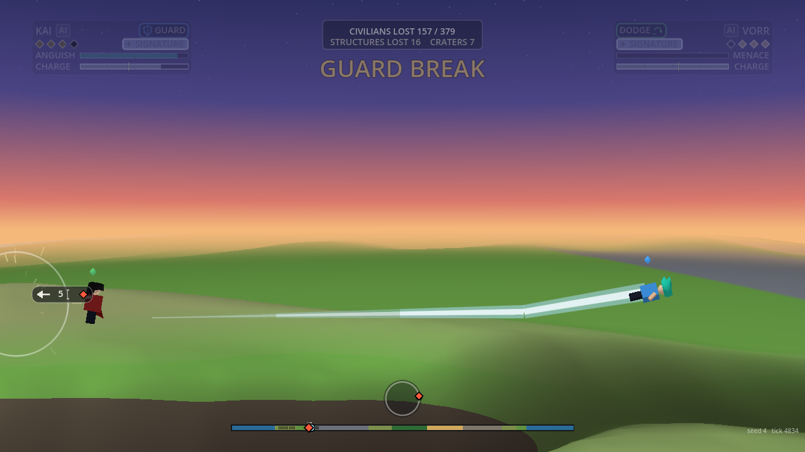

Cracks from a power-up (staged) and along a slide's trench in a real match: 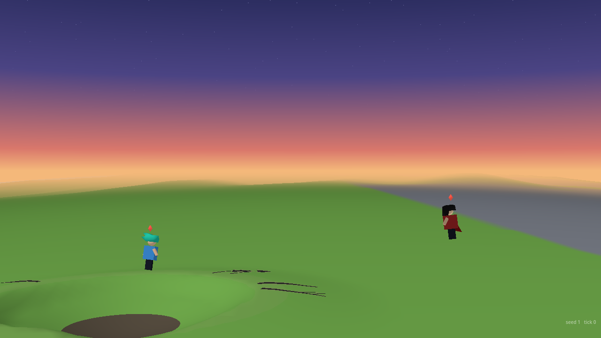 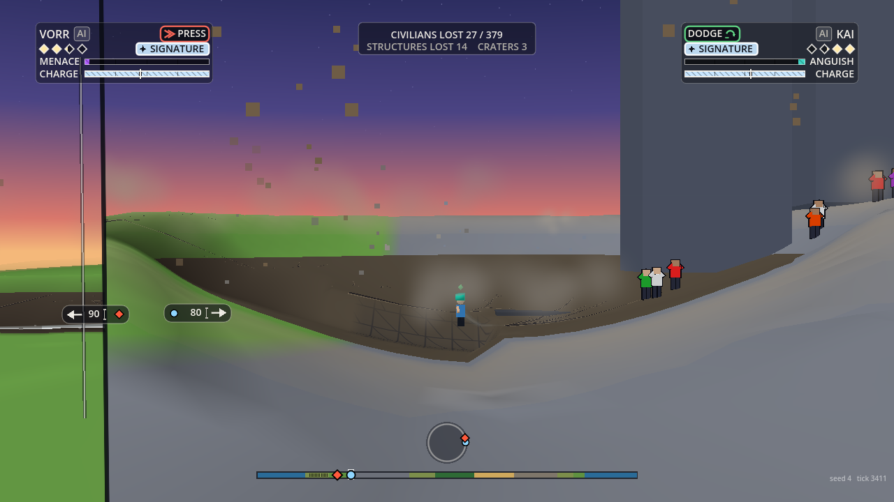

The mock burst-through at Camera's hold (glass thrown back at the entry and forward at the exit, steel, chunks, dust), a chain between two towers, and a block imploding (the towers vanish; Rendering's fall animation is not in this scene): 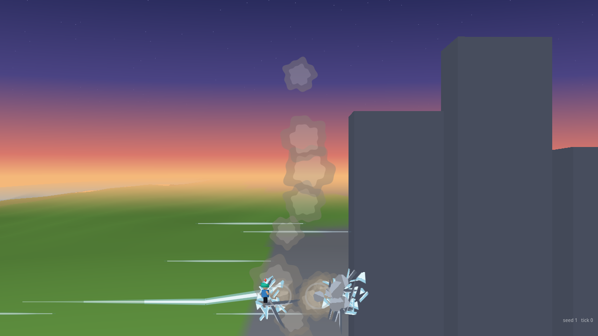 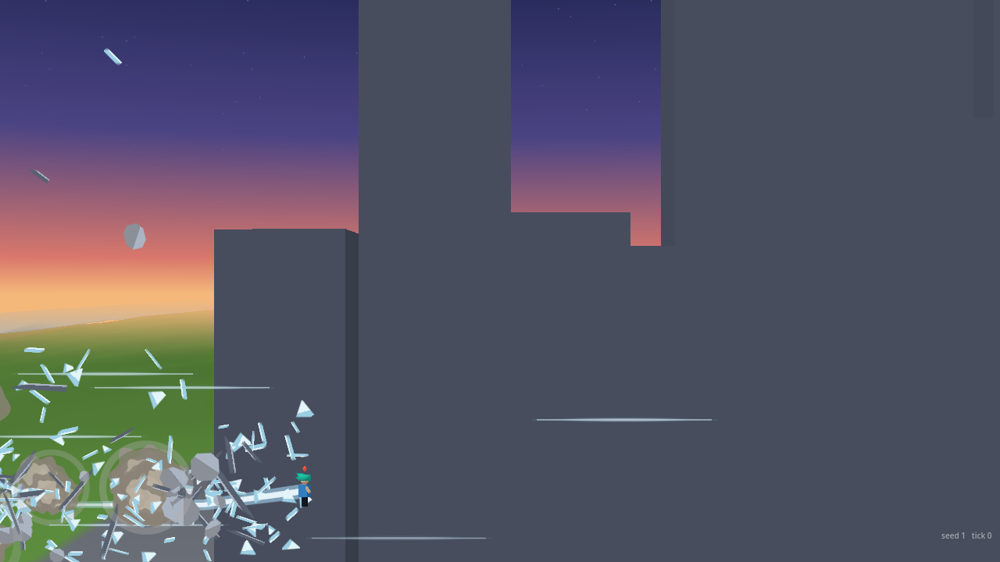 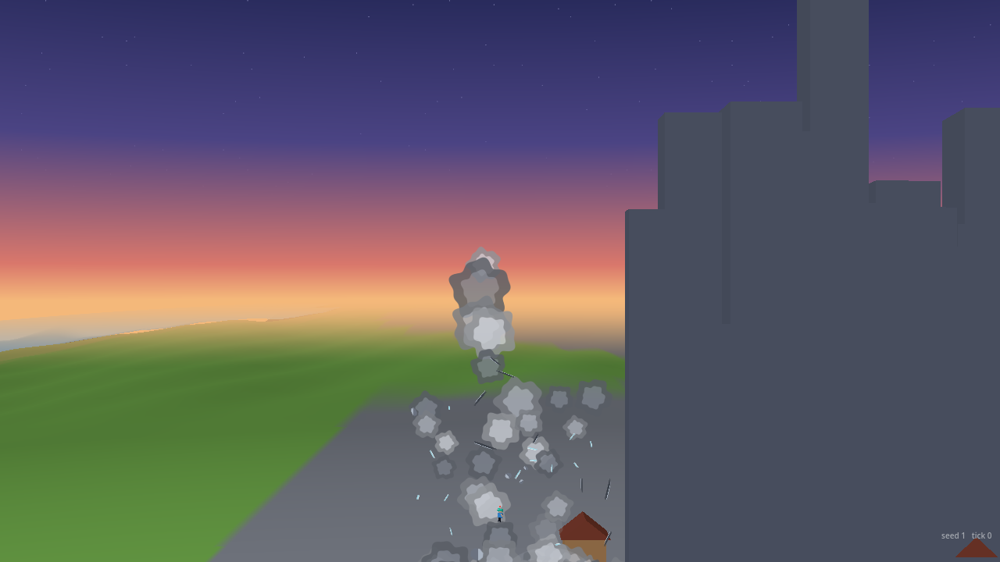

## Tools

All from the repo root, with Godot 4.7.2. Tools with pictures need a window; `--headless` ones do not. A new `class_name` script needs one `godot --headless --path . --import` before a tool can see it.

| Tool | Command (after `--script res://render/vfx/tools/`) | What it does |
| :--- | :--- | :--- |
| `hash_check.gd` | `-- --seeds=12345,4,7 --ticks=3600 [--negative-control]` | Gameplay hash (which includes `S.rng`) against the sim alone, every 60 ticks, for 60 Hz, 144 Hz, two jittered runs, quality low with reduced motion, and the split screen, with cracks and destruction on. Fails if the effects never ran. The negative control must fail |
| `vfx_shots.gd` | `-- --out=DIR --seed=4 --split [--cracks] [--on=impact --delay=25]` | Pictures from a real match at full trail strength, or after each impact |
| `crack_shots.gd` | `-- --out=DIR [--only=impact_mid,slide_paved]` | Posed cracks on staged craters and slides |
| `mock_shots.gd` | `-- --out=DIR --scenario=burst\|heavy\|chain\|implode\|all` | The mock burst-through, a heavy wreck with a hole, a three-tower chain, a block imploding, with Camera's 21-tick hold |
| `worst_case.gd` | `-- --frames=360` | The worst scene (a chain through four towers, an imploding block, 14 crack sets, two fighters at full trail), on and off |

## Checks run (2026-09-29, Godot 4.7.2, RTX 5070 Ti, Ryzen 7 9800X3D, 1280x720)

- **Hash.** `hash_check.gd` passed on seeds 12345, 4 and 7 to tick 3600, all six ways, cracks and destruction on. In those matches the sim's own `building_fall` events drove 6,797 debris bits, 1,095 marks spawned and 122,780 ribbon segments were drawn, and 54 crack meshes were built in 30.4 ms. The negative control (a 0.001 nudge of one fighter's x) fails. Rendering's `determinism.gd` passes with the hooks in.
- **Trails on a real match** (seed 4, 4,800 frames, split on): frame mean 1.688 ms without VFX, 1.702 with; p99 3.619 and 3.646; draw calls 189.6 and 189.8; the same final gameplay hash.
- **Worst-case scene** (`worst_case.gd`, VFX on against off): frame CPU mean 0.369 against 0.226 ms, p99 0.906 against 0.342, max 0.932 against 0.406; GPU mean 0.113 against 0.112; draw calls 25 against 24 (max 31 against 26). The hub's `consume` averages 0.22 ms with a 2.9 ms peak on the tick that spawns a chain and a block at once, and the layer's `update` 0.17 ms with a 1.8 ms peak. The debris pool reaches its 460 cap, 14 crack sets are 3,718 triangles, 16 ribbon segments and 10 marks.
- **Not measured:** the web build and an old laptop. The desktop CPU cost is small; on a machine several times slower the peak tick would be a dropped frame, which is why spawns are budgeted per tick (`SPAWN_PER_TICK`) and crack meshes build one a frame. The web number needs the CI export and `research/engine-spike/tools/bench-browser.mjs` with and without `--novfx`.

## Known limits

- Building depth. Rendering still draws every building's face at `RenderLook.Z_BUILDING_FRONT`; `VfxHub.front_z()` is the one place to change when it draws them at the sim's own `z`.
- The sim's own `debris` and `dust` events for a building's fall are still drawn by Rendering's particle view, so a collapse shows both while destruction is on. One of the two should go before it ships (Rendering and VFX, through the EP).
- The fighter is not hidden inside a building during the burst-through: that needs B2's depth (`z`) and Rendering's fighter placement. The prototype shows the fighter in front of the facade.
- Colours are placeholders (`vfx_look.gd`); Art's semantic roles replace them as data.
- Trails and beams share a colour language (accent and near white). If a playtest reads them as one thing, the trail moves to a neutral pale.

## Added after the first report

- **Fissure vents.** A fresh fissure (a record under half a second old) throws two dust puffs up from every third point as its front reaches it; a set rebuilt after a seek has none.
- **Scorch embers.** `scorch` events shed embers by variant: glass flecks (GLASS TRENCH), cinders (FIRESTORM), spray puffs (HORIZON CLEAVE), heat-ramp sparks elsewhere. Fire keeps the orange and yellow. Rendering's `ImpactFx` still draws its own sparks for the same event, so this stays off until it stops.
- **Break ring.** One thin arc, 0.25 s, at the front of a fighter the moment it reaches 110 bh/s from below (not in a rush, not twice within 1.5 s).
- **Implode column.** Dust in three tones (dark back bank, body, light front) in the biome's colour, and the column is spawned floor by floor over half a second, top first.
- `tools/effects_check.gd` (headless) asserts the palette, vents, embers, the pool cap and the ring; it passes, and `hash_check.gd` still passes on seeds 12345, 4 and 7 with all three groups on (9,122 debris bits from the sim's own `building_fall`).

## Playtest 2 fixes (2026-09-30)

- **Arcs and wires over the terrain.** Cause: the crack shader widened each strip in world z at a fixed height, so on a mountain flank the edges hung in the air, and cracks reaching past the ground band (where the drawn ground is the far relief, not the sim's) floated above it. Fixed: widening is now in screen space from vertices that stay on the ground; cracks stop at 80% of the band's depth; and they fade out between 2,500 and 7,000 units behind the plane.
- **Embers.** They fire only on `scorch` events, that is, a beam close to the ground, and only with `embers_enabled` (Ctrl+F6). They were 10 to 26 units long with 1 to 4 per event, so invisible next to ImpactFx's sparks. Now 30 to 80 units long, 2 to 8 per event, up to 12 a tick and 100 alive, in the heat ramp (glass flecks over a glass trench, spray over the sea). `mock_shots.gd --scenario=embers` shows all four variants.

## B2 events, live (2026-09-30)

The sim now emits `building_hit` (with `floor`-less summaries for small buildings), `floor_hit`, `floors_fall`, `chain_link` and `launch_depth` (`docs/architecture/fx-events.md`). The hub reads them as they are:

- `building_hit` on a small building (under 5 floors): the whole-building burst at the hit point (`x`, `y`, unit velocity `ux`, `uy`; the real speed is `spd` times the launch's traversal factor), plus a hole decal if it stands. On a skyscraper the same tick's `floor_hit` draws the burst and the summary adds nothing.
- `floor_hit` punch: the burst confined to the floors struck, a row of windows blowing out along the facade, rings; crack: a window shower; dent: a puff and chips. **No decal**: Rendering cuts the tunnel into the mesh from `fmask` (EP ruling). `floors_fall`: dust and glass and steel at each broken floor, top first over 0.4 s, then a ring at the base.
- `chain_link`: dust and chips along the segment. Shards and dust sit at the building's real facade depth (`z + d / 2`), now that Rendering draws buildings at the sim's own depth.
- One tick's spawns are budgeted (260 puffs, then 200 shards) so a busy tick stays small.
- Pictures from real matches (`tools/brunt_shots.gd`, seed 1): a four-house chain 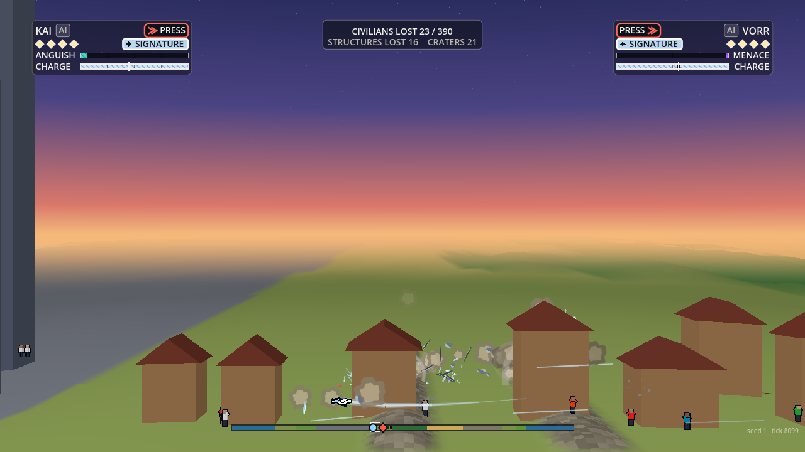 and a punch on a 23-floor tower, far back in the depth rows 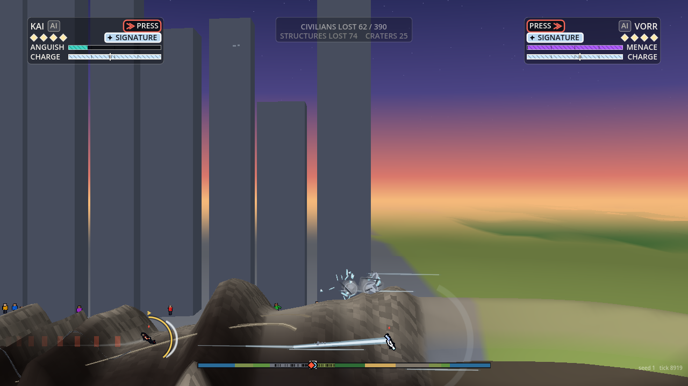
- Checks: `effects_check.gd` covers punch, crack, dent, pancake, the summary being skipped when a `floor_hit` came, holes only for small buildings and the pool cap under repeated pancakes; `hash_check.gd` (seeds 12345, 4, 7, all groups on, real B2 events: 15,941 debris bits) and `render/tools/determinism.gd` pass; worst-case scene CPU +0.17 ms mean, +0.55 ms p99, GPU +0.008 ms.

## Trail kink fix (2026-09-30)

Bug: a trail bent behind a fighter flying straight. Cause: the ribbon's head was drawn at the fighter's chest (feet + 36) but the history behind it was stored at the feet, so the first segment dropped 36 units and then ran level, a kink at the head on every flight. The hybrid projection, camera motion, pane anchors and the seam were not involved (the ribbon is built in world space and a planar line stays a line under the perspective). Fix: the history is stored at chest height (`trail_state.gd`). `effects_check.gd` now asserts a level and a climbing flight give a ribbon on one line (it measured 36.000 units off before the fix and 0.000 after). Before and after, same seed and tick: 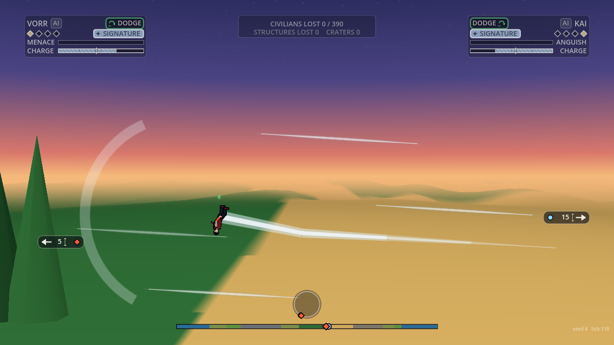 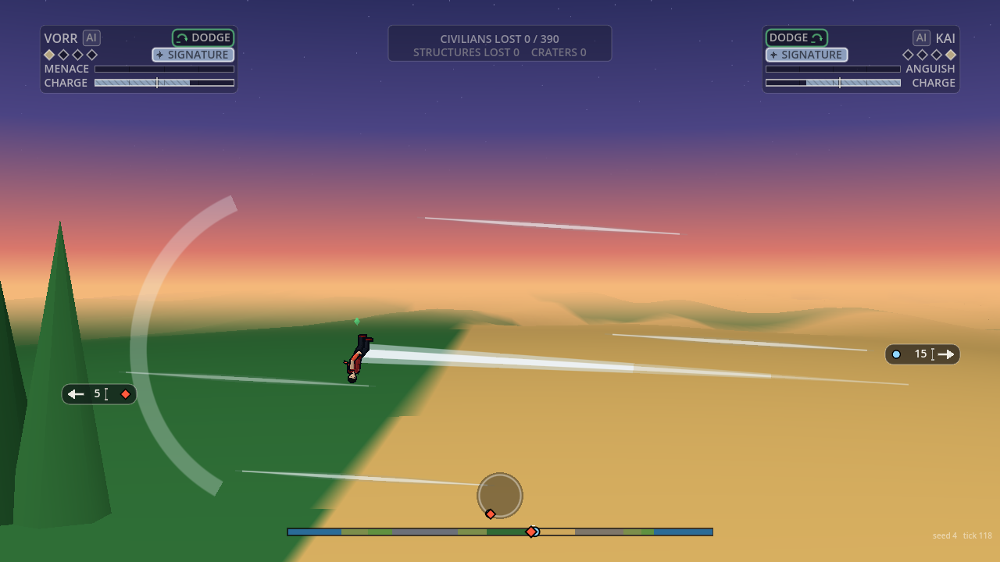

## Trail at depth (B3, 2026-10-01)

A launched fighter now flies into the building rows at the sim's depth (`Fighter.z`, interpolated by `host.fighter_z`). The trail keeps `z` in its history, draws the ribbon head at the fighter's depth (12 units behind it) and each segment at the depth it came from, scales its least on-screen width by the perspective at that depth (the pane camera's distance is passed by the layer), and places marks and the break ring relative to the fighter's depth, so the tip meets the fighter and the ribbon sorts with it. `effects_check.gd` asserts the ribbon's depth run (head at the fighter's z, tail at the earlier depths). Picture (mock burst, the fighter eased into a tower's row): 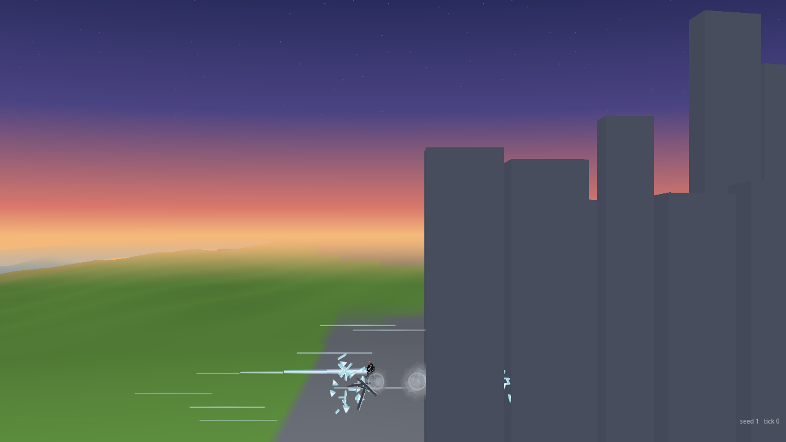

## More dramatic splashes (2026-10-01)

Orb on the skipping: "looks great, and i'd like to see more dramatic splash effects." Skip, plunge, beam strike and a low fast flight's wake now throw cel-drawn spray streaks and foam scaled by the fighter's speed and tier (code `water.gd`, numbers `data/vfx/water.json`, flag `water_enabled`, default on). Full write-up with before and after pictures, budgets and the plan for the coming `left_ground`, `bounce`, `skip` and `land` events: [water-plan.md](water-plan.md). A plunge 10 ticks in, before and after: 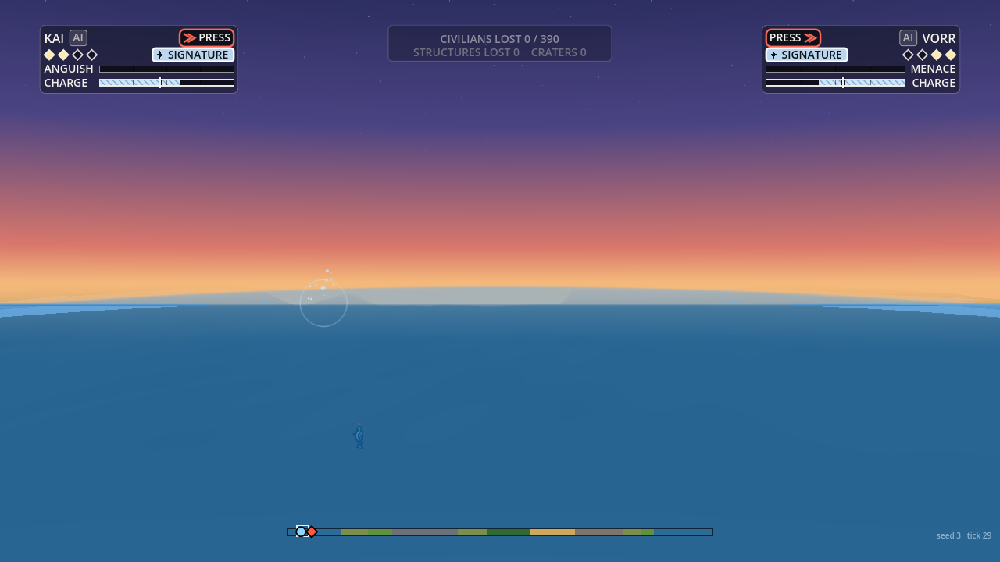 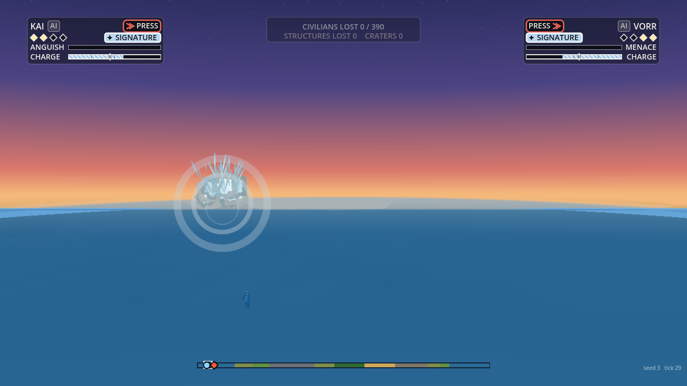

- Checks: `effects_check.gd` has 16 water cases (scale, a skip and a fifth skip, a splash of 8 not double-handled, plunge and rebound, low quality, beam, the cap, wake, off, data fallback, data against defaults); `hash_check.gd` (seeds 12345, 4, 7, six ways) and `determinism.gd` pass with water on; `worst_case.gd --sea` is the cost scene.

## Transformation effects (2026-10-01)

Keyed to the sim's `transform` event and its `version` (full, short, live), beat lengths from `moveset-rules.md` §10.8: the aura and loose dust are drawn inward on the gather, one ring leaves the body on the break while the aura swaps to the new tier's shape in a single frame, then the new aura holds steady and eases out. No upward flame, no lightning, the flash in the fighter's own colour. The clock is the host's tick, so a full or short version plays through the sim's pause (`S.pause.left`). Code `transform.gd`, `transform_view.gd`, `shaders/transform.gdshader`; numbers `data/vfx/transform.json`; flag `transform_enabled`, default on. Write-up with before and after pictures, budgets and what it needs from others: [transform-plan.md](transform-plan.md). The break, before and after:  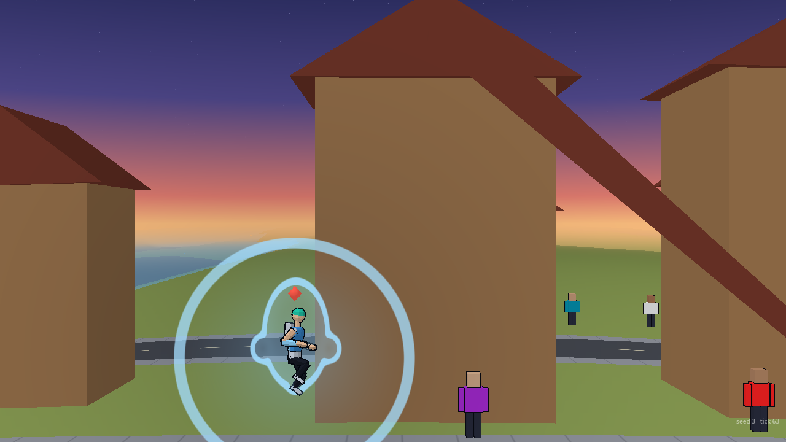

- Checks: `effects_check.gd` has 16 transformation cases (beats per version and scaled to a longer reveal, the clock through frozen ticks, a live version holding on a hit-stop, aura timing, four distinct tier shapes, flag off, data fallback and data against defaults). `hash_check.gd` now readies a form at ticks 300 and 1500 in every run, so real `transform` events and their Q10 pauses are in the compared match (it fails if none started; 108 started across its runs); it passes with the effects on, and so does `determinism.gd`.

## Standing aura while charging or attacking (2026-10-01)

Orb's answer: the aura is on only while the fighter charges or attacks, not constant, not gone. The current tier's aura shape and colour, eased in over 8 ticks and out over 24 after an 18-tick hold, weaker than the transformation's own (0.40 alpha against 0.60), keyed to the charge hold, the beam charge, being the attacker of the running exchange, a rush, or an own beam. Code `aura.gd`, numbers `data/vfx/aura.json`, flag `standing_aura_enabled`. Write-up: [aura-plan.md](aura-plan.md). Before and after, 30 ticks into a charge: 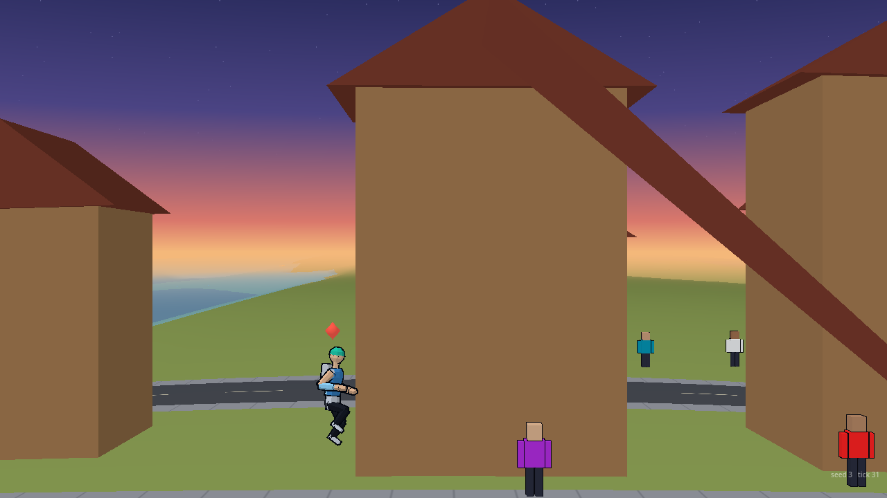 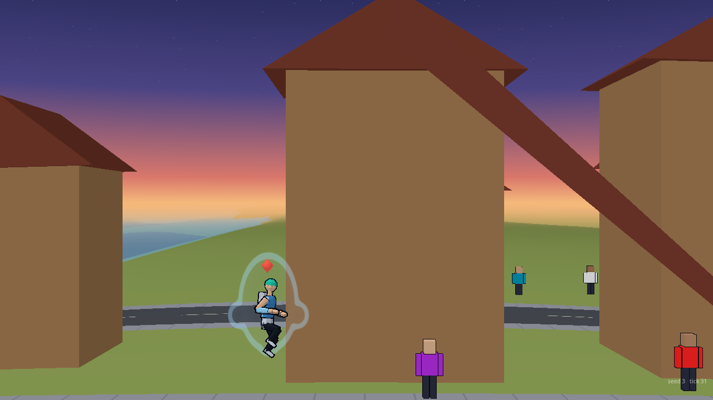

- Checks: `effects_check.gd` has 14 standing-aura cases (off when free, eased in and out, the hold, each attack signal, defender excluded, hidden, frozen ticks, a transformation cutting it, a real AI minute where it comes and goes, data fallback and agreement); `hash_check.gd` and `determinism.gd` pass with it on.

## Reactions to power, speed lines and Legal's notes (2026-10-01)

Wave 0 of the rule-of-cool plan: from tier 3 rubble lifts off the ground (scattered, with weight) and cracks spread where a high-tier fighter stands still, and a big impact blows the windows out of the block along it; the aura flickers when the fighter is worn (the core's wear stage and the brink); and speed lines alone run toward the hit on every launch and landed heavy (impact treatment B). The world effects stand down while the fighter charges and during his transformation (Legal's stacking rule), and the aura, the transformation's ring and its flash are never gold, white or red (a red-orange lane colour is swapped for Art's Anti-hero violet; see the recommendation for `fighter.json` in the plan). Code `react.gd`, `speed.gd`; numbers `data/vfx/react.json`; flags `react_enabled`, `flicker_enabled`, `speedlines_enabled`. Write-up, Legal notes, what Rendering can read, budgets and pictures: [react-plan.md](react-plan.md). The windows, before and after: 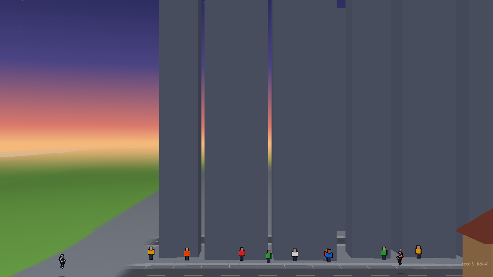 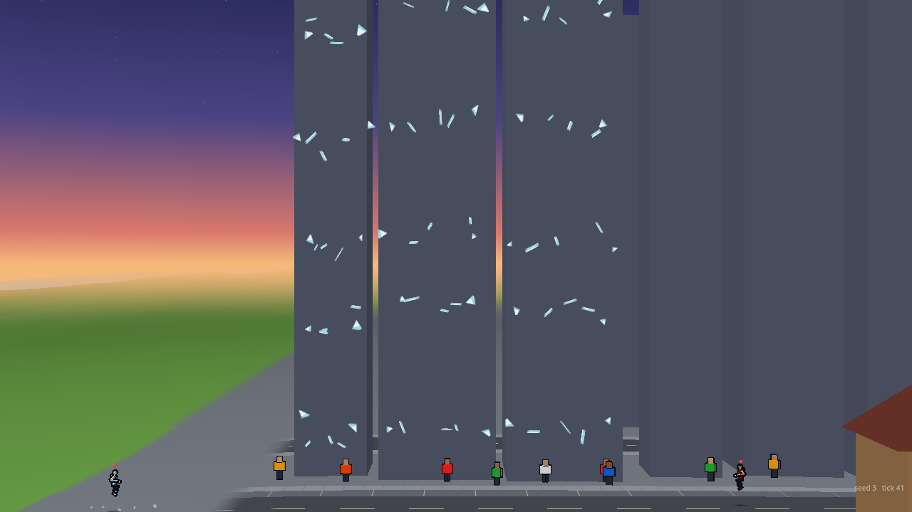

- Checks: `effects_check.gd` has the reaction cases (flicker by wear stage and brink, rubble by tier, scattered and capped, standing down while charging, standing cracks starting, fading and being removed, windows by tier and energy with the shock's travel, the list for Rendering, Legal's colour rule) and the speed-line cases (a heavy, a launch, the dedupe and the gap, a real minute's count). `hash_check.gd` now sets tier 3 for one fighter at tick 900 and a battered core for the other at tick 1200 in every run (and readies forms at 300 and 1500), so the reactions run in the compared match; it fails if none did. `determinism.gd` passes.

## The "violet rectangle" on the live web build (2026-10-01): Rendering's guard glow, not the aura

The EP saw a flat translucent rectangle beside and behind a fighter's lower body on the live page and suspected the aura, the flicker or a shader failing under the Compatibility renderer. Checked with a real web export (Godot 4.7.2 Web template, Chrome with ANGLE on D3D11, 800x600, `VfxLook` defaults as committed):

- **No shader fault.** The browser console shows no shader or script error, and the aura draws as its shaped outline on the web (`img/web-aura-vorr-attack.jpg`: the curved violet arc round VORR while he attacks).
- **The rectangle is `FighterView.guard`.** A defensive stance (the guard glow, `render/core/fighter_view.gd`: a sphere scaled to 12 x 84 x 60 in the stance colour) is drawn as a thin tall translucent ellipse beside the body, a fighter's height tall. It is there with every one of my effects switched off: a web export with the transformation, standing aura, flicker, reactions and speed lines all defaulted off (`img/web-guard-glow-vfx-off.jpg`, KAI guarding) is identical to the build with them on (`img/web-guard-glow-vfx-on.jpg`), and the desktop build with them off shows the same on VORR (`img/desktop-guard-glow-vfx-off.png`). The standing aura is on only while charging or attacking, so a fighter in a guarding stance does not have it.
- What to change is Rendering's: the guard glow's mesh, or its look (it reads as a flat panel, a rectangle with a soft edge, not a shield). Not edited here.
- Reproduce: `godot --headless --path . --export-release "Web" build/web/index.html`, serve it, press N, hold Shift (guard) for KAI in the demo; or `render/vfx/tools/react_shots.gd --case=rubble --slot=1 --stance=1 --nofx`.

## The "pale blue block" on KAI (2026-10-01): Rendering's afterimages, not an aura layer

Second sighting on the live build: KAI attacking at tier 1 with a thin oval outline round him (the standing aura, correct) and a flat pale blue block from the hips to the feet. Reproduced on desktop with the real sim (seed 1, both AI, `probe` of every frame where the standing aura is up at tier 1 on the ground, 800x600): at tick 133 (the "2 HIT CHAIN" frame) the block is there, and at tick 81 a row of fading pale blocks trails KAI's dash. **The same frames with every VFX flag of this work off** (transformation, standing aura, flicker, reactions, speed lines, water; same seed, same ticks) **show the same blocks pixel for pixel**: `img/afterimage-vfx-on-t133.png` against `img/afterimage-vfx-off-t133.png`, and `img/afterimage-vfx-on-t81.png` against `img/afterimage-vfx-off-t81.png`. They are the sim's `after` fx events (afterimages of a dash or rush: `x, y, face, life, col`) drawn by `render/core/particle_view.gd` as flat rectangles in the fighter's aura colour (`SHAPE["after"] = 0`), which is also why they are KAI's #8fd6ff and why they hide his legs. Not VFX, so nothing changed here. The standing aura is only the thin oval in both pictures. Not repeated on a web export: the web build runs the same scripts and the same particle code, and last time's web pair (guard glow, effects on and off) matched the desktop one.

## Earth, material and fire (2026-10-01)

The reference consumer's placeholders taken over: `debris` squares become chunks that tumble, in the right material (the biome's earth, paving, steel and concrete, wood, foliage); `fire` discs become cel flames (a leaning tongue in three bands, a side lick, a wobble, a wisp of smoke); `dust` and a crater's and a slide's squares become scalloped puffs and tumbling ejecta; and World's ground-contact events (`land`, `bounce`, `left_ground`, `tumble_end`, `journey_end`, and the skid itself) throw clods, spray and dust by surface and speed. Code `earth.gd`, numbers `data/vfx/earth.json`, flag `earth_enabled`. Write-up with the exact hooks Rendering needs (one on `sim_host.gd`, one flag on `impact_fx.gd`), before and after pictures on desktop and web, and budgets: [earth-plan.md](earth-plan.md). A slam, before and after: 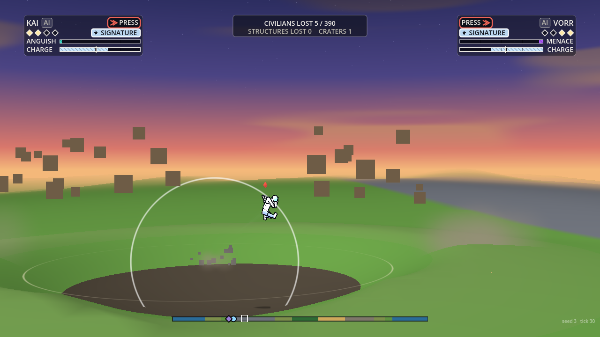 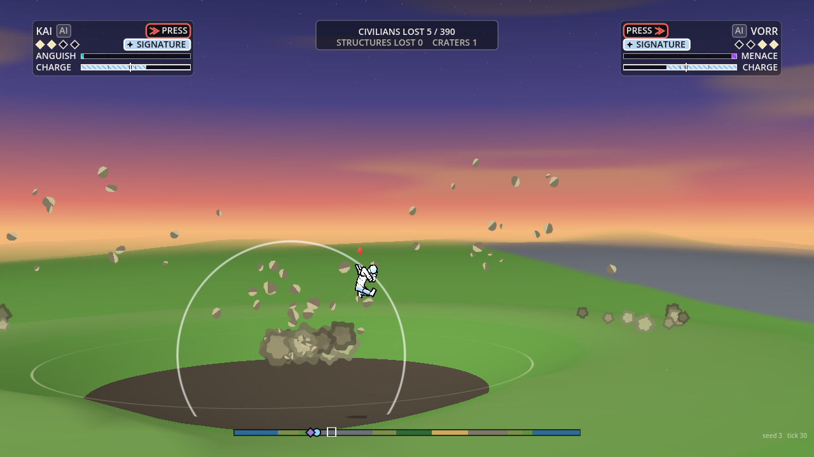

- Checks: `effects_check.gd` has the earth cases (material by colour, tumbling, the reference-event filter, flames within their cap with smoke only when not reduced, a slam by surface and speed, a skid, water ignored, a bounce, leaving a lip or a crest, settling, a wall, crater ejecta, a slide's end, the skid spray, a flood within the pool, and a real minute of launches with ground contact on). `hash_check.gd` and `determinism.gd` pass with ground contact on (the committed data): 12,472 chunks, flames and contact effects in the compared matches.
