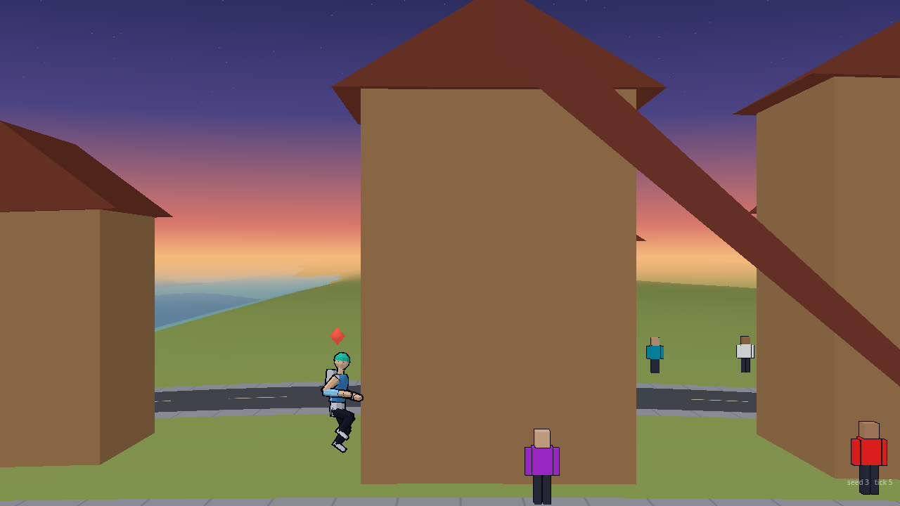
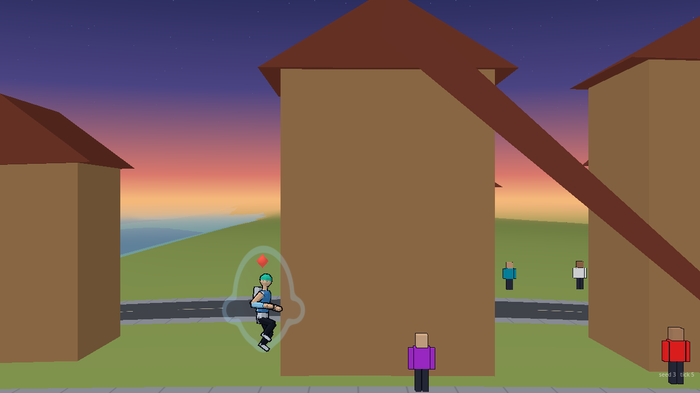
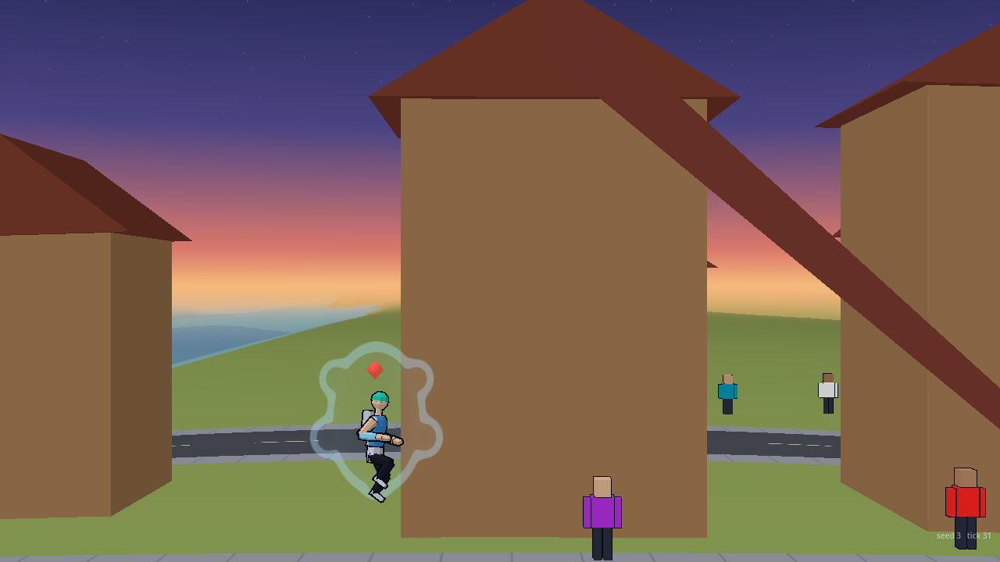

# VFX standing aura

Owner: VFX Director. 2026-10-01. Orb's rule for the aura after a transformation: on only while the fighter is charging or attacking, not a constant standing aura and not gone. Presentation only: it reads sim state and writes nothing, no `S.rng`, the gameplay hash is unchanged. Code: `render/vfx/aura.gd` (class `VfxAura`, `hub.aura`), drawn by `render/vfx/transform_view.gd` with the transformation's shader. Numbers: `data/vfx/aura.json` (every key also has a default in `aura.gd`; `effects_check.gd` asserts they agree). Flag: `hub.standing_aura_enabled`, default on (it also needs `transform_enabled`).

## When it is on

Read each host tick from sim state already available, per fighter:

- the fighter is **charging** (`state == "charging"`, the charge hold);
- or a **beam charge** is running (`beamCharge`);
- or the fighter is the **attacker of the running exchange** (`S.dirS.ex.A`: a strike, heavy or signature; the defender does not get it);
- or a **rush** is on (`rush`);
- or the fighter's **own beam** is out (`S.beams`, `b.A`).

Not while hidden, down or launched (knocked about), and not during the fighter's own transformation (the transformation draws its own aura, and the standing one starts again after it). In a real AI-against-AI minute (seed 12345) it was on for about 40% of the ticks, in 13 separate spells.

## How it looks

The **current tier's aura shape and colour** (the same per-tier table as the transformation: oval, shoulders, crest, hips; the fighter's own `aura` colour), at **0.40 alpha against the transformation's 0.60 settle** and 70% of its fill, so it is clearly weaker. It **eases in over 8 ticks** and, after a **hold of 18 ticks** (so it does not blink between strike beats), **eases out over 24**. A slow breathing pulse (3% in size, 50 ticks) keeps it alive; reduced motion drops the pulse. Quality scaling: at low the fill is dropped and only the outline is drawn; medium and high draw both. It is one quad a fighter in the transformation's draw call. The level holds through a hit-stop or a pause.

## Before and after

Tier 3 fighter charging (the charge hold) from tick 0 and released at tick 50, a plains scene.

| | Before | After |
| :--- | :---: | :---: |
| Charge, 4 ticks in (easing in) |  |  |
| Charge, 30 ticks in |  |  |

Eased most of the way out, 30 ticks after the release: . Holding a beam charge, tier 1 and tier 4:  

Pictures: `godot --path . --script res://render/vfx/tools/transform_shots.gd -- --out=DIR --aura=charge|attack [--noaura] [--release=50] [--tier=1..4] [--ticks=...]`.

## Notes for others

- It reads the same sim signals the director already exposes; if a future attack state is added that does not set one of them (a new rush kind, say), add it to `VfxAura.is_active`.
- The aura is a standing aura of the **tier**; the later rule-of-cool picks (flicker when worn, rubble, cracks at high tiers, windows, speed lines) are not built.
- `data/vfx/aura.json` needs a Tools schema (the validator warns "no schema for this folder" until then).

## Legal's notes (2026-10-01)

Colour: never gold, white or red; the aura uses `VfxAura.lane_color`, which swaps a fire-range or near-white colour for Art's Anti-hero accent (`#9a80d8`) and uses a cool one (KAI's `#8fd6ff`) as it is. The tier "mix" toward white is 0, the fills are thinner (0.14 to 0.17, half that for the standing aura), so it reads as an outline. It flickers when the fighter is worn (the core's wear stage and the brink): `react-plan.md`.
