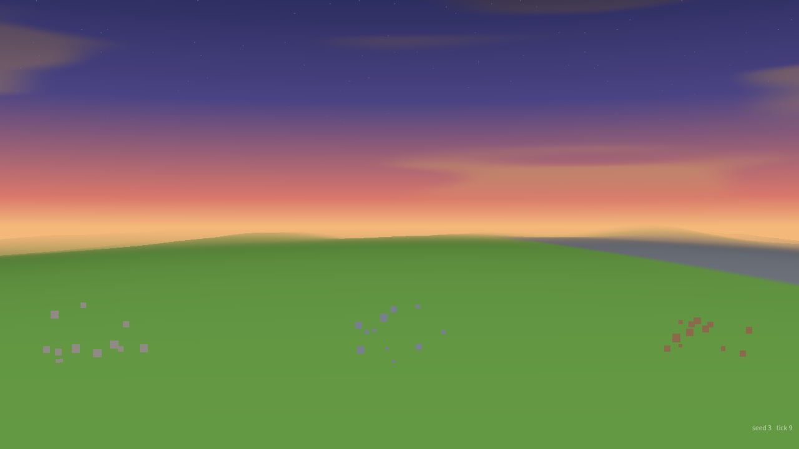
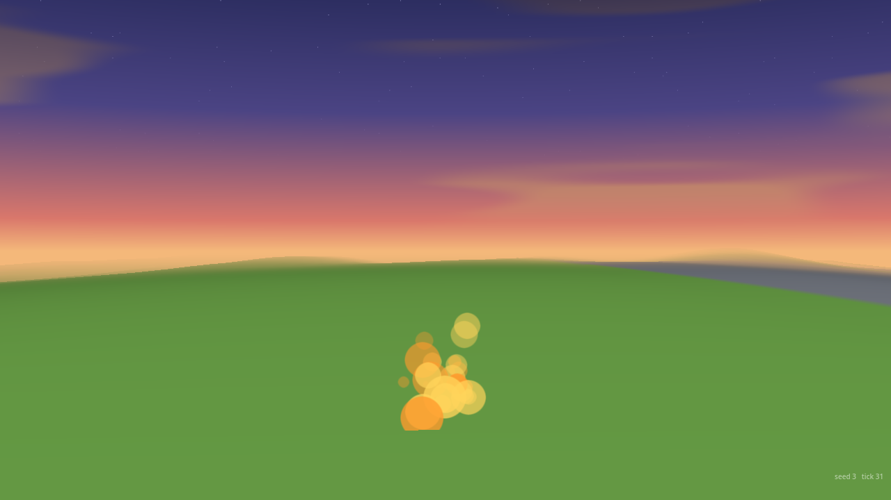
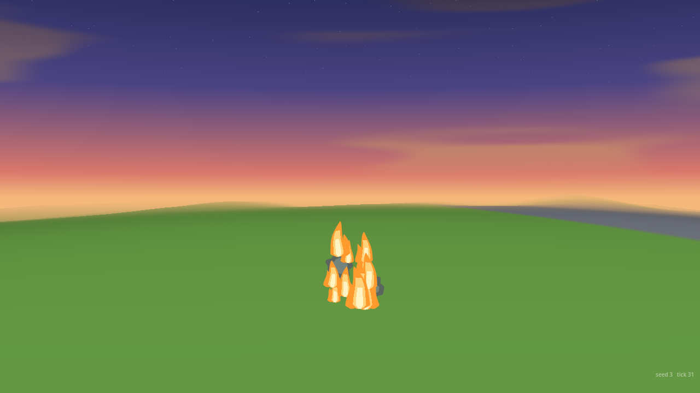
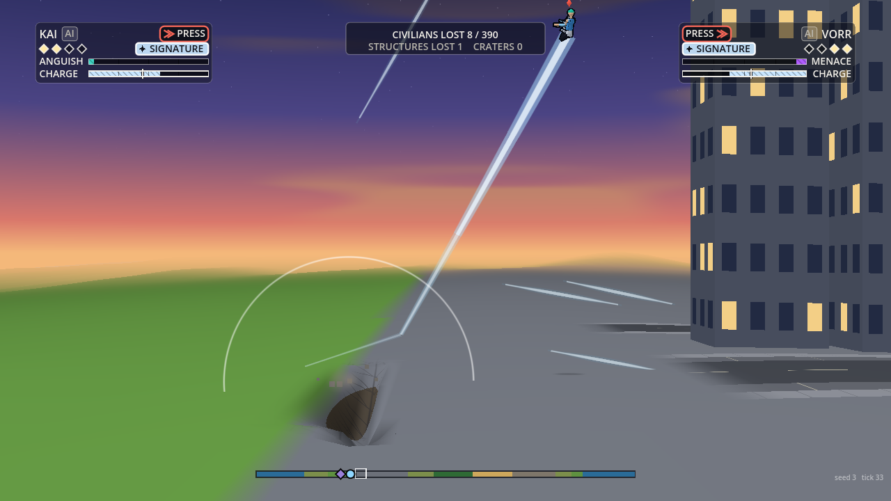
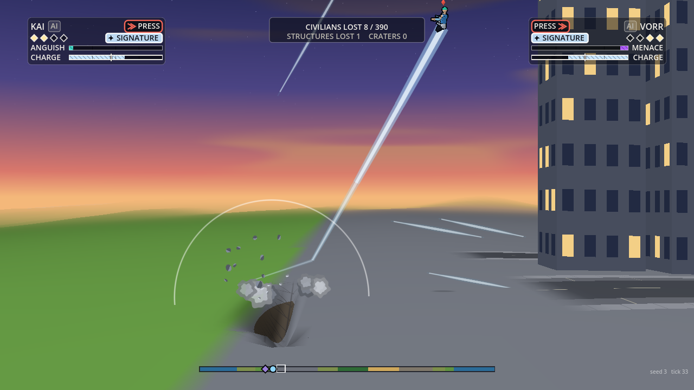
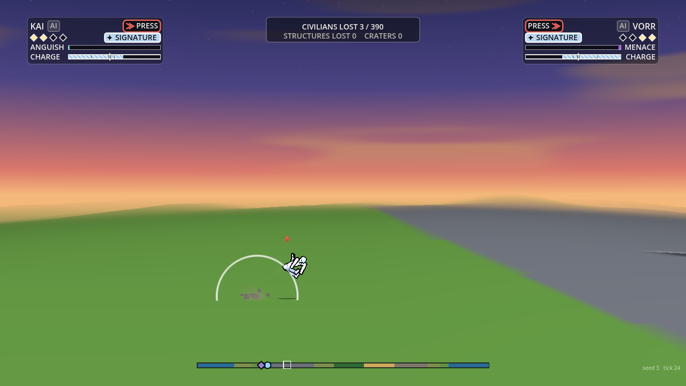
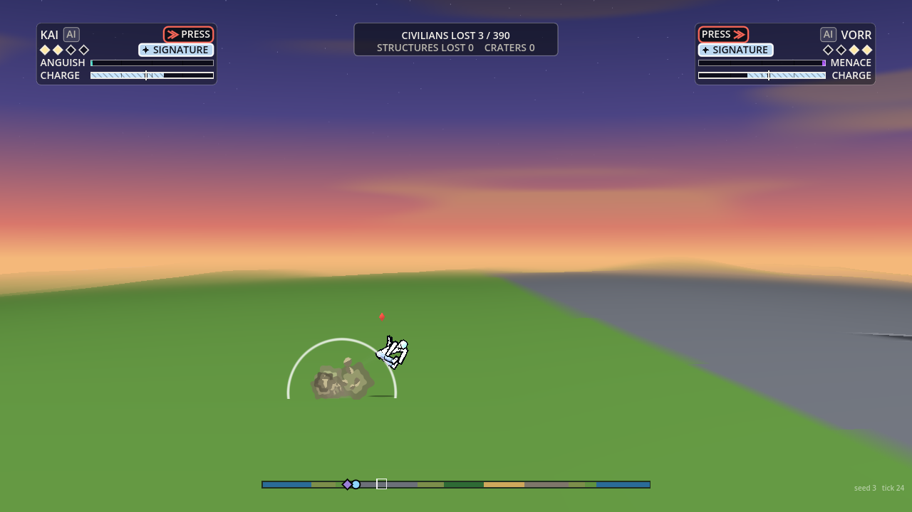
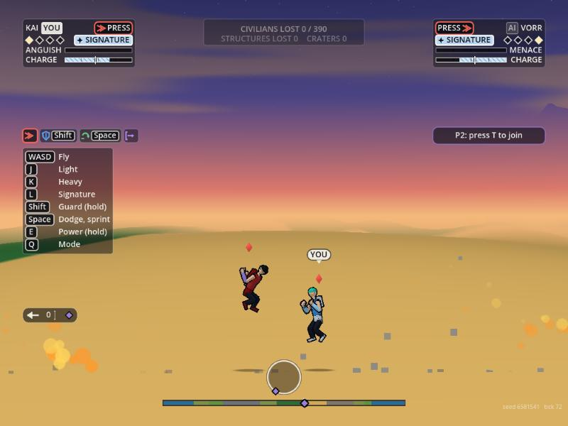
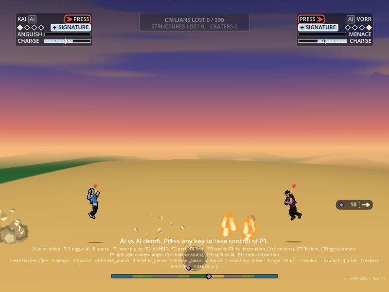
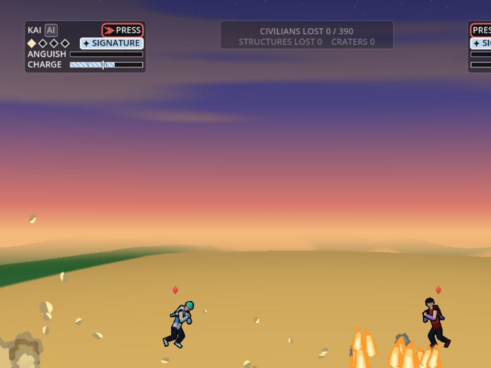

# VFX earth, material and fire

Owner: VFX Director. 2026-10-01. Brief: take over the reference particle consumer's placeholders that still read as such in play (`deb`: small solid squares; `flame`: solid discs), and build the ground-contact visuals against World's real events. Presentation only: it reads events the sim already sends and writes nothing, no `S.rng`, the gameplay hash is unchanged (checked with ground contact on, which HEAD now has: `data/biomes/contact.json` `"enabled": true`). Code: `render/vfx/earth.gd` (class `VfxEarth`, `hub.earth`), chunk, flame and smoke bits in `render/vfx/debris.gd`, the flame and earth-chunk shapes in `shaders/shard.gdshader`. Numbers: `data/vfx/earth.json` (every key also has a default in `earth.gd`; `effects_check.gd` asserts they agree). Flag: `hub.earth_enabled`, default on.

## What is drawn from what

| Sim event | What it was | What it is now |
| :--- | :--- | :--- |
| `debris` (x, y, n, col, spd, z) | `n` solid squares, never turning | `n` (at most 14) chunks that tumble, bounce off the ground twice and fade. Material by colour: grey ground debris takes the biome's own earth (Art's dust ramp, so sand in the desert, rock in the mountains), paving (`#8f8b84`) the light steel-grey ramp, a tower's `#77808f` steel and concrete with the shared rim, anything else (a house's wood, foliage) its own colour with a lit and a shaded side. Debris at a building that fell this tick is left to the fall's own effect |
| `fire` (x, y, n, z) | solid discs | cel flames: a leaning tongue in three bands (orange, warm yellow, pale core) with a second small lick, a wobble that moves as it burns, rising and shrinking over 0.7 to 1.5 s, with a wisp of smoke every third. At most 40 alive |
| `dust` | flat squares (the big brown squares in a slam) | scalloped dust puffs in the biome's colours, or the colour the event names when it is not grey (a glass trench's gold) |
| `crater` | ejecta squares and dust squares (ImpactFx) | tumbling chunks of the bowl's earth thrown out, `3 + 2E` of them up to 30, and dust lifting off the rim; the shock ring stays Rendering's |
| `slide` end | dust squares off the berm | a burst of dust puffs and chunks |
| `land` (kind slam, skid or tumble; surface; spd) | nothing of this kind | by surface and speed: a slam throws clods and dust both ways, a skid or tumble throws the surface up and back along the way he came. Sand throws fewer chunks and more dust, paving more and sharper chunks |
| `bounce` (surface, vn, k, keep) | nothing | clods and a puff, by how hard he hit (`vn`) |
| `left_ground` (cause: lip, heap, cliff, crest, bounce; vx, vy; spd) | nothing | along his leaving vector: a lip or heap throws chunks forward and up, a cliff a few, a crest only dust |
| `tumble_end` (kind), `journey_end` (kind) | nothing | a settling cloud; a wall throws chunks; a capped journey a bigger cloud; water throws nothing |
| a body sliding (`Fighter.slide` above 500) | nothing continuous | a spray of his surface thrown back every few ticks, more the faster he goes |

Water is the skip's (water-plan.md): a `bounce`, `left_ground` or journey over the sea throws no earth.

## Reduced and budgets

- Counts are at quality high; medium 0.7, low 0.35, reduced motion halves again (the same factors as the shards), and reduced motion drops the smoke and the flames' sway. The flame cap thins with quality too (27 at low).
- Everything lives in the shared debris pool (460), so no draw call is added: the chunks, flames and puffs are drawn in the shards' one MultiMesh pass. The per-tick spawn budget and the pool's own eviction keep a flood bounded (asserted: 120 slams and bounces a second leave the pool at 446 of 460).
- `earth_shots.gd --case=bench` (a fire burst every tick, 14 chunks every 8 ticks, a slam every 30, a bounce every 17, a sliding body; 1280x720, fast desktop): frame CPU mean 1.39 ms with these effects against 1.11 ms with them off, which has the reference consumer drawing all its squares and discs; draw calls 22 in both; peak bits 449 of 460; consume 0.8 ms mean (1.7 max). A second run read 1.59 against 1.45, so the difference is 0.15 to 0.3 ms, near the noise. Not measured: the web build's frame cost and an old laptop (Tools bench).

## What Rendering has to do (hooks), exactly

The reference consumer must not draw what this hub draws, or both appear (as the water marks did before their guard). Three one-line guards, all in Rendering's files; I did not edit them. They are in the scratch copy used for the pictures:

1. `render/core/sim_host.gd`, the line that feeds the reference consumer:
   `fxv.consume(S, vfx.reference_events(_without_fall_debris(S, S.out.fx) if vfx.enabled and vfx.destruction_enabled else S.out.fx))`
   (`VfxHub.reference_events` returns the tick's events less `debris`, `fire` and `dust` while the hub's earth effects are on, and every event when they are off).
2. `render/core/impact_fx.gd`: a flag `ejecta_marks` (default true) set in `sim_host.gd` next to `water_marks`: `impact.ejecta_marks = not (vfx.enabled and vfx.earth_enabled)`. While it is false `_crater` draws only its shock ring (the `_crater_ring` split out of it), and `_slide_dust` and `_slide_end` return at once. Those three are where the big flat brown squares in a slam come from: they are ImpactFx's own `dust` and `deb` particles, not events.
3. Nothing else: the `after` outlines (their 45e406e) stay as they are.

## Before and after

Desktop, real sim, 1280x720 (ground contact on). Before has `earth_enabled` off, which leaves the reference squares and discs.

| | Before | After |
| :--- | :---: | :---: |
| `debris` of three materials (paving, tower steel, a house's wood) |  |  |
| `fire`, a burning building's burst |  |  |
| A slam: a launched fighter meets the ground at 3600 |  |  |
| A skid on paving, 12 ticks on |  |  |
| A bounce |  |  |

On the web build (Godot 4.7.2 Web template, Chrome, ANGLE on D3D11, 800x600; a scratch export with the three guards above and events staged by the URL, `?stage=earth`, the same events with `&nofx=1` for before): before , after  . No console error. The chunks are sand-coloured because the staged fight is in the desert.

Pictures: `godot --path . --script res://render/vfx/tools/earth_shots.gd -- --out=DIR --case=deb|flame|slam|skid|bounce|bench [--off]`.

## Plan for the knocked-about events: built

The plan in water-plan.md for `left_ground`, `bounce`, `skip` and `land` is built against World's real events (the fields are as in `fx.gd contactEvent`: x, y, z, spd, n, surface, kind, cause, vx, vy, slope, vn, keep). The sea's `skip` is the existing `skim` (a water `bounce` and `left_ground` are ignored here). `effects_check.gd` runs a real minute of launches with ground contact on and asserts events were handled and earth thrown (it skips that check, and says so, if the data switch is off).
