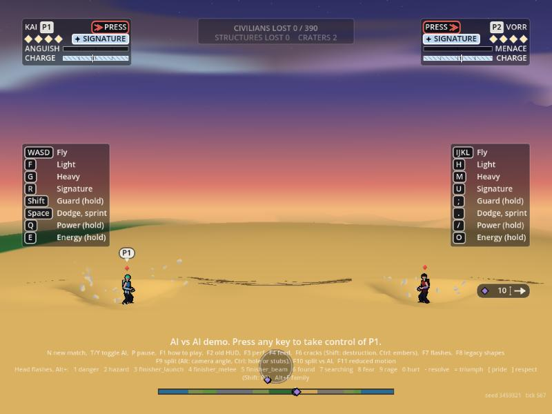
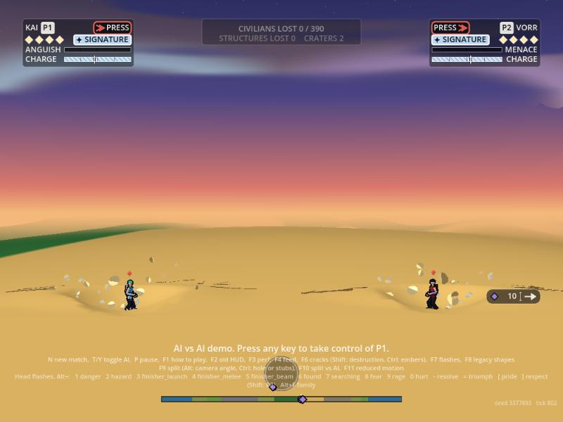
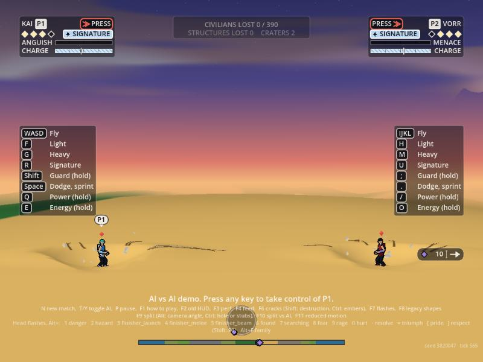
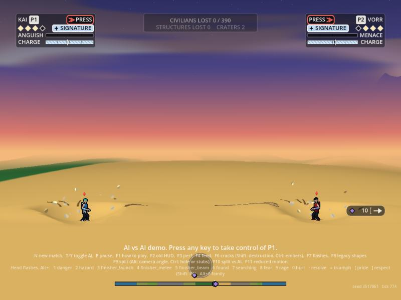
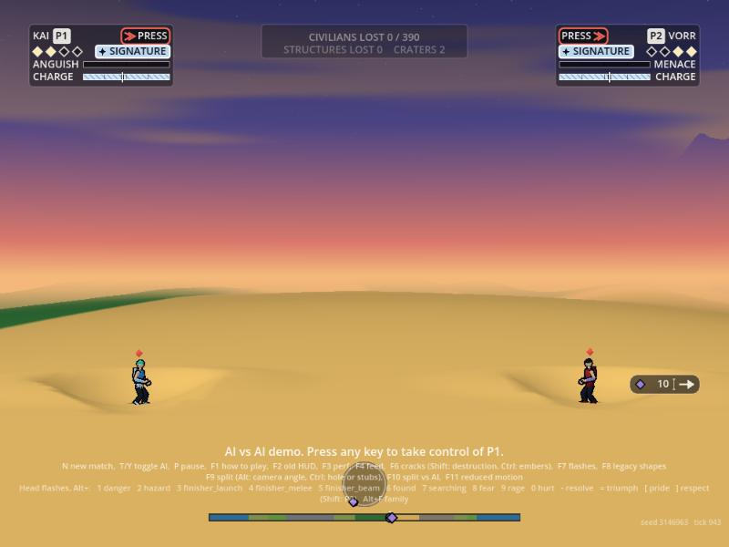
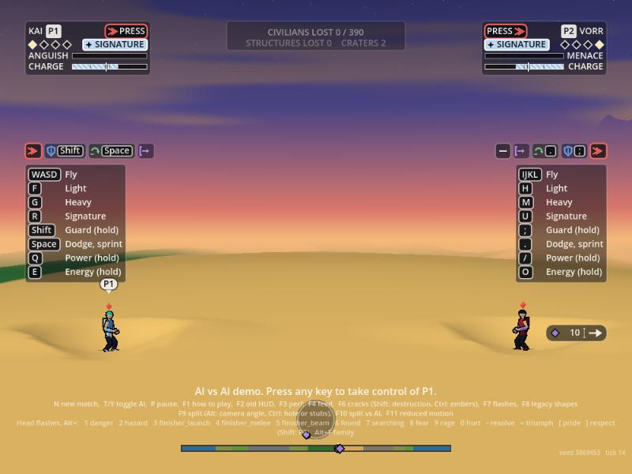

# Power language: showing a higher tier without more speed

Owner: VFX Director. 2026-10-02. Brief from Orb via the EP: at maximum transformation the fighters feel almost a little too fast, so find other ways for the picture to say "stronger". Orb's own pointers: rocks levitating around a powered-up fighter, and the craters that transformations and beam explosions blow out, both of which "look really cool". Presentation only: everything here reads sim state and writes nothing, no `S.rng`, the gameplay hash is unchanged.

Fifteen to twenty ideas, each with the tier it starts at, its cost on the Compatibility renderer (WebGL2 on the web build), and whether it fits Legal's stacking rule. **Top five are marked ★.** The levitating rocks (idea 1) are built, behind a flag, with pictures: see "The prototype" below.

## Legal's rule, as it bears on this list

`docs/legal/rule-of-cool-screen.md`: no single moment may show more than two of seven marks: (1) crouch with fists at sides, (2) scream or drawn-out chant, (3) flame-shaped body aura streaming upward, (4) rubble rising in a ring, ground cracking and wind under a changing sky, (5) crackling lightning on the body, (6) hair rising or changing colour, (7) gold, white or red flash with a shouted form name. Row 12: rubble lifts gently with weight, not a ring of rocks round the fighter; no lightning; the sky pales or parts and never darkens. Aura: thin outline or ring in the lane colour, no flame, no spike, no lightning.

Two consequences for this list:

- **Mark 4 is one bundle.** Rising rubble, ground cracking and wind together count as a single mark. So every ground idea below (rocks, hover pressure, dust rings, cracks) is "mark 4" and they do not add up against each other: five of them at once is still one mark. What stops them being a ring-of-rocks power-up scene is the row 12 wording (gentle, weight, uneven, no ring), which each ground idea keeps.
- **Marks 1 and 2 are the charge.** A charging fighter is already at two marks (crouch, scream), so anything in mark 4 on top of it makes three. The existing rubble lifts and standing cracks already stand down while a fighter charges, transforms or hides; every ground idea here must do the same. That one gate is what "fits the stacking rule" means for the ground ideas below.

"Fit" below is: **fits** (not a mark, or only mark 4 with the stand-down gate), **needs re-screen** (close to a mark's wording, Legal should see a picture first), or **Legal says no** (none in this list).

## The ideas

| # | Idea | What the player sees | Starts at | Compat cost | Stacking rule |
| :-- | :--- | :--- | :--: | :--- | :--- |
| 1 ★ | **Levitating rocks** (built) | Chunks of the ground's own earth hang loose about a standing or hovering fighter, uneven distances and heights, drifting very slowly, bobbing a little; rise as he reaches the state, sink as he leaves | T3 (5 pieces), T4 (10, bigger) | One MultiMesh draw, 12 quads a fighter at most. Measured 81 µs a frame headless for 17 pieces | Mark 4 only. **Needs re-screen** (closest to the "rubble" wording). Stands down for charge, transform, hidden, down, and above 40 fighter-heights a second |
| 2 ★ | **Blast amplification: craters and shock rings** | Every crater and beam explosion scales with the tier of who caused it: thrown rim chunks, a dust dome, a flat shock ring running out along the ground, a second fall of pebbles half a second later, a settling bowl whose dust slides down its sides | T2 small, T3 and T4 clearly larger | Uses the existing debris pool (460 bits, no draw call) plus one ring quad. Cheap; the pool's per-tick spawn budget is the limit | Mark 4 (ground and rubble), one-off event, not a held state. **Fits** |
| 3 ★ | **Hover pressure** (ground and water) | A fighter hovering low presses the world down: over earth, a disc of pressed, paler dust with hairline cracks creeping outward and a slow outward dust breath; over water, the surface dishes in and a ring of waves runs out | T3 | A disc quad and the existing crack system (already built for the standing cracks); water uses `WaterRipples`. Cheap | Mark 4. **Fits** with the stand-down gate. Cracks are drawn, not sim scars |
| 4 ★ | **Pressure rings on movement** | A thin ring of displaced air at the start of a dash, a hard stop or a hard turn; wider and doubled at higher tiers. Reads "strong" without making him faster: the dash is the same, its effect on the air is bigger | T2 (single, small), T4 (double, wide) | Ring quads in the transformation MultiMesh (shared draw); about 4 alive at most. Cheap | Not a mark (a ring is not wind streaming past). **Fits**. Lane colour only, thin, never white |
| 5 ★ | **Light on the terrain** | The ground and the nearest building faces near a high-tier fighter take a soft pool of his lane colour; tier sets the radius and the strength, a slow breath rather than a flicker | T3 | One additive ground quad per fighter in the existing ground pass. Cheap; no screen copy, no real light | Not a mark. Lane colour only (never gold, white or red); a pool of colour, not a flash. **Fits** |
| 6 | **Air shimmer** | A faint wobble of the air above and about him, wider at tier 4 | T3 | The real thing (refracting the screen) needs `hint_screen_texture`, which on Compatibility makes a full-frame copy: expensive on web and old laptops. A fake (thin slow ripples drawn as faint arcs) is cheap | **Fits** (not a mark). Use the fake; skip the real one on web |
| 7 | **Dust and arrival rings** | A ring of dust that runs out along the ground when he lands, takes off or powers up at ground level; at tier 3 and 4 it is heavier and followed by cracks | T2 small, T4 heavy | Ring quad (shard shader shape 5) plus 6 to 12 pool bits. Cheap | Mark 4, one-off. **Fits** |
| 8 | **Water parting** | Over the sea a tier 3 or 4 fighter holds a dished circle of still water with the waves heaped at its rim; a heavy arrival throws a slow upward column | T3 | Extends the water effects already built (`docs/vfx/water-plan.md`); a few ring quads and pool bits. Cheap | **Fits** (not a mark; closest cousin of mark 4's "wind", but it is water and gentle) |
| 9 | **Afterimage quality by tier** | At tier 1 none; at tier 2 two faint copies; at tier 3 copies held at fixed points in the lane colour that fade slowly; at tier 4 copies that keep slightly off the fighter's pose. A look, not a speed cue, if the copies hold position rather than trail | T2 | Rendering owns afterimages (their sprite pass); a VFX request, not a build. Per-copy cost is the sprite's own draw | **Fits** (no mark). Hand to Rendering |
| 10 | **Aura that breathes** | The existing thin aura outline swells and settles on a slow beat, a second thin ring a little way out at tier 4 (a halo, not flame); tier sets the beat's size, never its speed | T3 | Same quads as today; a scale term. Free | Aura rules kept: thin outline, lane colour, round tips. **Fits** |
| 11 | **The opponent's body near him** | A lower-tier opponent next to a higher-tier fighter has dust pushed off his feet and away from the stronger one, a little cloth or scarf lean (Animation), a flinch on guard. The picture says the stronger one weighs on the room | Difference of 1 tier, strongest at 2 | Dust: a few pool bits. Cloth and flinch are Animation's | **Fits** (no mark) |
| 12 | **The sky parts** | At tier 4 a ring of cloud overhead pulls apart or the sky above pales (never darkens) | T4 | A shader term in Rendering's sky; VFX has nothing to draw. Cheap | Row 12 allows it explicitly (pale or part). Mark 4's "changing sky" part, so it counts toward that same mark. Rendering's to build |
| 13 | **Buildings and ground feel him** | Within four fighter heights of a tier 4 fighter, dust trickles off roofs, a few tiles fall, window glass trembles (the facade windows are Rendering's: `host.vfx.react.blowouts` is the hook) | T4 | Pool bits, a trickle. Cheap | Mark 4 at most. **Fits** |
| 14 | **Motes** | A slow drift of small lane-colour specks lifting off the shoulders and drifting out, a few at tier 3, a loose cloud at tier 4. Never streaming upward as one column | T3 | Quads in the transformation MultiMesh; 8 to 16 alive. Cheap | Watch mark 3: a column of upward sparks starts to read as flame. Keep them scattered and sideways-drifting. **Needs re-screen** |
| 15 | **Settling bowls** | After a transformation or a big impact, the crater's dust keeps sliding down its slopes for a second or two, and loose pebbles roll in; the bowl "breathes out" instead of sitting dead | T3 | Pool bits spawned along the rim by the crater event. Cheap | Mark 4, a consequence of an existing event. **Fits** |
| 16 | **Footfalls and prints** | A tier 3 or 4 fighter standing leaves faint pressed prints in the dust and a small puff each time he shifts his weight; he reads as heavy | T3 | A decal quad and a puff. Cheap | **Fits** (no mark) |
| 17 | **Sound-linked pulses** | A slow low pulse (every 1.2 to 2 s at tier 4) that shivers dust off the ground in a ring and nudges the aura; the same beat Audio plays as a low thud | T4 | Rings and pool bits; the hook is an Audio event | **Fits** (no mark). Needs an Audio hook, EP to route |
| 18 | **Desaturating the world near him** | The background loses a little colour within a radius of a tier 4 fighter, a "the room goes still" read | T4 | Needs a screen-space pass (a full-frame shader). Moderate to expensive on web | **Needs re-screen**: it must never darken (row 12) and a flat grey wash can read as a "changing sky". Not recommended on web |

Eighteen ideas. Ideas 1 to 5 and 7 to 8, 10, 15 and 16 are VFX's to build; 9 and 12 are Rendering's; 11 and 17 need Animation and Audio.

## My top five, and why

1. **Blast amplification (idea 2).** Orb named it, it costs almost nothing (the debris pool already exists), and it adds weight at the moment weight is read: the hit. It also makes tier visible without changing how fast anyone moves.
2. **Levitating rocks (idea 1).** Orb named it too. Built; only the numbers and Legal's re-screen stand in the way.
3. **Hover pressure (idea 3).** The same family as the rocks but quieter and rooted: a fighter hovering low visibly weighs on the ground or the sea. Reuses the crack and water systems.
4. **Pressure rings on movement (idea 4).** The only idea that fixes the "too fast" feeling directly: a dash gets its size from the air it shoves aside, so the same speed reads as heavy instead of quick.
5. **Light on the terrain (idea 5).** Cheap and it lifts the whole scene at tier 3 and 4 without adding a single drawn object; the lane colour keeps it clear of Legal's gold, white and red.

Order I would build them in: 2, 4, 3, 5, then re-screen 1 with a picture.

## The prototype: levitating rocks (idea 1)

**Flag.** `VfxHub.rocks_enabled`, default `false` (`VfxLook.ROCKS_DEFAULT`). Off, the effect does nothing and costs nothing. `hash_check.gd` turns it on to prove the gameplay hash is untouched.

**Look.** A tier 3 fighter has 5 pieces, a tier 4 fighter has 10 and each piece is 25% bigger; quality low and medium thin them to 35% and 70%, and reduced motion halves the count and stops the bobbing. They are the same chunk shape and lit earth shading as the debris's rubble, in the dust colours of the biome under him. Each sits at its own distance (0.8 to 2.6 fighter heights), its own height (just under his feet to 1.9 fighter heights up), and drifts round him at 0.05 to 0.22 radians a second in its own direction, so the cloud is never an even ring and never turns as one. A slow bob (0.07 of a height at 0.35 Hz). They rise out of the ground one at a time over 0.8 s as he reaches the state and sink back in 0.5 s when he leaves.

**When it stands down** (the stacking gate): while he is in a transformation, charging, charging a beam, hidden or down; when he is more than 6 fighter heights above the ground or over water; when he is moving faster than 40 fighter heights a second. So it never coincides with the charge's crouch and scream, and it never trails a dash.

**Where it lives.** `render/vfx/rocks.gd` (logic: `VfxRocks`, `hub.rocks`), `render/vfx/rocks_view.gd` (a MultiMesh on the shard shader, one draw), numbers in `data/vfx/power.json` (every key has a default in `rocks.gd`). Seeded cosmetic stream `vfx.rocks`; no sim writes. Asserted by `effects_check.gd` (`_rocks()`, 13 cases: tier gates, easing, each stand-down, the count by quality, the seed, no ring) and `hash_check.gd`.

**Cost.** Headless CPU for the whole layer with 17 pieces on screen: **81 µs a frame**; one more draw call (12 quads a fighter at most, 24 in all). The web build and an old laptop are not measured (Tools' bench).

### Before and after

Real sim fighters on the desert, staged on the exported web build and photographed in the browser pane (no Godot window), 800x600. The "before" pictures show the existing rubble lifts and cracks (react-plan.md) and nothing else; the "after" pictures add the rocks.

| Tier | Before (rocks off) | After (rocks on) |
| :-- | :---: | :---: |
| 4 |  |  |
| 3 |  |  |
| 2 (rocks on: none, by design) | |  |
| 1 (rocks on: none, by design; a tick-14 frame, the tier gate is asserted in `effects_check.gd`) | |  |

What the pictures show, honestly: at tier 4 the cloud of chunks about each fighter is clearly readable and different from the rubble's brief scatter, because the pieces hang rather than fly. At tier 3 it reads as a few loose pieces. At this framing the fighters are small and the chunks (11 to 30 units) are small too; a close camera makes them read far better. Stills cannot show the slow drift. If Orb wants them more present, `size_max` and `count_t4` are the two numbers.

### Open points for the EP

- **Legal re-screen.** The rocks are the idea closest to the wording of mark 4. They are uneven, few, slow, tied to the ground and never at a charge, so I believe they sit inside row 12, but that is Legal's call, and a picture is attached.
- **Tools schema.** `data/vfx/power.json` is new and the validator warns "no schema".
- **Flag.** Default off; turning it on is one constant, `VfxLook.ROCKS_DEFAULT`, once Legal and Orb have seen it.
