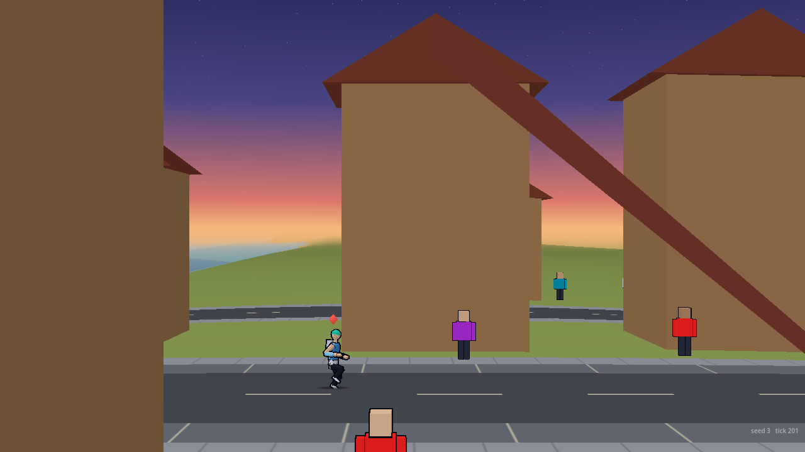
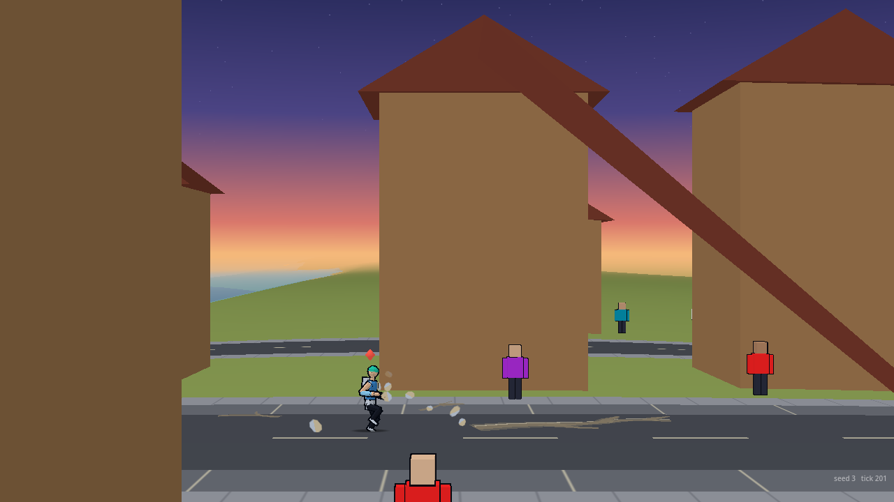
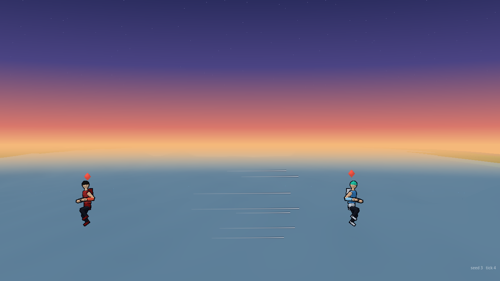
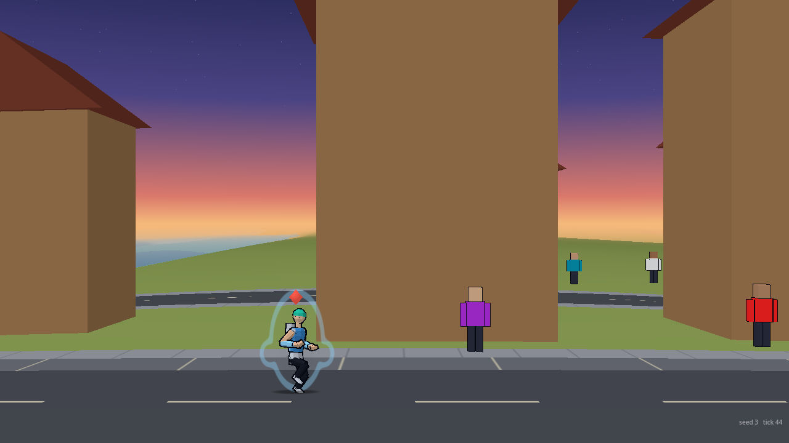
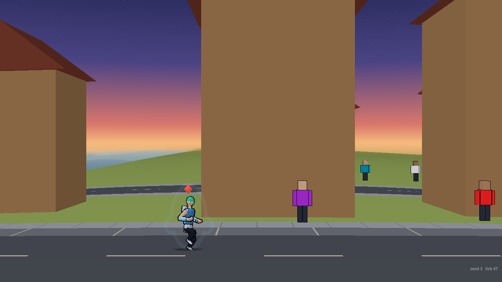
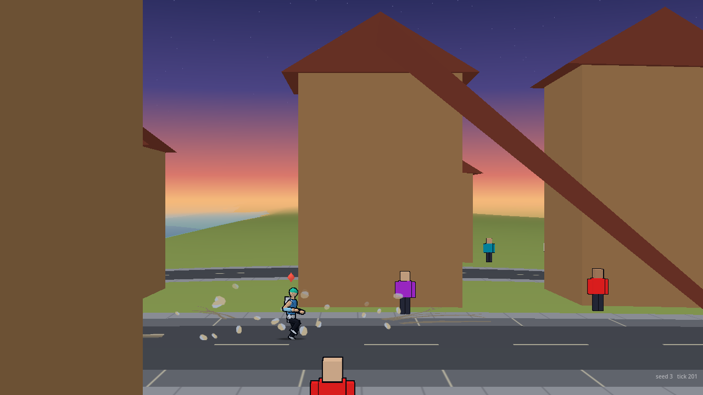
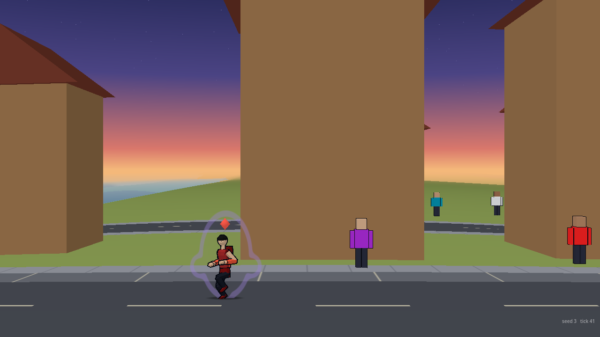

# VFX reactions to power

Owner: VFX Director. 2026-10-01. Wave 0 of the rule-of-cool plan (`docs/design/rule-of-cool.md` rows 1, 11 and 12), shaped by Legal's screen (`docs/legal/rule-of-cool-screen.md`) and by Orb's picks (impact treatment B, the stacking rule). Presentation only: it reads sim state and events and writes nothing, no `S.rng`, the gameplay hash is unchanged. Code: `render/vfx/react.gd` (class `VfxReact`, `hub.react`), `render/vfx/speed.gd` (class `VfxSpeed`, `hub.speed`), drawn by `transform_view.gd` and `crack_view.gd`, rubble and glass in the shared debris pool. Numbers: `data/vfx/react.json` (every key also has a default in `react.gd`; `effects_check.gd` asserts they agree). Flags on the hub, all default on: `react_enabled` (rubble, standing cracks, windows), `flicker_enabled`, `speedlines_enabled`.

## What each effect does

| Effect | Trigger (sim state already available) | Tier | Look | Reduced version |
| :--- | :--- | :--- | :--- | :--- |
| **Aura flicker** (row 1) | The core's wear stage (`f.stage[1]`: battered 0.5, broken 1.0) plus the brink (+0.25). Reads wounds, so it stays and builds through a transformation | Any | The aura's alpha drops out for a few ticks at a time (up to 80% at full wear), more often the more worn, with a 3% size stutter. A pure function of the tick: no random stream, the two fighters out of step | A steady dimming (up to 40%) instead of flicker |
| **Rubble lifts** (row 12) | A fighter at tier 3 or 4 near the ground (within 3 fighter heights), not charging, not hidden, not in his transformation, on dry land | 3 and up; wider and more at tier 4 (4 and 9 pieces a second, within 1.6 and 2.6 fighter heights) | Chunks of the biome's earth leave the ground one at a time and rise slowly with weight (a gentle upward acceleration, heavy slow spin), gone in 2 to 3 seconds. Scattered either side, never straight under him, never a ring | Quality scales the count (0.7, 0.35), reduced motion halves it |
| **Cracks spread where he stands** (row 12) | The same fighter standing still (under 300 u/s) on the ground for half a second | 3 and up | A web of cracks from his feet, drawn by the existing crack system, spreading over 2.5 s, kept while he stands there, faded out and removed 1.5 s after he leaves. Not a sim scar: the sim's own craters are untouched | Drawn at once and 60% smaller (no spreading motion) |
| **Windows blow out** (row 12) | A `crater` event (a big impact: energy 8 or more) caused by a tier 3 or 4 fighter | 3 and up; reach 1800 units at tier 3, 3200 at tier 4 | The nearest buildings of three floors or more (up to 10) throw glass off a few of their floors' rows, each after the shock has reached it (2600 u/s): a block's worth of windows going in a wave | Fewer buildings and glass (quality, reduced motion) |
| **Speed lines alone** (row 11, treatment B) | Every `launch` event and every `damage` event of kind heavy with a number (a landed heavy) | Any | Seven thin lines at 0.7 alpha running toward the hit for 6 ticks and stopping short of it, behind the fighters. No cut | Four lines, no dark keyline |

Rationing: speed lines are one streak per hit (a heavy that launches gives one), at least 6 ticks apart, at most 4 alive. In a real AI-against-AI minute (seed 12345) it came to 15 streaks, against the 20 a minute (8 heavies and 12 launches) treatment B was sized on; the dedupe skipped 7. Panel cut-ins are Camera's and UI's, not here.

## Legal's constraints, and how each is kept

- **Stacking rule** (no more than two of the seven power-up marks in one moment). The world effects (rubble and the standing cracks) **stand down while the fighter charges** (`state == "charging"` or a beam charge) and during his transformation, so the scene "crouch, scream, body aura, rising rubble and cracks" cannot happen. The effects checks assert it. Aura only during charge and attack, as built.
- **Rubble lifts gently and with weight, not a ring.** Scattered (never spawned within a fifth of a fighter height of him, `min_dx` asserted in the check), small counts, slow.
- **No lightning, no wind, no darkening sky.** None is drawn. **The sky pales or parts is not built**: the sky belongs to Rendering's planet and sky shader; a pale-sky lift for tier 3 is a suggestion for them (see below).
- **Aura colour.** No gold, white or red. `VfxAura.lane_color` swaps a fire-range or near-white aura colour for Art's Anti-hero accent (`data/art/flashes.json` accents.A.mid, `#9a80d8`). The transformation's ring, flash and motes use it too, and I took out the white lightening I had put on them (the tier "mix" values are 0 now). **Fighter data is not changed.** The Anti-hero's `aura` in `data/fighters/VORR/fighter.json` is `#ff5a3c`, red-orange; **my recommendation is `#9a80d8` (Art's Anti-hero accent mid; its light step is `#c2adf0`)**, which makes the swap unnecessary. KAI's `#8fd6ff` is cool and used as it is.
- **Aura shape.** Thin outline and a faint fill (the fills are now 0.14 to 0.17 for the transformation and half that for the standing aura): oval, shoulder lobes, a low round crest, hip flares. Every tip is round, nothing is pointed or streams upward, and the tallest is 1.9 fighter heights. If Legal wants the crest and hip flares gone, tiers 3 and 4 become `lobes 1` and `lobes 1` in `transform.json` (one number each).
- **Transformation flash** stays in his own colour (the lane colour above); the break's ring and ground crack are as built.

## For Rendering

- **Windows going out on the facades.** I draw the flying glass only. The building shader's windows (Rendering's `fdmg` and `fmask` states) have no way to know a blow-out happened. `host.vfx.react.blowouts` is the list for them: each entry is `{b: building index, at: the sim time its windows go (S.T), strength: 0 to 1, lo, hi: the floor range}`, pruned six seconds after `at`. A shader can darken or break the windows of building `b`, floors `lo` to `hi`, from `at` on, with `strength` as the share. The hub fills it from the same `crater` events, so the picture and the facade can match.
- **The sky.** Row 12's "sky pales or parts from tier 3" is Rendering's; Legal's rule is that it pales or parts and never darkens. Nothing from VFX touches the sky.
- The crater cracks and the standing cracks share the crack shader: new `fade` uniform, default 1, and a material per slot for the standing sets (two more materials tracked with the pane's curvature).

## Budgets

- Draw calls: the aura, the speed lines and the transformation share one MultiMesh draw (now up to 220 quads), the standing cracks add up to two crack draws, the rubble and the glass are in the debris pool (no draw call). Everything at once (below): +3 draw calls.
- Rubble alive: 36 at quality high (inside the pool's 460), thinned with quality. Windows: at most 10 buildings and 6 floors each a wave, with the pool's per-tick spawn budget. Standing cracks: one set per fighter, mesh built like any other crack set.
- **Everything at once** (`react_shots.gd --case=bench`: both fighters tier 4 and worn, standing and charging in turn in the city, a big crater every second, a heavy every 8 ticks), 1280x720, fast desktop: frame CPU mean **1.02 ms against 0.40 ms** with the reactions off (p99 1.59 against 0.61), draw calls 27.7 against 24.6, peak bits 426 of 460, consume 0.41 ms mean (1.23 max). Not measured: the web build and an old laptop (Tools bench).

## Before and after

Real sim fighters, plains and city scenes, the sim standing still for the shot.

| | Before | After |
| :--- | :---: | :---: |
| Rubble and cracks, tier 3, 200 ticks into a stand |  |  |
| Windows, a tier 4 impact, 40 ticks in |  |  |
| Speed lines on a landed heavy, 3 ticks in |  |  |
| Worn aura (broken core, on the brink), charging; frames three ticks apart |  (steady, not worn) |   |

Tier 4 rubble is wider and denser: . The Anti-hero's aura in the lane colour, charging (what the swap gives while his data is still red-orange): 

Pictures: `godot --path . --script res://render/vfx/tools/react_shots.gd -- --out=DIR --case=rubble|windows|flicker|speed|bench [--off] [--tier=3|4] [--slot=0|1] [--ticks=...]`.
