# Energy blasts on screen

Owner: VFX Director. 2026-10-03. Encounter's slice 5 fires shots (`S.shots`, Simulation's `docs/architecture/shots.md`) and nothing in render drew them. This draws them. Presentation only: it reads `S.shots`, the four shot events, the cues and the fighters, and writes nothing, no `S.rng`; the gameplay hash is unchanged (`hash_check.gd`). Code: `render/vfx/shots.gd` (`VfxShots`, `hub.shots`: the state behind the events) and `render/vfx/shots_view.gd` (`VfxShotsView`: the drawing). Flag: `VfxHub.shots_enabled`, default **on** (`VfxLook.SHOTS_DEFAULT`). Numbers: `DEFAULTS` in `shots.gd` (an optional `data/vfx/shots.json` can override them; none yet, so no schema is owed).

## What is drawn

| Thing | How |
| :--- | :--- |
| **Every live shot, each frame, from `S.shots`** | Interpolated: the state is the end of the last tick, so a frame between ticks is drawn a fraction of a tick back along the shot's velocity (none for a shot fired this tick, and none through a hit-stop or a pause, when shots stand still). In its owner's lane colour (`VfxAura.lane_color`: never white, gold or red), so a deflected shot, which the sim hands to the other fighter, changes colour as it turns back |
| **A bolt** | A small cel disc (a darker rim, the lane colour, a lighter core) with a short tapering tail |
| **A charged shot** | Bigger by its power and by its charge (a tap, 44 damage, is smaller than a full 66), with a longer tail and a thin halo ring |
| **A seeking shot** | On a slight arc, zero at both ends (a tenth of a fighter height, more for a longer flight): it leaves and arrives on its true line. Game Design's "may be drawn on a slight arc" |
| **The charge on the hand** (`blast_charge` to `blast_full`) | Each fighter's own look at the forearm of the arm toward the rival, in the lane colour: **plates stacking along the forearm for the Anti-hero** (a villain), **thin rings stacking along it for the others**; one more each fifth of the charge; a pulse ring along the forearm at `blast_full`; gone when the shot leaves, or on `blast_cancel` or `charge_stopped`. Never a sphere growing in a palm, hands at a hip or a two-hand push (Legal), checked: no disc among its quads |
| **A hit** (`shot_hit`) | By outcome: `hit` a flash and a ring; `guard` a splash fanning back toward the shooter; `deflect` a bigger ring in the deflector's colour, and the shot itself is seen turning back; `shrug` and `stop` a smaller flash; `dodge` nothing at him (the shot flies on) |
| **A trade** (`shot_clash`) | A ring in each fighter's colour and a burst of eight short lines |
| **A miss** (`shot_end`) | On the ground: dust and a few chunks off the point (World's crater comes by its own `crater` event, and gets the blast amplification as before); on the water: the water plunge; at the end of its life: a small fading ring |

## Legal

The first energy slice's rule for the charge look (`docs/legal/agency-pass-screen.md` section 3) is kept as above. No white, gold or red (the core is the lane colour lightened a little and checked to stay coloured); no sky change; no lightning or flame. The stacking rule: a shot is not one of the seven marks; the charge on the hand is a thin ring or plate stack, not the crouch, scream or flame aura; the ground puff at a miss is mark 4's one-off (rubble and ground), never a held state.

## Budget

At most 32 live shots (the sim's cap), 4 quads a bolt and 5 a charged shot, so 160 at most, plus up to 14 for the hit and trade effects and 16 for the two charges: **one MultiMesh, one draw call, 224 quads reserved** (the transformation's shader). In the debris pool only for a miss on the ground (no draw call). Not measured: the web build and an old laptop (the hash check's matches fire 60 shots and draw 3 at once at most).

## Where it hangs

The view is a child of `VfxTrailView` (`trail_view.gd`), which the layer already updates every frame, and updated at the start of its `update`; `VfxLayer` is untouched. If you would rather it were the layer's own child, that is a two-line move.

## Checks

`effects_check.gd` `_shots()` (34 cases): a shot in `S.shots` is drawn and none once it is gone; 32 shots in one draw; the interpolation (60, 30 and 0 units back), a shot fired this tick and a hit-stop held in place; the arc's ends; size by kind, power and charge; each shot in its owner's colour, never white, gold or red; each outcome's effect; a trade drawn and gone after its life; a miss on the ground throws dust; the charge starts, builds to full in 30 ticks, pulses, ends when the shot leaves, on cancel and on stop; the Anti-hero's plates and the others' rings; no sphere; flag off; data fallback. `hash_check.gd`: 60 shots fired and up to 3 drawn at once over its matches, hash unchanged. `determinism.gd` passes.

## Pictures

Real sim shots fired by `SimShots.fire` on the desert (the web build in the browser pane, 800x600):

| Volley (three bolts, one trading with VORR's) | A charged shot in flight, the muzzle ring at KAI |
| :---: | :---: |
| 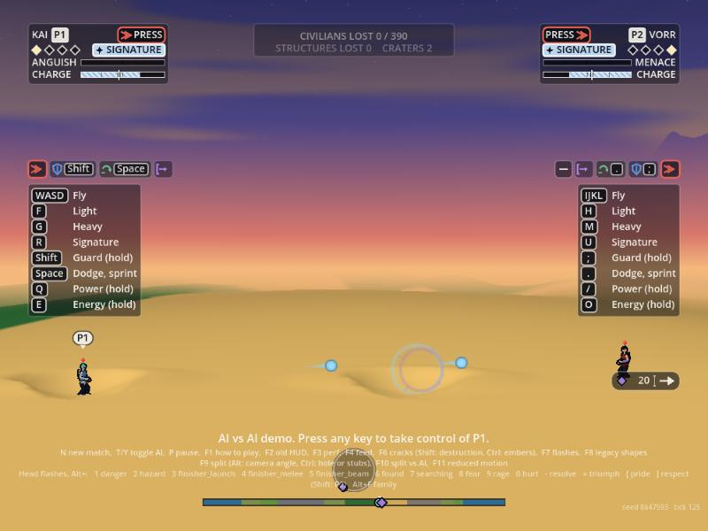 | 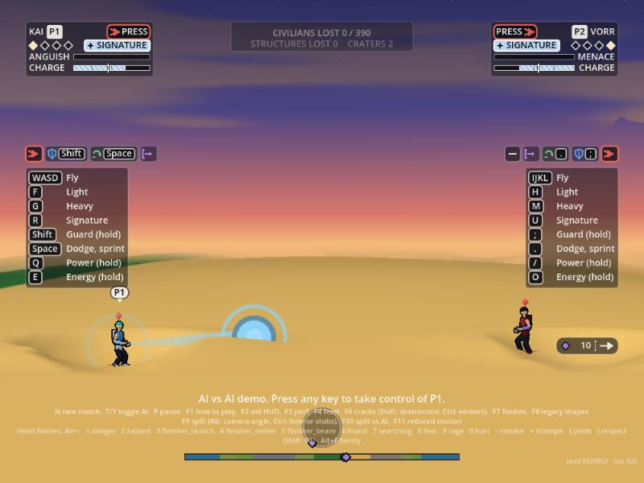 |

| The charge on the hand: KAI's rings, VORR's plates | A deflect: the shot turns back in VORR's colour, ring at his hand |
| :---: | :---: |
| 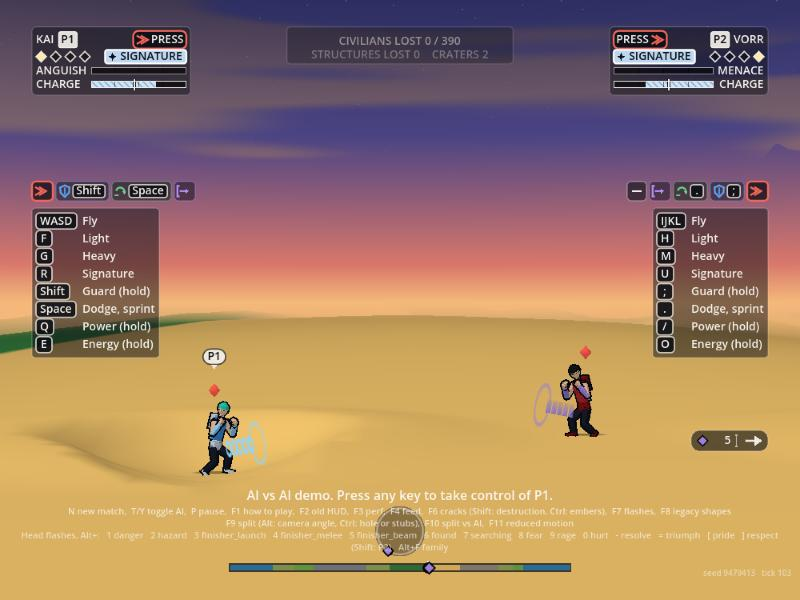 | 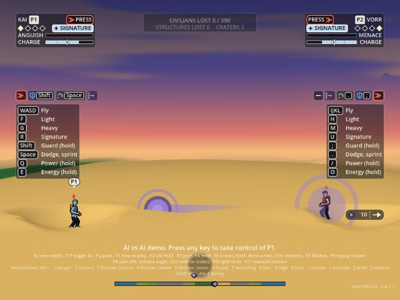 |

| A trade: shots fired | A trade: VORR's charged shot meets KAI's bolts |
| :---: | :---: |
| 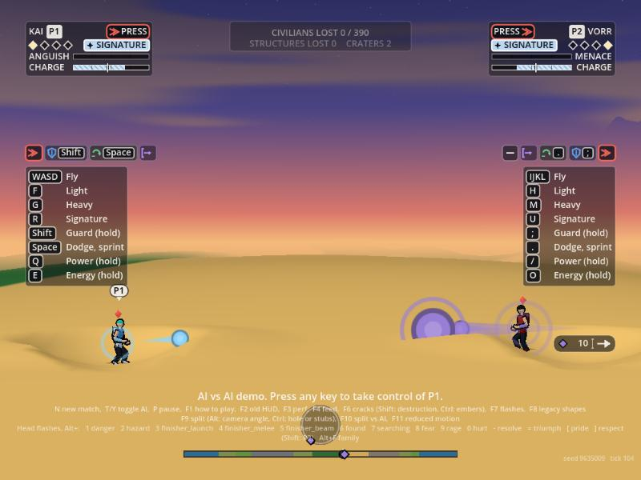 | 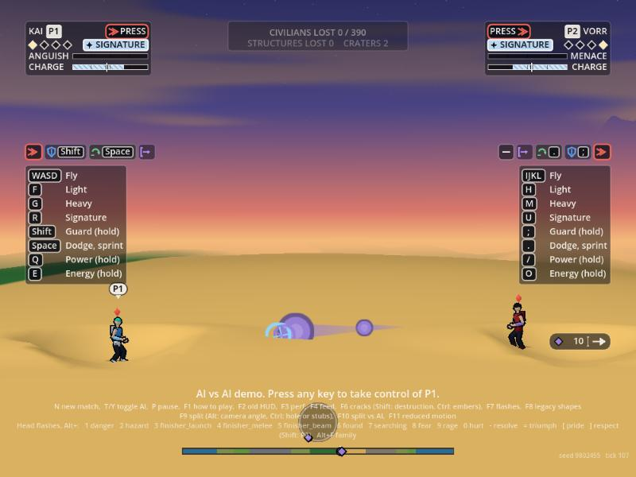 |

Open: the ground burst and the guard splash have no picture; the pressure rings' drawing still waits for Orb.

## Explosions, the knocked-loose look and the mines of concept (2026-10-03)

Orb, after watching AI matches (`docs/ep/vision.md`): the blasts should "erupt into flame and smoke, explosive particles"; a deflected shot should fly off and "hit the ground elsewhere and explode"; and he wants hovering energy mines. Game Design's numbers are in `docs/design/agency-pass.md` section 15 and Legal's look rules in `docs/legal/agency-pass-screen.md` (RL-060 to RL-062). Code: `render/vfx/explode.gd` (`VfxExplode`), `shots.gd` and `shots_view.gd` (the knocked-loose look and the mines), the hex shape in `shaders/transform.gdshader`. Flag: `VfxHub.explosions_enabled`, default **on** (`VfxLook.EXPLOSIONS_DEFAULT`).

### 1. The explosion

A shot's hit and end are now explosions, sized by the **blast radius** from Game Design (`VfxExplode.radius_for`): a bolt or shard 0.5 bh, an arc 1 bh, a lob 1.5 bh, a charged shot 1.5 bh tapped and 2 bh fully charged (damage 60 or more of its 66), times 1.25 at the shooter's tier 3 and 1.5 at tier 4; the smoke stays 2, 3, 4 and 5 seconds by size, for show. Where it goes off decides what it is:

| Where | What |
| :--- | :--- |
| **Ground** (a missed shot) | A flame burst (the cel flames: a pale core, orange, then the dark of the smoke), sparks stepped through Art's ember ramp, thrown chunks of the ground's own earth that fall, dark smoke rising, a flat ring along the ground out to the blast's radius, and **a scorch that smoulders for a few seconds** (a wisp of smoke and the odd ember at the point, one at a time over 0.5 to 3.6 s). World's crater comes by its own `crater` event, as before |
| **Fighter** (a hit) | The same without the chunks, the ring and the scorch, at 0.55 of the size: flame, sparks and smoke at the body. A guard, a deflect, a shrug or a stop gives sparks and smoke only; a dodge nothing at him |
| **Water** | Steam: pale puffs off the surface and a few sparks (the plunge is the water effects') |

The shot's end carries no owner in the event, so the owner, damage and tier are remembered from `S.shots` by shot id.

**Colours (what I used, for Legal).** Fire as environment, as RL-060 allows: the cel flame's own orange body with a lighter mid and a pale core, Art's ember ramp for the sparks (`hot` `#ffd27a` then `warm` then char), dark shadow shades of the biome's dust for the smoke, the biome's earth for the chunks. **The shot's own core stays the shooter's lane colour** (violet for the Anti-hero, blue for the others), as does the fighter's ring and every mine. No sky change: the smoke is local puffs, and the flame stays local and in proportion (a tongue rises about its blast radius and is gone in under a second: never a pillar, no mushroom cloud, nothing planet-scale).

### 2. A shot knocked loose

A shot with `deflected` above zero (the sim changes its owner now, and will send it off at random: the view reads only the count, so it works for both) is drawn **tumbling**: a cross of light turning on it and a tail that wobbles, with **a smoke puff left behind each tick** (at most six such shots trail; every other tick at quality low) and the odd ember. In its new owner's colour. Where it lands, the explosion above. Picture: `img/explode-knocked-loose.jpg` (the deflect here is made in the staging, in a made-up direction, since the sim still sends it straight back).

### 3. Mines (concept, look only; no sim behind them)

Each fighter's own look, never a sphere (RL-062): **the others' mine is a hexagonal plate** (a flat hexagon with a raised inner hexagon and a thin ring round it), **the Anti-hero's a faceted caltrop** (three tapering spikes round a small hexagonal hub). Hovering (face-on, bobbing, a faint line down to a flat shadow on the ground) or on the ground (the plate lies flat; the caltrop stands on its spikes). States: **arming** (30 ticks: the ring or the spikes close in and fade up, dim then bright), **armed** (a slow breathing of the inner hexagon), **the fuse** (about to go: a quick blink, the inner hexagon swelling, the ring drawing in, and one thin warning ring running out to the blast's 2 bh radius), **the blast** (a power-3 full-size explosion: on the ground a ground burst, in the air a burst with no chunks or ring). They hover and wait; no markings, no stars, no row or ring of matching shapes is staged.

The hexagon is a new shape in the transformation's shader (shape 4). The mines draw in the shots view's one draw call (at most 24 held, 320 quads reserved in all).

**What a sim would send** (nothing sends these today, `shots.gd` reads them if it does): `mine_place {id, actor, x, y, z, mode: hover|ground}`, `mine_armed {id}`, `mine_fuse {id}`, `mine_end {id}` (the blast). A mine's radius and the chain 6 ticks apart are the sim's. Until then the tools place them (`VfxShots.add_mine`).

### Pictures

Real sim shots on the desert (the web build in the browser pane); the mines are placed by the staging.

| Before: a charged shot meets the ground, 6 ticks on (the old dust and ring only) | After: the same with explosions on |
| :---: | :---: |
| 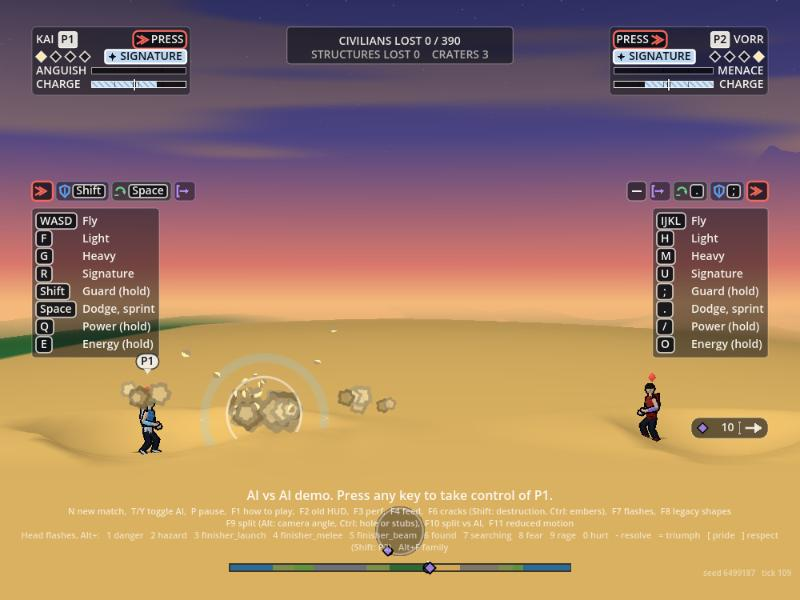 | 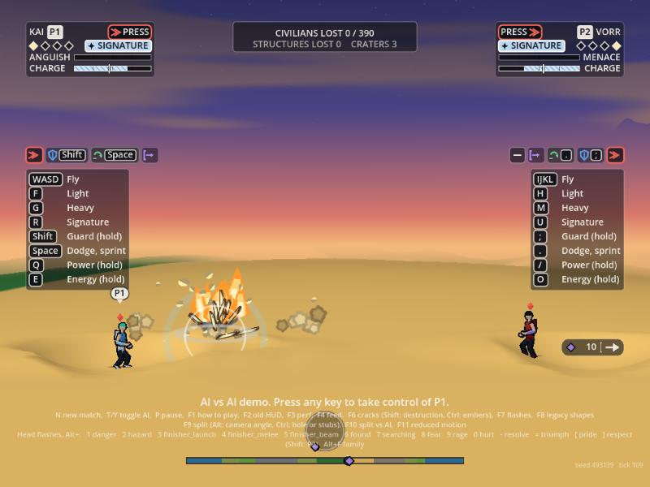 |

| 40 ticks on: the flames dying, dark smoke, chunks falling | A bolt, for scale |
| :---: | :---: |
| 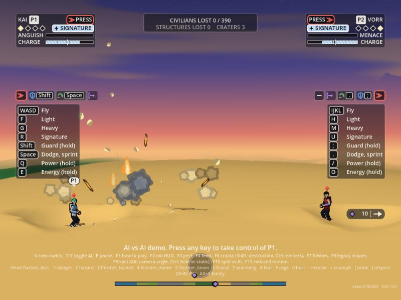 | 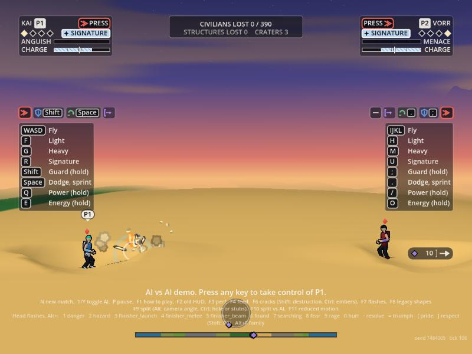 |

| A shot knocked loose: tumbling, smoke trail, in the deflector's colour | |
| :---: | :---: |
| 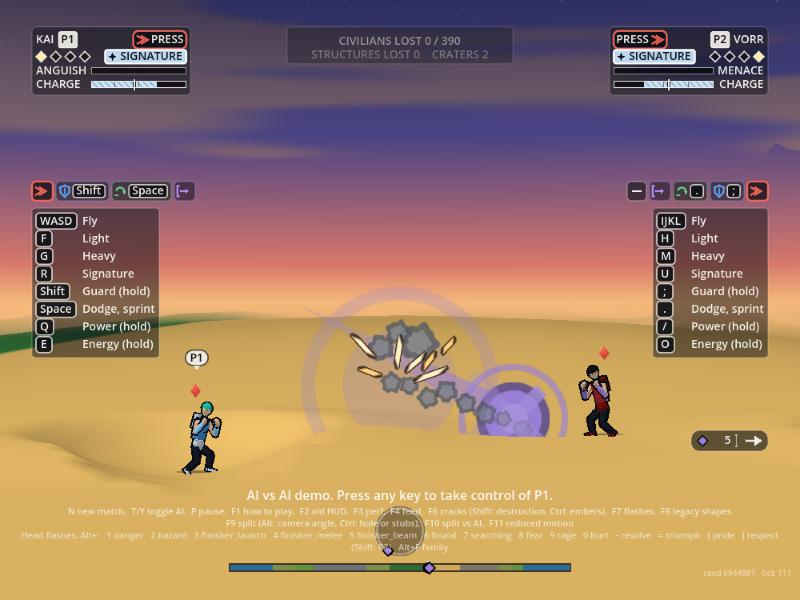 | |

| The others' mines (hexagonal plates), hovering and on the ground | The Anti-hero's mines (caltrops) |
| :---: | :---: |
| 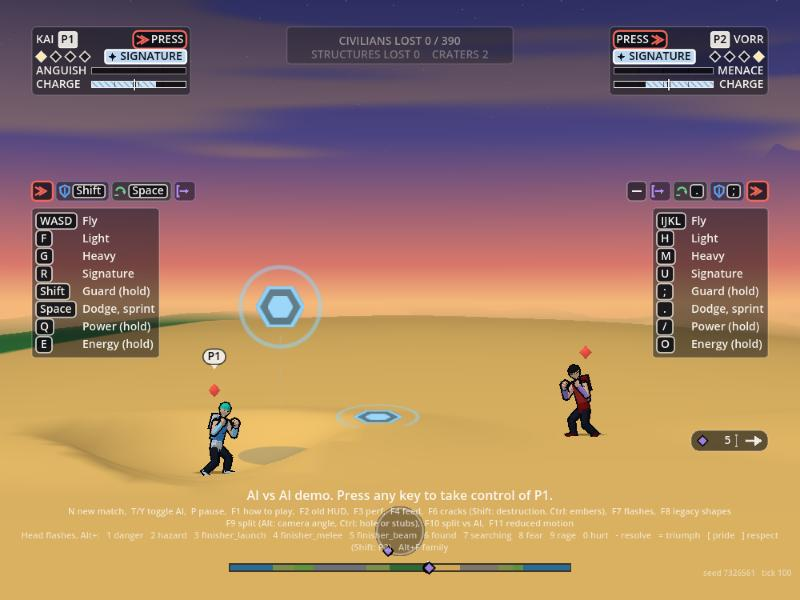 | 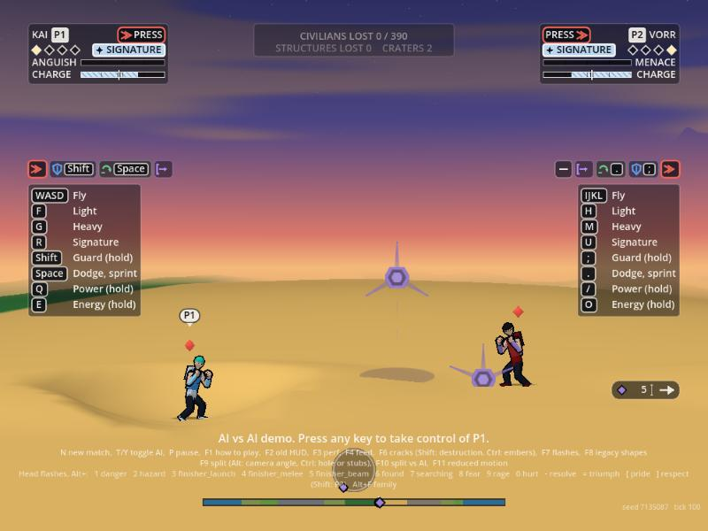 |

| The fuse: blinking, the warning rings running out to the blast radius | The blasts (two on the ground, two in the air) |
| :---: | :---: |
| 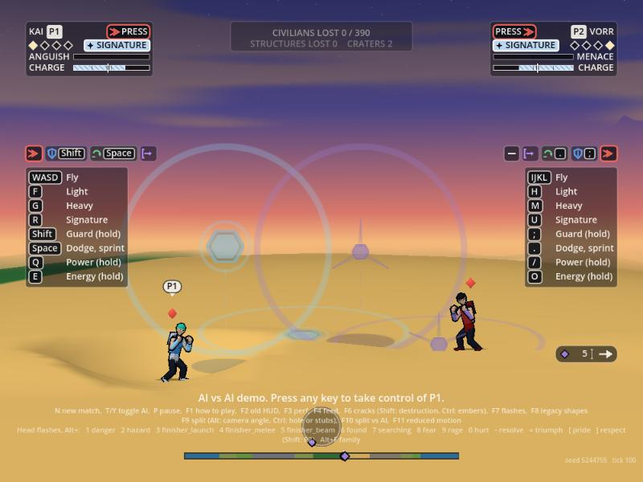 | 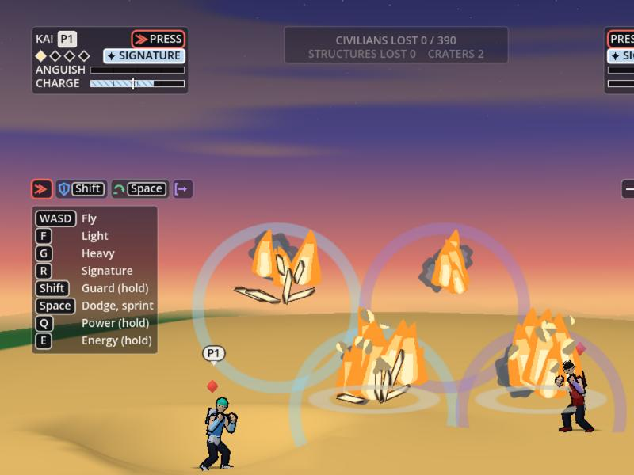 |

### Cost

Explosions go into the shared debris pool (no draw call), a fixed number of draws a call from the cosmetic streams: a bolt asks for about 9 bits, a full charged shot about 32 plus its 8 smouldering wisps (11 more bits over the next seconds). Caps hold: flames 40 alive, sparks 12 a tick and 100 alive, the pool 460 (twenty full bursts in one tick: 40 flames, 12 sparks, 292 bits, checked); thinned to about 0.35 at quality low, no ring and half the count with reduced motion. The tumbling look is 2 more quads a knocked-loose shot; a mine is 7 to 13 quads. Not measured: the web build and an old laptop.

### Checks

`effects_check.gd` `_explosions()` (32 cases): the radii, the tier factor and the smoke seconds; more of everything for a bigger blast; the ground burst's parts, the ring flat, the chunks falling, the smoulder jobs running; the fighter, guard, water variants; the budgets (twenty bursts, quality low, reduced motion); the events (a missed shot, a hit, a guard, a dodge, flag off); a knocked-loose shot's trail and tumble; the mines (arming, armed, fuse, blast, each fighter's look, hexagons and no filled disc, the events). `hash_check.gd` and `determinism.gd` pass; the gameplay hash is unchanged.
