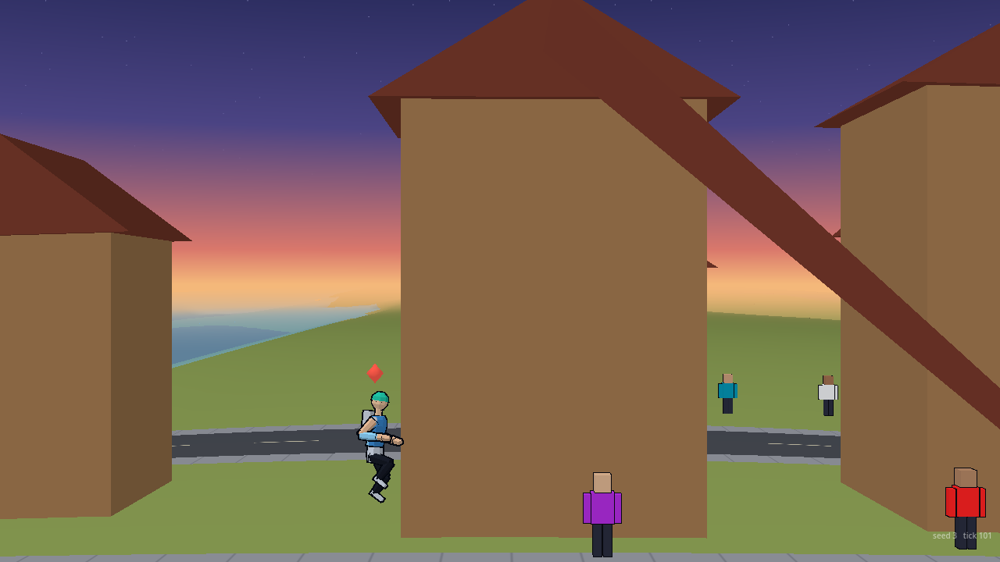
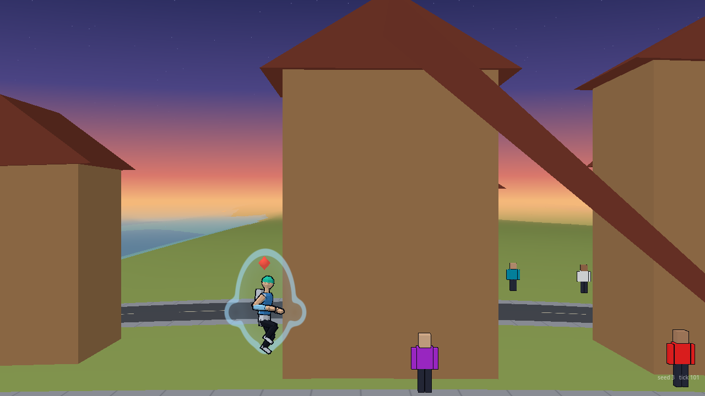
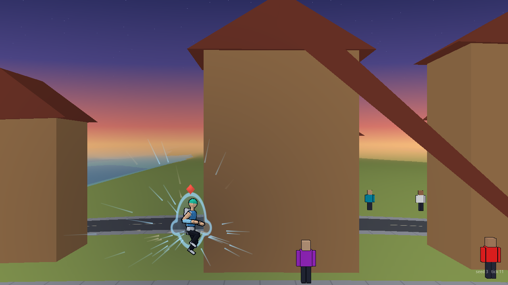
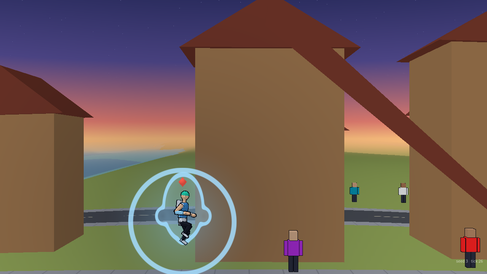
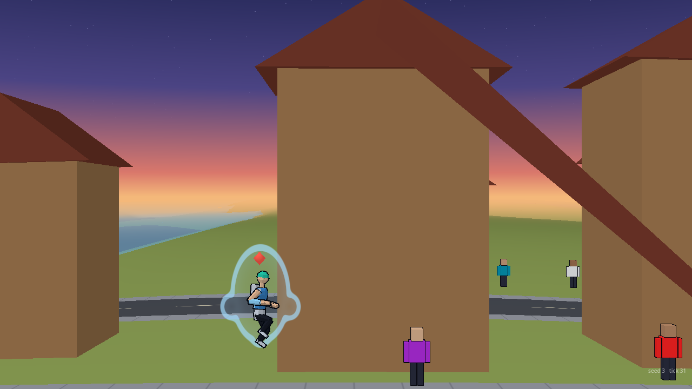

# VFX transformation effects

Owner: VFX Director. 2026-10-01. Brief: the transformation's effects per `docs/design/moveset-rules.md` §10.8: the aura draws inward on the gather, one ring goes out on the break while the aura swaps shape in a single frame, then it holds steady; no upward flame, no lightning. Keyed to the sim's `transform` event and its `version` (`docs/architecture/fx-events.md`). Presentation only: nothing here writes the sim, no `S.rng`, the gameplay hash is unchanged. Code: `render/vfx/transform.gd` (class `VfxTransform`, held by the hub as `hub.xform`), `render/vfx/transform_view.gd` (one MultiMesh per pane), `render/vfx/shaders/transform.gdshader`. Numbers: `data/vfx/transform.json` (every key also has a default in `transform.gd`; `effects_check.gd` asserts the two agree). Flag: `hub.transform_enabled`, default on.

## The three beats

Beat lengths are §10.8's table, in ticks. When the event's `dur` differs from their sum (a final-form reveal's 4 s full version) every beat is scaled to fit, so the effect always ends with the pause.

| Beat | Full (3 s pause) | Short (1.5 s pause) | Live (0.8 s, no pause) | What is drawn |
| :--- | :--- | :--- | :--- | :--- |
| Gather | 60 | 24 | 10 | The old tier's aura shape is drawn in to the sigil (chest) and fades; streaks of aura colour and loose dust in the biome's colour run inward to the sigil along their own angles (two loops in the full version, one in the others), the lower half flattened so nothing runs into the ground; a dark soft disc behind him dims the light round him. Nothing goes outward. |
| Break | 30 | 18 | 14 | In one frame the new tier's aura appears at full size, one thin ring leaves the body (0.7 to 4.2 fighter heights in 14 ticks), a short flash disc in his own aura colour (never white or gold; off with reduced motion), and the dim is gone within 4 ticks. |
| Settle | 90 | 48 | 24 | The new aura holds steady (it eases from 0.9 to 0.6 alpha over 10 ticks) and fades out over its last 24 ticks (half the beat at most). |

**Aura shapes by tier,** all round-tipped, nothing pointed or flame-shaped, and none taller than 1.9 fighter heights: tier 1 a plain upright oval; tier 2 adds two shoulder lobes; tier 3 a low round crest as well; tier 4 round hip flares as well and the widest. The read at 12 px is the colour mass and the outline changing in one frame at the break. The colour is the fighter's own aura colour (`aura` in `fighter.json`), lightened only slightly (8% to 25% by tier), so it never goes white.

## Holding through a pause

The effect's clock is the host's tick, not the sim's. `VfxHub.consume` is called every host tick, and a sim pause (`S.pause.left`, Q10) is a run of frozen ticks that each carry a `tick` event with `frozen` true, so a full or short version advances on each frozen tick and plays through the pause at the wall-clock rate of 60 ticks a second, ending with it. A live version has no pause, and it holds still on a hit-stop's frozen tick like the fight does. Every part of the picture is a function of the form's age at the frame (interpolated between ticks), positioned on the fighter's interpolated pose, so it also follows a fighter who moves (a live version) and has no particles to freeze.

## Budgets

- One MultiMesh draw per pane, at most 140 quads. One fighter in the busiest beat (the gather's middle) is 51 quads; both fighters at once about 100.
- Counts (gather streaks 40 aura and 14 dust at quality high) scale with quality: 0.7 at medium, 0.35 at low (no dust at low), halved in reduced motion, which also drops the flash and halves the dim.
- Cost: the view's update is about 80 microseconds a frame for one fighter in the busiest beat, on the fast desktop; the hub's clock step under 2 microseconds. No pool, no allocation per frame beyond the buffer.

## Before and after

Real fighter, plains scene, a tier 3 transformation (old shape tier 2, new shape tier 3), the sim standing still as in a pause. "Before" has `transform_enabled` off, which is what the game drew until now (nothing).

| Beat | Before | After |
| :--- | :---: | :---: |
| Full, gather, tick 40 |  |  |
| Full, break, tick 62 |  |  |
| Full, settle, tick 100 |  |  |

The short version (ticks 10, 25 and 40) and the live version (ticks 4, 11 and 30):

  

  

Pictures: `godot --path . --script res://render/vfx/tools/transform_shots.gd -- --out=DIR [--off] [--version=full|short|live] [--tier=2..4] [--ticks=...] [--x=1500] [--zoom=1.6]`.

## What this does not do, and what it needs from others

- **The tier step lands at the start of the gather, in the sim.** The `tier_up` and its burst and crater come in the same tick as the `transform` event (fx-events.md), which is the start of the gather, 60 ticks (full) before the break. §10.8 puts the burst and crater and the 10% size step on the break. VFX draws its own break at gather ticks after the event; the crater (a sim record, so its cracks are drawn by VFX at the event tick) and anything Rendering or Animation does on `tier_up` will land early unless they wait the gather length. `hub.xform.forms[i]` holds `g` (gather ticks), `b`, `s` and the age, so a consumer can read when the break is.
- **The aura exists only during the transformation.** Rendering's placeholder aura sphere is off by default (head flashes replace it, F7), and there is no standing per-form aura. At the end of the settle mine fades out. If Orb wants the new tier's aura to stay on, the shape and colour are already per tier in the data: a `persistent` flag would keep drawing the settled aura (weaker) at all times while the fighter's tier is 2 or more.
- **Ground cracks on the break** come from the sim's crater at the event tick (see the first point), not drawn by this effect.
- **Pride forms (the Anti-hero) and the other fighters' own looks (§10.4 to 10.6)** are Animation's and Art's silhouette changes; the effect here is the same for every fighter in their own aura colour. Per-form variations (the Empress's fleet shadow, the Cyborg's lamp) would be new cases keyed on the fighter; not built.
- Camera shots (push in, low wide angle, snap zoom) are Camera's.
