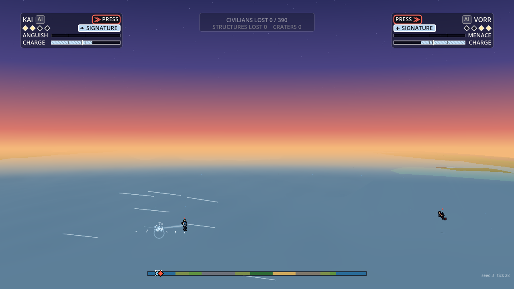
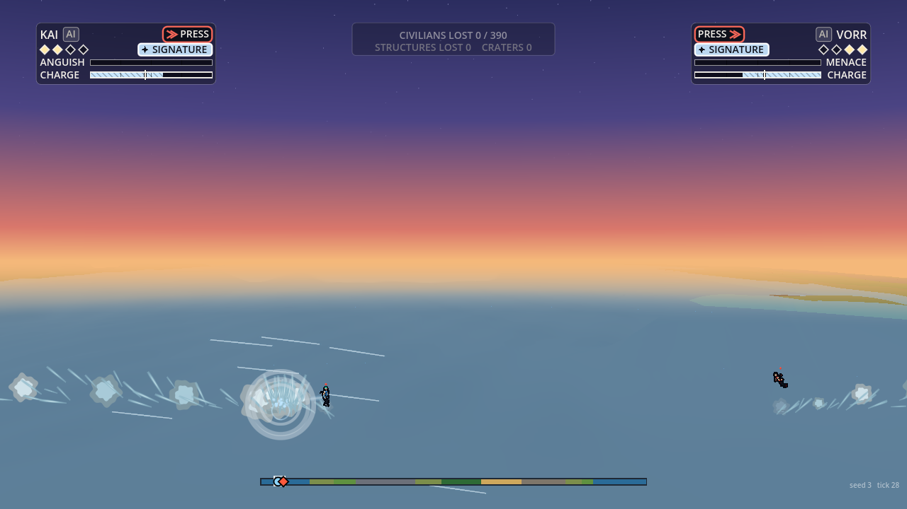
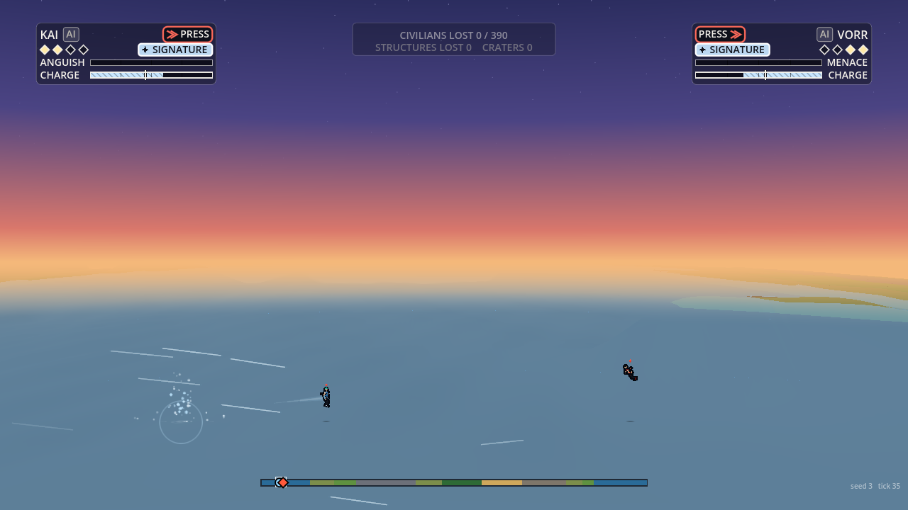
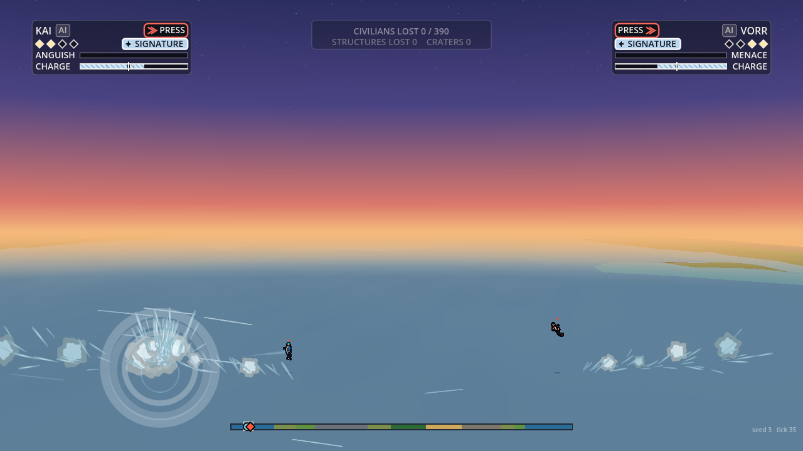
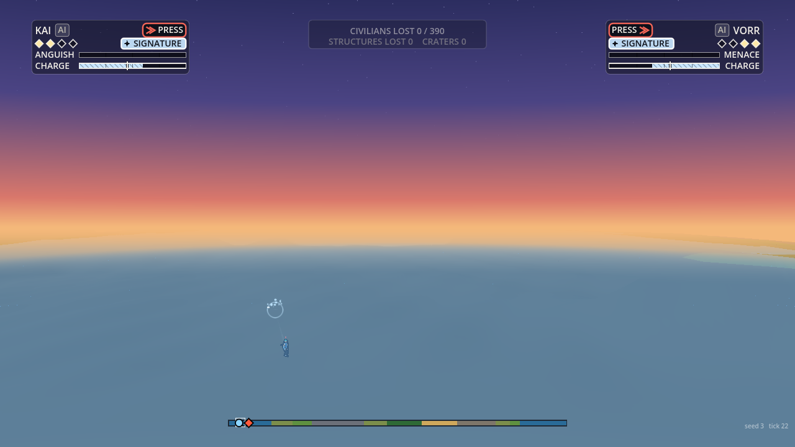
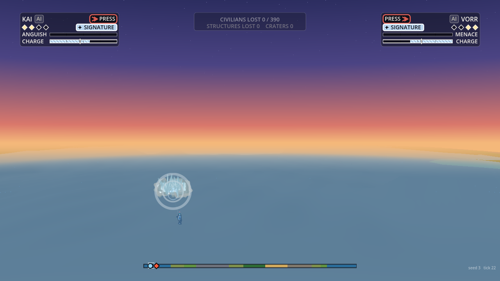
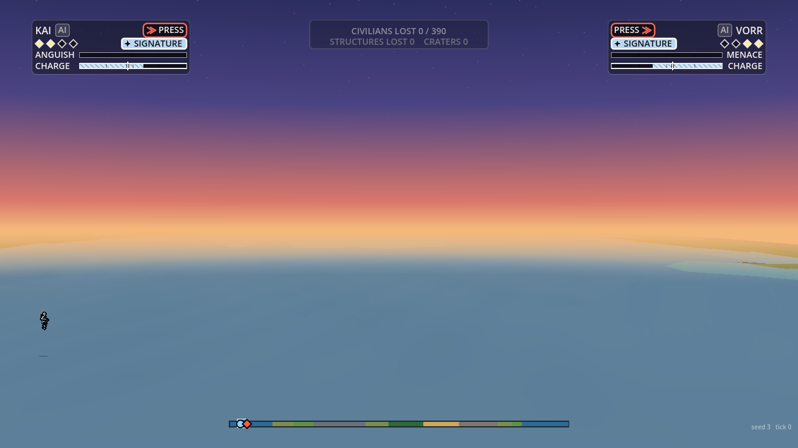
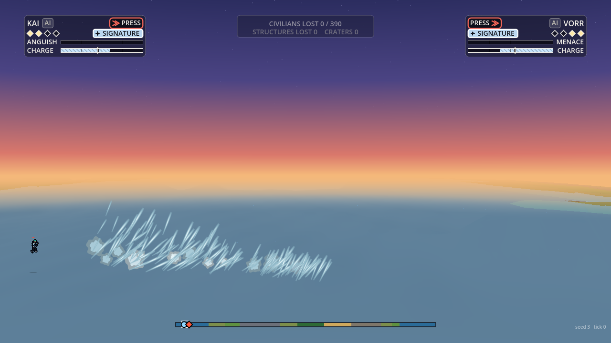
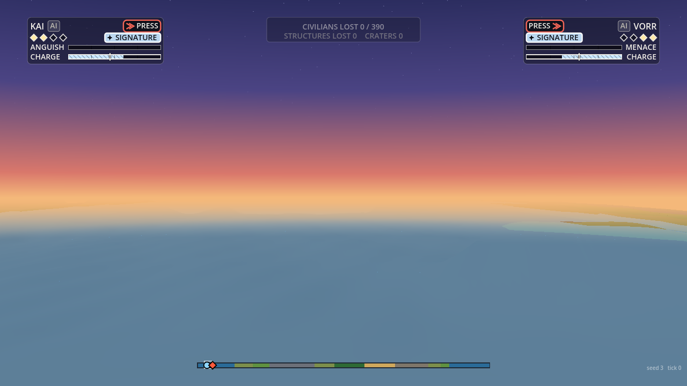
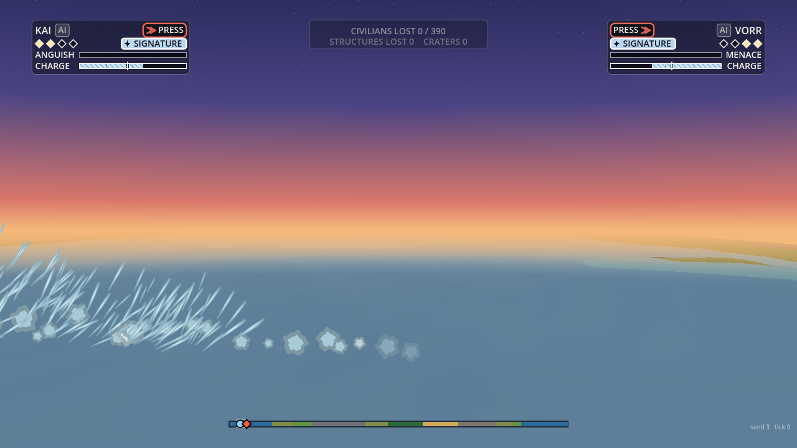

# VFX water effects

Owner: VFX Director. 2026-10-01. From Orb's words on the ocean skipping: "looks great, and i'd like to see more dramatic splash effects." Presentation only: nothing here writes the sim's state, no `S.rng`, the gameplay hash is unchanged. Code: `render/vfx/water.gd` (class `VfxWater`, held by the hub as `hub.water`), spray and foam bits in `render/vfx/debris.gd`, the droplet shape in `shaders/shard.gdshader`. Numbers: `data/vfx/water.json` (every key also has a default in `water.gd`; `effects_check.gd` asserts the two agree). Flag: `hub.water_enabled`, default on.

## What each event does now

| Event | Effect | Scales with |
| :--- | :--- | :--- |
| `skim {x, y, spd, n}` (a skip off the sea) | A fan of 14 to 40 spray streaks thrown up and forward along the travel, a tail of 4 to 13 foam puffs thrown up and back, one thin expanding ring on the surface. | Raw speed `spd` and the nearest fighter's tier (`scale`). Each later skip is 15% smaller (`skip_decay`), so a skipping stone reads as losing energy. |
| `splash {n >= 10}` (a plunge: 12, or a ground impact at sea: 14) | A crown of 22 to 80 streaks in a narrow cone, a column of foam 300 to 3500 units high, two rings, then a smaller jet 0.28 s later when the cavity closes. | The fighter's speed at entry and tier. Column height is a quarter of the speed in units. |
| `splash {n < 10}` (a skip's own 8, a beam's 3) | Not drawn here: the skim event and the beam path carry those. | n/a |
| `beamSplash {x}` (a beam sample close to the surface) | Raking spray: a share of the samples (30%, at most 4 throws a tick) throws 4 streaks forward along the beam, and every second throw a foam puff. | The beam's power (the `S.beams` entry nearest to x) and its direction. |
| Wake (every tick, from the fighters' state) | A fighter at 2200 u/s or more, mostly horizontal, within 160 units of the surface throws two spray streaks back and up, and a foam puff every fourth tick. Free flight and launches alike. | Speed and tier. |

Colours are Art's ocean dust ramp (`data/art/effects.json`: ocean light, mid, shadow), with a one pixel darker rim under every droplet so the pale spray reads on a pale sky. A streak is a stretched cel droplet along its velocity (shard shape 7); it falls at 1200 u/s squared and vanishes when it is back at the surface.

## Budgets

- Spray streaks alive: 260 at quality high, thinned with quality (`0.5 + 0.5 x` the quality share: about 175 at low, fewer with reduced motion). The cap is exact: a streak is counted when thrown, and the count is recomputed after the jobs run.
- At most 60 water bits thrown a tick. All water bits live in the shared debris pool (460 in all, see `effect-budgets.md`), so water adds no draw call: one MultiMesh draw for puffs, shards and rings together.
- Counts are at quality high; medium is 0.7, low 0.35, reduced motion halves again (the shards' factors).
- Cost scene: `worst_case.gd --sea` (a fighter raking the sea at 9000 u/s, a skip every 20 ticks, a plunge every second, a power-4 beam sweeping 14 samples a tick, and the wake, all at once). Numbers in `effect-budgets.md`.

## Before and after

Real sim, seed 3, launched over open sea. "Before" has `water_enabled` off, which leaves only Rendering's own splash and spray (the reference consumer's `ImpactFx`); "after" has both.

| | Before | After |
| :--- | :---: | :---: |
| Skip, 3 ticks in (6500 u/s, tier 2) |  |  |
| Skip, 10 ticks in (a second, smaller skip) |  |  |
| Plunge, 3 ticks in (a dive at 3800 u/s) |  |  |
| Plunge, 10 ticks in |  |  |
| Beam raking the sea, 10 ticks in (power 3) |  |  |
| Beam, 24 ticks in |  |  |

The beam "before" shows nothing because the harness stages `S.beams` and `beamSplash` events directly and Rendering's `ImpactFx` is not in that path; in a real match its own beam splash adds a few small droplets.

Pictures: `godot --path . --script res://render/vfx/tools/water_shots.gd -- --out=DIR [--nowater] [--case=skim|plunge|beam] [--tier=1..4] [--zoom=0.3]`.

## At the camera pitch

Water is drawn flat on the fighter plane like the other effects, so at the 49 degree camera a column reads 0.66 as tall (the EP's standing note). Re-shoot once Orb picks an angle.

## Planned for the knocked-about events (the ground ones are built: earth-plan.md)

Game Design's knocked-about rules (skid, bounce, tumble, lip launches, the tech) added the sim events `left_ground`, `bounce`, `land`, `tumble_end` and `journey_end` (World's ground contact, on in HEAD since 2026-10-01); the ground effects for them are built in earth.gd (see earth-plan.md), and a water bounce is the existing `skim`. The plan was: each is a new case in `water.gd` reading the same data keys, no new pools.

- `skip` (a body bouncing off the water): the same function as `skim`, with `spd` the body's speed and `n` the bounce count, so a tumbling body's skips decay the same way. Nothing new to draw.
- `bounce` on dry ground at a crater lip: the same machinery with the dirt ramp (`VfxPalette.dust(biome)`) and a kill height at the ground, a short fan of chips and dust thrown along the lip's tangent, same `scale_of`.
- `left_ground` (a lip launch): a small plume at the lip thrown along the launch vector, plus the trail's break ring; leaving the sea is a plunge in reverse (a column rising as the body leaves the water).
- `land` at sea: a plunge sized by the landing speed (the sim sends `splash` n 12 for a plunge today; if `land` replaces it, route it to `plunge`). On dry ground it is the existing impact effects.
- If the events carry the body's depth `z`, the spray takes it; today water sits on the fighter plane.
- When they land: the same `water_enabled` flag, the same budgets, and an `effects_check.gd` case for each (a skip n=1 against n=5, a lip bounce throwing dirt, a landing at sea routed to a plunge).

## For Rendering and Tools

- Rendering's reference consumer still draws its own ripples, droplets and wake. The two stack, which is what the "after" pictures show. If Orb prefers VFX's alone, `ImpactFx`'s skim spray and splash should be skipped while `host.vfx.water_enabled` is on (a one-line guard on their side).
- `data/vfx/water.json` has no schema in `tools/schemas/map.json`: the validator reports one warning, "no schema for this folder". Tools to add one.
